# CC-IFM 项目结构图

版本 **485** · 生成时间 2026-10-06 21:27:47 · 源文件 37 个 / 函数原型 1725 个（不含生成物 `backend/ifm_bundle.lua`）

图例：`+` = 模块/全局可见（`function M.foo()`、`function Class:method()`、`foo = function()`、`function foo() {}`、`def foo()`）；`-` = 文件内私有（Lua 的 `local function`、Python 的 `_name`）。Lua 的 `Class:method(a)` 在类图中写作 `+method(a)`（`self` 隐式传入）。前端 10 个 `web/*.js` 由 `index.html` 顺序加载、共享同一个全局作用域，故每个文件画成一个 class。
§1 运行时架构、§2 模块依赖、§7 模块间接口调用（谁调用了谁的哪些接口）、§5 每个文件的函数原型、§8 每个文件的函数调用图、§9 外部接口明细表、§10 调用统计。
渲染方式：在 GitHub、VS Code（Markdown 预览 + Mermaid 插件）或 https://mermaid.live 里打开本文件即可。本文件由 `tools/gen_structure.py` 从源码自动生成，重新生成：`python tools/gen_structure.py`。

## 1. 运行时总体架构

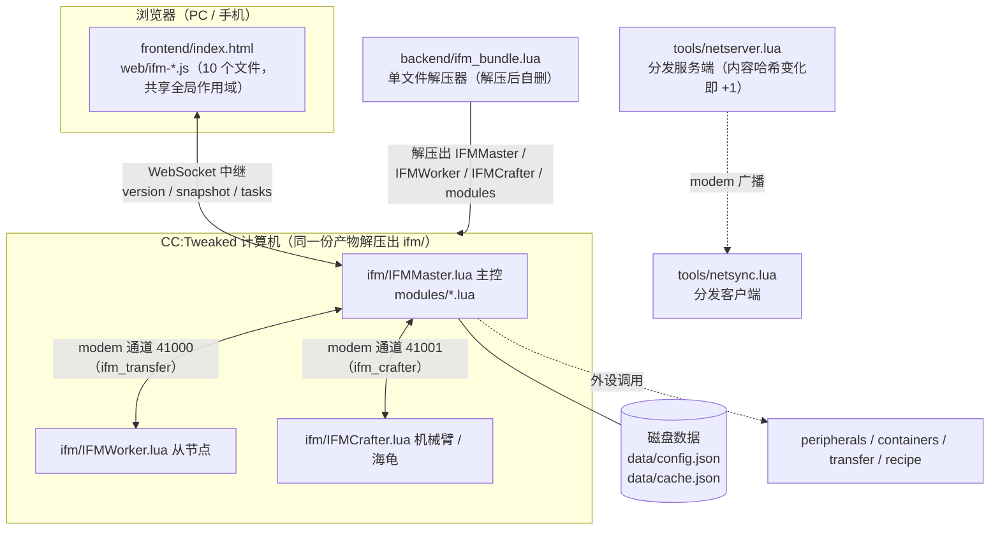

## 2. 后端模块依赖（`loadModule("…")`）

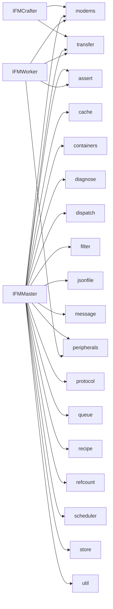

## 3. 前端脚本加载顺序（`index.html`）


注：`pinyinlite_full.min.js` 是第三方拼音词典（放在 `frontend/web/dist/`，仓库里没有该文件），缺失时前端静默降级为中英文关键词匹配。

## 4. 协议操作（源码里的 `op == "…"`）

| 文件 | 处理的操作 |
| --- | --- |
| `backend/IFMCrafter.lua` | `craft`, `detail_request`, `hello`, `inventory_request`, `ping` |
| `backend/IFMWorker.lua` | `detail`, `hello`, `job`, `pong`, `query`, `welcome` |
| `backend/modules/transfer.lua` | `busy`, `crafter_here`, `detail`, `detail_result`, `done`, `hello`, `inventory`, `job`, `pong`, `query`, `query_ack`, `query_result`, `results`, `state` |

## 5. 各文件函数原型

### `backend/IFMCrafter.lua`（404 行 / 15 个函数）

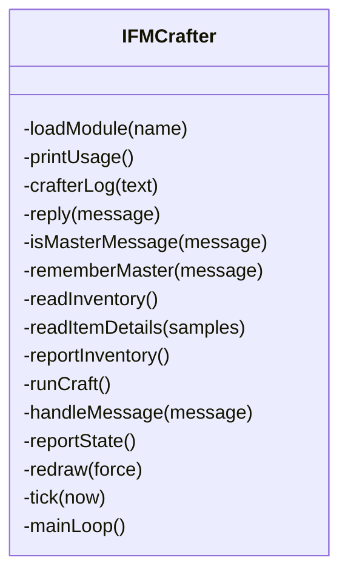

### `backend/IFMMaster.lua`（3095 行 / 85 个函数）

```mermaid
classDiagram
class IFMMaster {
  -randomRoom()
  -printUsage()
  -loadModule(name)
  +processExists(name)
  +tagProvider(name)
  +revisionProvider()
  -normalizeRoom(value)
  -buildProducerIndex()
  -mark(key, processName)
  -filterHasProducer(filterName)
  -itemTags(name)
  -itemDetailUi(kind, name, nbt)
  -collectResources()
  -collectMachines()
  -collectPeripherals()
  -add(kind, name)
  -inBootGrace(now)
  -collectWorkers()
  -collectSnapshot()
  -detailQueueKey(name, nbt)
  -storeTags(itemName, detail)
  -absorbWorkerDetails()
  -queueMissingDetails()
  -pruneTagCache()
  -queueTagScan()
  +buildStatus()
  -handleSendItems(payload)
  -containerCandidates(needle)
  -findContainerByPayload(payload)
  -containerView(payload)
  -manualSlotAccepts(containerName, slot, item, amount)
  -manualStackMatches(stack, resource, nbt)
  -manualFinish(task, ok, reason, moved)
  -runManualTask(task, now)
  -containerMove(payload, dir)
  -forgetRemovedContainers(reason)
  -dataFileNames()
  -dataFilePath(name)
  -toHex(text)
  -fromHex(text)
  -handleRequestInner(payload)
  -handleRequest(payload)
  +revisionProvider()
  -isInputContainer(peripheralName)
  -scanKindOf(name)
  -queueSlotLimits()
  -afterScan(name, now)
  -noteScanFailure(name, reason)
  -noteScanSuccess(name)
  -partTaskRunner(task, now)
  -scanTaskRunner(task, now)
  -sendTargetsOfDeliveries()
  -maintainScanQueues()
  -makeMoveRunner(queuePolicy)
  -clearCompactQueue(reason)
  -compactMoveRunner(task)
  -stackScanRunner(task)
  -crafterDetailKeyOf(sample)
  -crafterDetailInFlight(sample, now)
  -isVirtualDetailContainer(containerName)
  -needsCrafterDetail(sample)
  -requestCrafterDetail(sample)
  +enqueueDetail(container, slot, name, nbt)
  +run(task)
  +run(task, now)
  -syncTurtleCrafters()
  +onCrafterInventory(name, items, at, size)
  +onCrafterDetails(name, entries)
  -finishScanInflight(name)
  +onQueryDropped(key, reason)
  +onMovesDropped(keys, reason)
  +onQueryResult(_, key, message)
  +onDetailResult(_, message)
  +onDetailSettled(request, reason)
  -armTick()
  -statusLine()
  -perfStatOf(label)
  -timed(label, fn, ...)
  +dispatch()
  +dispatch()
  +protocol_update()
  -peripheralSignature()
  -refreshPeripheralsIfNeeded(now)
  -masterTick(now)
  -mainLoop()
}
```

### `backend/IFMWorker.lua`（1248 行 / 46 个函数）

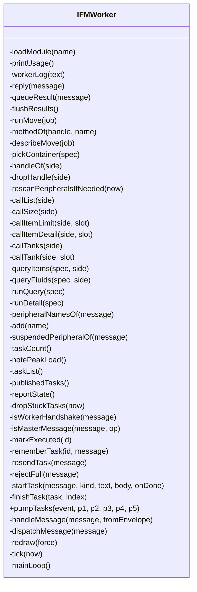

### `backend/modules/assert.lua`（98 行 / 13 个函数）

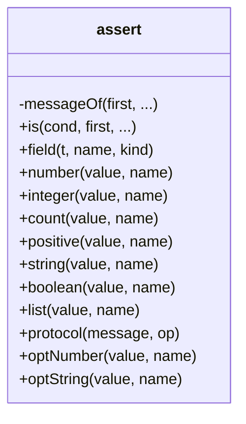

### `backend/modules/cache.lua`（602 行 / 41 个函数）

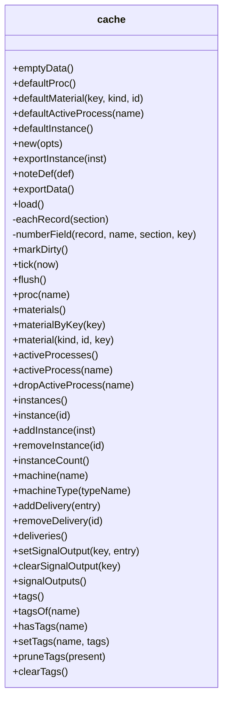

### `backend/modules/containers.lua`（5117 行 / 240 个函数）

```mermaid
classDiagram
class containers {
  -samePeripheralReason(Message, fromContainer, toContainer, peripheralName)
  +defRole(containerName, kind)
  +scanQueueTargets(opts)
  -bucketOf(role)
  -wanted(role, peripheralName)
  -mergeSort(list, less)
  +slotStackMultiplier(slotLimit, itemMaxCount)
  +stacksToItems(stacks, itemMaxCount)
  +slotItemCapacity(slotLimit, itemMaxCount)
  -levelLogger(fn)
  +base()
  +warn(...)
  +error(...)
  +__call(_, ...)
  +new(opts)
  +slotLimitEntry(peripheralName, slot)
  +slotLimitOf(peripheralName, slot)
  +requestSlotLimit(peripheralName, slot)
  +markLimitUnavailable(peripheralName, slot, reason)
  +takePendingLimits(limit)
  +clearPendingLimit(peripheralName, slot)
  -slotStacksOf(self, peripheralName, slot, entry)
  +slotMultiplierReady(peripheralName, slot)
  +slotStackCount(peripheralName, slot)
  +slotCapacityFor(peripheralName, slot, itemName, nbt)
  +slotMultiplierOf(peripheralName, slot)
  +slotCapacityInfo(peripheralName, slot)
  +peripheralFlags(peripheralName)
  +isFixedSlotCapacity(peripheralName)
  +isScannedMod(peripheralName)
  +defOfPeripheral(peripheralName)
  +slotMultiplierDefaultOf(peripheralName)
  +slotOverrideOf(peripheralName, slot)
  +needsSlotScan(peripheralName)
  +applyFixedSlotCapacity(peripheralName)
  +markCapacityPending(peripheralName)
  +clearCapacityPending(peripheralName)
  +hasUnknownSlotCapacity()
  +pendingCapacityCount()
  +pendingCapacityList(limit)
  +unknownSlotCountList(limit)
  +hasUnknownSlotCount()
  +slotScanPendingPeripherals()
  -add(name)
  +containerIssues(limit, pendingSlotScan)
  -add(peripheralName, containerName, kind, reason)
  -requestAllSlotLimits(self, peripheralName)
  -slotCapacityComplete(self, peripheralName)
  -noteSlotLimitKnown(self, peripheralName)
  +refreshSlotMultipliers(peripheralName)
  -noteSlotDetailsKnown(self)
  +peripheralOf(containerName, kind)
  +supports(containerName, kind)
  +infoMissing(peripheralName, kind)
  +needsSize(peripheralName)
  +snapshotComplete(peripheralName, kind)
  +hasSnapshot(peripheralName)
  +slotForItem(peripheralName, item)
  +isInteractionContainer(containerName, kind)
  +watchContainer(containerName, kind, ttlMs)
  +watchedPeripherals(now)
  +noteView(peripheralName, ttlMs)
  +viewedPeripherals(now)
  +watchCount(now)
  +needsReconcile(peripheralName)
  +reconcilePeripherals()
  +reasonNode(key, params, cacheKey)
  +unusableReason(containerName, kind)
  +priorityOf(def)
  +byRole(role, kind, order)
  -noteScan(self, peripheralName, method, startedAt)
  +noteReadCost(elapsed)
  +peripheralCount()
  +scanSummary()
  +scanStatsSummary(limit)
  +advanceTick()
  +needsScan(peripheralName, maxAgeTicks)
  +modelOf(peripheralName)
  -itemKeyOf(name, nbt)
  -locKeyOf(kind, peripheralName, index)
  -isClaimSource(source)
  +inUseOf(peripheralName, create)
  -itemUseSlot(self, peripheralName, slot, create)
  -fluidUseSlot(self, peripheralName, name, create)
  -addUse(self, kind, peripheralName, index, source, delta)
  +indexAddItem(peripheralName, slot, name, nbt)
  +indexRemoveItem(peripheralName, slot, name, nbt)
  +indexAddFluid(peripheralName, name)
  +indexRemoveFluid(peripheralName, name)
  +indexClearSlots(peripheralName)
  +indexClearTanks(peripheralName)
  +indexClearModel(peripheralName)
  +reserve(source, kind, peripheralName, index, resource, nbt, amount, dir)
  +releaseReserve(source, keep)
  +useHeldBy(peripheralName, kind, index, source)
  +itemUseTotal(peripheralName, slot)
  +fluidUseTotal(peripheralName, fluidName)
  -sumUse(entry, mode)
  +itemMoveUse(peripheralName, slot)
  +fluidMoveUse(peripheralName, fluidName)
  +slotBusy(peripheralName, slot)
  +sourcesAt(peripheralName, kind, index)
  +releaseInUseOf(peripheralName)
  -claimKeyOfSpec(spec)
  +residualEntry(key, create)
  +residualAdd(source, key, amount)
  +residualTake(source, key, amount)
  +resourceMatchesSpec(spec, kind, name, nbt)
  -locMatchesSpec(self, loc, spec)
  +isStoragePeripheral(peripheralName, kind)
  +allocatableLocations(spec)
  +claim(spec, amount, owner)
  +releaseClaimAmount(spec, amount, owner)
  +releaseClaim(spec, amount, owner)
  +releaseClaimSource(owner)
  +claimedAmount(spec)
  +dirtyAmount(spec)
  +claimsSummary()
  +sourcesOfMap(map)
  +countInModel(model, name, nbt)
  +visibleSlotCount(model, slot)
  +visibleTankAmount(model, tank)
  +visibleSlots(peripheralName)
  +visibleTanks(peripheralName)
  +rebuildClaims(instances)
  +claimView(containerName, kind)
  +availableForCraft(spec)
  +availableForFilterSpec(spec)
  +noteMoveResult(record, moved, err)
  +sourceFreeFor(record)
  +settleMove(request, moved, final)
  +releaseMoveKey(key, reason)
  +scanCountOfReply(message)
  +noteScanProtocolMismatch(peripheralName, detail)
  +beginScan(peripheralName, scanStartedAt, ts)
  +scanDataError(peripheralName, what)
  -validCount(value)
  +applyItems(peripheralName, items)
  +applySize(peripheralName, size)
  +applySlotLimit(peripheralName, slot, limit, item)
  +applyTanks(peripheralName, tanks)
  +applyScan(peripheralName, items, tanks, scanStartedAt, size, ts, slotLimits)
  +snapshotSummary()
  -count(map)
  +takeScanSeen()
  +listPeripheral(peripheralName)
  +stacksPeripheral(peripheralName)
  +tanksPeripheral(peripheralName)
  +stacks(containerName)
  +tanks(containerName)
  +setDispatcher(dispatch)
  +setTransferProvider(provider)
  +submitMove(record, queueName)
  +sourceShortage(record)
  +abandonMove(record)
  +executeMove(record)
  +runMoveTask(record)
  +takeMoveResult(key)
  +moveActorOf(peripheralName, kind)
  +pushItemImpl(fromContainer, fromSlot, limit, toContainer, toSlot, mode, queueName, sourceItem)
  -debugLog(self, fmt, ...)
  +setTickSeq(seq)
  +tickOf()
  -roleOfDef(self, containerName, kind)
  -requireModel(self, peripheralName, what)
  -assertItemSource(self, peripheralName, slot, item, count)
  -assertFluidSource(self, peripheralName, fluidName, count)
  -queueNameForAction(action)
  +queueItemMove(action, fromContainer, fromSlot, toContainer, toSlot, item, count, queueName)
  +sendItem(storageContainer, storageSlot, targetContainer, targetSlot, item, count, queueName)
  +takeItem(sourceContainer, sourceSlot, storageContainer, storageSlot, item, count, queueName)
  +manageItem(fromContainer, fromSlot, toContainer, toSlot, item, count, queueName)
  +queueFluidMove(action, fromContainer, toContainer, fluidName, count, queueName)
  +sendFluid(storageContainer, targetContainer, fluidName, count, queueName)
  +takeFluid(sourceContainer, storageContainer, fluidName, count, queueName)
  +manageFluid(fromContainer, toContainer, fluidName, count, queueName)
  +pickSourceSlots(containerName, item, prefer)
  +pickSourceSlot(containerName, item, prefer)
  +safeTakeAmount(containerName, slot, item)
  +fluidAvailable(containerName, fluidName)
  +pickTargetSlot(containerName, item, count, prefer)
  +pickTargetSlots(containerName, item)
  +beginScanTick()
  +scanItem(containerName, ts, part, slot)
  +scanFluid(containerName, ts, part, slot)
  +scanSlotLimit(containerName, slot, ts)
  -callerOf(level)
  +scanContainer(containerName, kind, ts, part, slot)
  +pushItem(fromContainer, fromSlot, limit, toContainer, toSlot, mode, queueName, sourceItem)
  +runItemMove(record)
  +orderStacks(list, order)
  +itemMaxCount(itemName, nbt)
  +insertSlotFor(containerName, itemName, nbt, amount, mode)
  -inSlot(peripheralName, slot)
  -noteFailure()
  +pushFluid(fromContainer, limit, fluidName, toContainer, queueName)
  +runFluidMove(record)
  -itemDetailKey(itemName, nbt)
  +cachedItemDetail(itemName, nbt)
  +itemDetail(itemName, nbt)
  +setItemDetail(itemName, nbt, detail, source)
  +markDetailUnavailable(itemName, nbt, reason)
  +absorbItemDetails(entries)
  +detailsInFlight(itemName, nbt)
  +noteDetailSettled(request)
  +requestItemDetails(samples)
  +setDetailProvider(provider)
  +collectStacks(role)
  +collectTanks(role)
  +snapshot(role)
  +invalidate()
  +referencedPeripherals()
  +forgetPeripheral(peripheralName, reason)
  +clearSnapshot(peripheralName, reason)
  +pruneMissingPeripherals(reason)
  +invalidateAll()
  +matchSpec(spec, role, order)
  +countOf(spec, role)
  +countIn(containerName, spec)
  +resources()
  +filterResources(filterName)
  +filterCount(filterName)
  +stackScanStatusFromSnapshot(containerName)
  +stackScanStatus(containerName)
  +stackLimitOf(itemName, nbt)
  +planInputRevision()
  +resetStackStepStats()
  +stackStepText()
  +stackScanStep(containerName)
  +stackScanTargets()
  +slotCount(peripheralName)
  +compactPlanner(role, opts)
  +capacityStats()
  +slotName(containerName, slot)
  +stackAt(containerName, slot)
  +compactPlanPass(planner)
  -compactLayoutSnapshot(self, role)
  +compactPlanSimple(role, planner)
  +missingPeripherals()
  -note(peripheralName, kind)
}
```

### `backend/modules/diagnose.lua`（822 行 / 17 个函数）

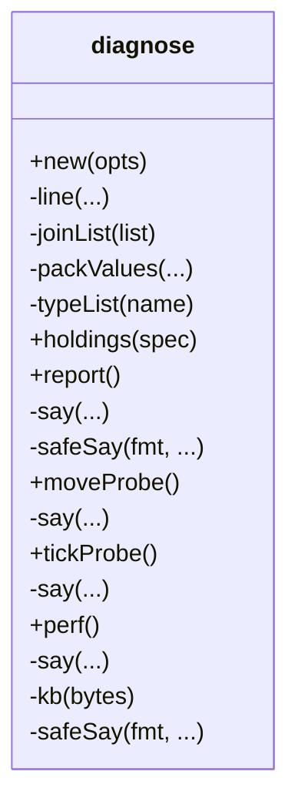

### `backend/modules/dispatch.lua`（796 行 / 43 个函数）

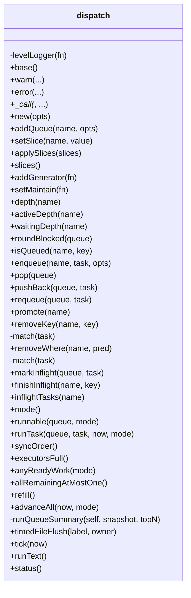

### `backend/modules/filter.lua`（487 行 / 21 个函数）

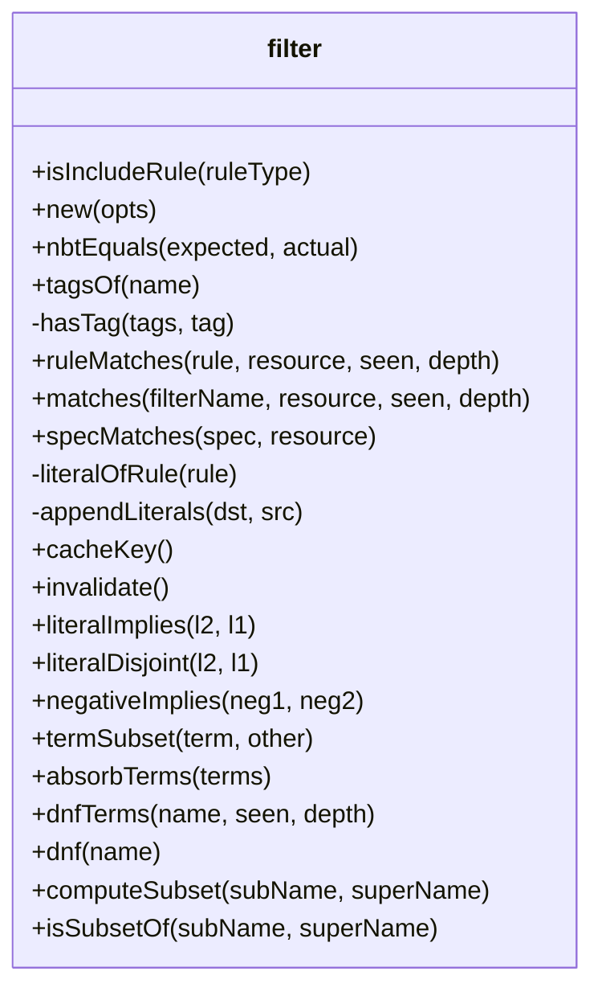

### `backend/modules/jsonfile.lua`（94 行 / 6 个函数）

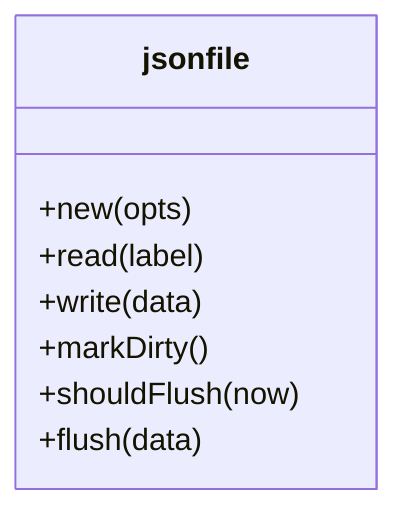

### `backend/modules/message.lua`（253 行 / 4 个函数）

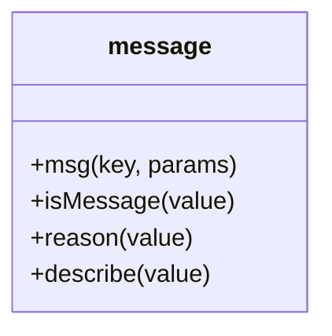

### `backend/modules/modems.lua`（83 行 / 6 个函数）

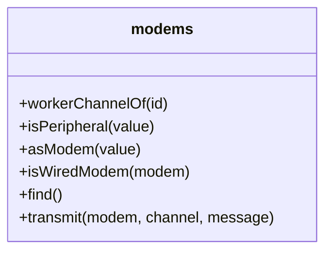

### `backend/modules/peripherals.lua`（178 行 / 14 个函数）

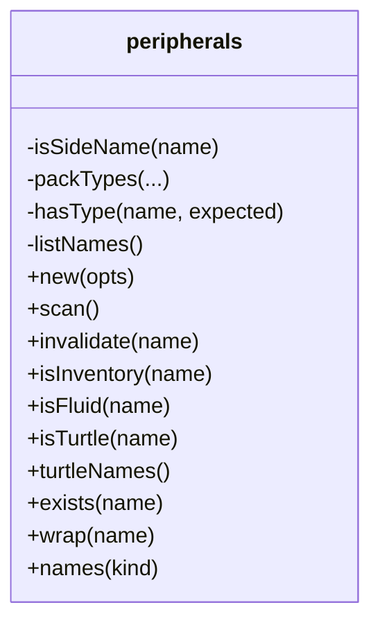

### `backend/modules/protocol.lua`（1339 行 / 46 个函数）

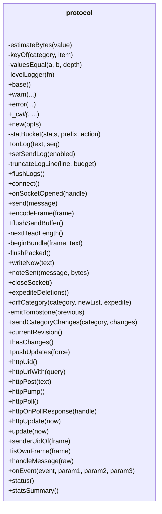

### `backend/modules/queue.lua`（188 行 / 13 个函数）

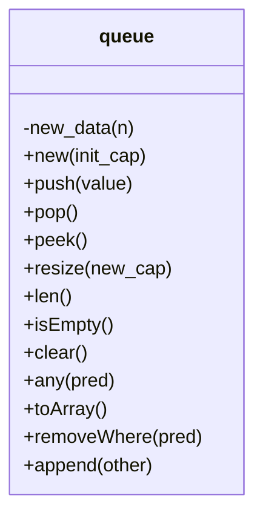

### `backend/modules/recipe.lua`（4414 行 / 157 个函数）

```mermaid
classDiagram
class recipe {
  -instanceSource(inst)
  -processIoMode(process)
  -processBlockParallel(process)
  -elementDemand(element, batch)
  -isMaterialElement(element)
  -elementSpec(element)
  -outputScopeOf(opts)
  +gt(a, b)
  +ge(a, b)
  +eq(a, b)
  +le(a, b)
  +lt(a, b)
  -readAnalog(peripheralTable, side)
  -writeAnalog(peripheralTable, side, strength)
  +new(opts)
  +debugInfo(fmt, ...)
  +stallLog(fmt, ...)
  -callerOf(level)
  +batchOf(record)
  +indexOf(record)
  +moveKeyCount()
  +trackMoveKey(token, key)
  +settleInFlightMove(token)
  +noteInflightWant(token, want)
  +inflightWantOf(prefix)
  +settleInFlightMoves(prefix)
  -paramsKey(params)
  +messageOf(key, params, cacheKey)
  +record(name)
  +isAbstract(process)
  +machinesOfType(typeName)
  +signalPeripheralOf(entry)
  +machineUsable(machine)
  +machineProblem(machine)
  +chooseMachine(typeName)
  +machineRef(machineName)
  +machineRunning(machineName)
  +occupyMachine(machineName, delta, source)
  +machineUsage()
  +resetMachineUsage()
  +resolveSignals(machine, element)
  +signalSatisfied(machine, element)
  +switchSignals(targets, strength)
  +signalTargets(machine, element)
  +emitSignals(machine, element)
  +startPulse(machine, element, record, now, nextIndex)
  +advancePulse(record, now)
  +restoreSignals()
  +inputContainers(machine, resourceKind, containerIndex)
  +outputContainers(machine, resourceKind, containerIndex)
  +rememberPendingMove(token, record)
  +forgetPendingMove(token)
  +forgetPendingMovesWithPrefix(prefix)
  +resumePendingMove(token)
  +resolveFilterSource(spec)
  +planTargetSlots(item, want, containerNames)
  +sendToMachine(spec, itemTargets, fluidTargets, toSlot, amount, token, opts)
  -availableInTarget(self, name, kind, spec, slot)
  +alreadyInTargets(spec, itemTargets, fluidTargets, element)
  -collect(name, kind)
  +transferFailureReason(machine, element, itemTargets, fluidTargets, reason)
  +resolveFilterOutput(spec, machine, opts)
  +takeFromMachine(spec, machine, amount, token, opts)
  +takeFromMachineMulti(spec, machine, amount, token, opts)
  +drainInputContainers(now)
  +machineRemaining(spec, machine, opts)
  +availableFor(element)
  +batchMaterialsReady(process, record)
  +outputMatchesInput(output, element)
  +inputsSatisfied(process, record)
  +noteMaterialShortage(process, record, now)
  +storageBaseline()
  +stepInput(process, record, machine, now)
  -attempt(element, index, key)
  -releaseInputClaim(element, amount)
  -markSkipped(transferred)
  +firstInflightInput(record, inputs)
  +requestMachineCraft(process, record, machine)
  +setCraftProvider(provider)
  +setDispatch(dispatch)
  +prepareOutputs(process, record)
  +stepOutput(process, record, machine, now)
  -attempt(element, index, key)
  +peripheralProblem(process, record)
  +markDeliveryError(delivery, text)
  +addDelivery(entry)
  +processDeliveries(now)
  +startCompact(role)
  +advanceCompactPlan(job, now)
  +setCompactFreeRatio(value)
  +storageFreeRatio()
  +compactPlanTick(now)
  +abortCompact(reason)
  +autoCompactStep(now)
  +compactStatus()
  +stepCompact(now)
  +elementKeyOf(spec)
  +specOfElement(element)
  +availableForCraft(element)
  +bestSingleInput(element)
  -consider(kind, name, nbt, visible)
  +materialKeyOf(spec)
  +materialKeyOfElement(element)
  +craftIndex()
  -add(key, processName, yieldPerBatch)
  +expectedYield(process, element)
  +materialLimit(process, gap, report)
  +bindSingleInputs(inst)
  +createInstance(process, machine, multiplier, now)
  +finishInstance(process, inst, now)
  +killInstance(inst, reason)
  +abortInstance(processName, id)
  +stepInstance(inst, now)
  +conversionInputMatchesFilter(input, output)
  +stepConversionInstance(inst, def, now)
  +stepInstances(now)
  +activeInstanceContainers()
  +takeInstanceScanBurst()
  +maintain(now)
  +maintainKeepStock(now)
  +finishTick()
  +tick(now)
  +tickStatsText()
  +reconcile()
  +storageCount(kind, name, nbt)
  +baselineCountIn(baseline, kind, id)
  +storageBaselineCount(record, kind, id)
  +storageGain(spec, record)
  +progressOf(record)
  +currentElement(process, record)
  +instancesOf(owner)
  +runtime()
  +producers(kind, name)
  +abstractProducer(kind, name)
  +outputPerBatch(process, kind, name)
  +startResource(kind, name, count, processName)
  +cancel(processName)
  +queueSend(kind, name, count, containerName, nbt)
  +craftAndSend(kind, name, count, containerName, nbt)
  +deliveries()
  +ensureMaterial(element)
  +materialOfKey(key)
  +materialKeysOfOutput(output)
  +visibleStock(material)
  +perCraftUnits(element)
  +parallelCap(process)
  +outputUnits(process, output, multiplier)
  +craftingRef(key)
  -syncCrafting(self, key)
  +noteCrafting(process, inst, sign)
  +releaseCrafting(inst)
  +rebuildCrafting()
  +settleProduced(process, inst)
  +countMap(map)
  +planTick(now)
  +materials()
  +plan()
}
```

### `backend/modules/refcount.lua`（123 行 / 11 个函数）

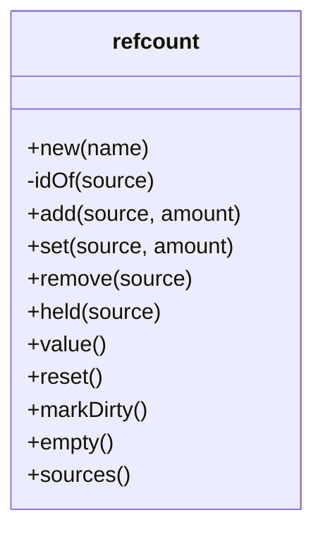

### `backend/modules/scheduler.lua`（69 行 / 5 个函数）

```mermaid
classDiagram
class scheduler {
  +new()
  +after(seconds, fn)
  +every(seconds, fn)
  +cancel(id)
  +tick(now)
}
```

### `backend/modules/store.lua`（1367 行 / 59 个函数）

```mermaid
classDiagram
class store {
  +weightMax()
  -round6(value)
  +normalizeSlices(slices)
  -isName(s)
  -normalizeSides(list)
  -normalizeStringList(list)
  +containerKey(containerKind, name)
  +containerPlainName(value)
  +emptyData()
  +scheduleSettings()
  +keepSettings()
  +setKeepStock(key, amount)
  +new(opts)
  -migratedKind(Assert, obj, where)
  -migratedRole(Assert, obj, where)
  -migratedOp(Assert, el)
  +load()
  +getRoom()
  +setRoom(roomName)
  +markDirty()
  +revision()
  +tick(now)
  +flush()
  +isTypeConversion(value)
  +setVirtual(kind, list)
  +virtualOf(kind)
  +isTurtleCrafter(machine)
  +get(kind, name, containerKind)
  +findContainer(nameOrKey, containerKind)
  +findContainerByPeripheral(peripheralName, containerKind)
  +list(kind)
  +names(kind)
  -refKey(kind, name, containerKind)
  +addRef(index, key, refKind, refName)
  +buildRefIndex()
  +ensureRefIndex()
  +references(kind, name, containerKind)
  +purgeReferences(kind, name, containerKind)
  -purgeList(machine, listKey, match)
  -match(entry)
  -match(entry)
  +containerNameFor(obj, name)
  +signalNameFor(obj, name)
  +dropSignalByPeripheral(peripheral, keepName)
  +dropContainerByPeripheral(containerKind, peripheral, keepName)
  +patchSettings(name, patch, opts)
  +set(kind, name, obj, opts)
  -restorePrevious()
  +delete(kind, name, containerKind, opts)
  +machinePeripheralNames(machine)
  +normalizeElement(el, allowPlaceholder)
  +normalize(kind, name, obj)
  -validateFilterRules(store, filterName, rules)
  -walks(name, path)
  +validateElement(el, allowPlaceholder, index, label)
  +elementIsAbstract(element)
  +processIsAbstract(process)
  -has(list)
  +validate(kind, name, obj)
}
```

### `backend/modules/transfer.lua`（1746 行 / 70 个函数）

```mermaid
classDiagram
class transfer {
  -levelLogger(fn)
  +base()
  +warn(...)
  +error(...)
  +__call(_, ...)
  +new(opts)
  +ensureModem()
  +workerSlots(worker)
  +workerHasRoom(worker)
  +workerBegin(worker)
  +beginDispatchRound()
  +endDispatchRound()
  +workerEnd(worker)
  +workerRelease(worker)
  +idleCount()
  +freeWorkerSlots()
  +freeExecutorSlots()
  +workerLabel(worker)
  +workerHasPending(worker)
  +workerCount()
  +workerStale(worker, now)
  +workerUsable(worker)
  +available()
  +pendingCount()
  +status()
  +usableBreakdown()
  -keyOf(job)
  +pickWorkerFor()
  +send(message, chan)
  +sendTo(worker, job)
  +queueTo(worker, message)
  +flushOutbox()
  +stampSent(message, at)
  +request(job)
  +touchWorker(id, name, version, slots)
  +onModemMessage(side, channel, replyChannel, message, distance)
  +applyWorkerResult(worker, message)
  +applyQueryResult(message, worker)
  +applyDetailResult(message, worker)
  +touchCrafter(id, message)
  +sendCrafter(message)
  +onCrafterMessage(message)
  +pickCrafter(name)
  +findCrafterByName(name)
  +requestCrafterDetails(containerName, samples)
  +requestCrafterInventory(crafter)
  +refreshCrafterReports(now)
  +requestCraft(spec)
  +craftStatus()
  +craftersForUi()
  +releaseInstructionWorker(worker)
  +tick(now)
  +setContext(ctx)
  +capableWorkers()
  +sendQuery(worker, id, spec)
  +requestQuery(spec)
  +submitPart(name, kind, part, slot, ts)
  +submitScan(name, freshMs, ts, part)
  +queryResult(key)
  +queryStatus()
  +queryPendingCount()
  +sendDetail(worker, request)
  +detailRequest(samples)
  +takeDetailResults()
  +detailPendingCount()
  +detailStatus()
  +applyWorkerLogs(worker, message)
  +applyWorkerState(worker, message)
  -counter(name)
  +workersForUi(opts)
}
```

### `backend/modules/util.lua`（157 行 / 19 个函数）

```mermaid
classDiagram
class util {
  +deepcopy(value, seen)
  +now()
  +clamp(v, lo, hi)
  +num(v, default)
  +int(v, default)
  +trim(s)
  +kindOfDef(def)
  +count(t)
  +setLogHandler(fn)
  +logColour(level)
  +pushLog(prefix, text, level)
  +logSince(seq)
  +makeLogger(prefix, enabled)
  -emit(level, fmt, ...)
  +warn(fmt, ...)
  +error(fmt, ...)
  +log(level, fmt, ...)
  +__call(_, fmt, ...)
  +uid()
}
```

### `backend/tools/netserver.lua`（494 行 / 27 个函数）

```mermaid
classDiagram
class netserver {
  -usage()
  -validName(value)
  -idChannel(id)
  -log(fmt, ...)
  -readVersion(path)
  -writeVersion(path, version)
  -scriptDir()
  -loadConfigs(dir)
  -parsePaths(text, dir, kind)
  -isIgnored(path)
  -scanIncludes()
  -add(abs)
  -walk(dir)
  -resolveFile(clientPath)
  -hashText(hash, text)
  -computeContentHash(files, index)
  -readHash(path)
  -writeHash(path, value)
  -readChunk(path, offset, count)
  -sendList(targetChannel, clientId)
  -sendFile(targetChannel, clientId, rel, offset)
  -clientOf(channel, clientId)
  -enqueue(replyChannel, clientId, message)
  -sweepClients(now)
  -nextRequest()
  -serveQueues()
  -announce()
}
```

### `backend/tools/netsync.lua`（389 行 / 22 个函数）

```mermaid
classDiagram
class netsync {
  -usage()
  -validName(value)
  -idChannel(id)
  -humanSize(bytes)
  -progressDone()
  -log(fmt, ...)
  -progress(index, total, path, percent)
  -detachModem(reason)
  -attachModem()
  -handlePeripheralEvent(event, side)
  -pumpEvents(handler)
  -versionPath()
  -readLocalVersion()
  -saveLocalVersion(newVersion)
  -waitForAnnounce()
  -waitForReply(predicate, timeout)
  -requestList(server)
  -resolveDest(rel)
  -fetchFile(server, entry, index, total)
  -fetchAll(server, files)
  -writeAll(files, blobs)
  -syncFrom(server)
}
```

### `frontend/web/ifm-app.js`（3020 行 / 145 个函数）

```mermaid
classDiagram
class ifm_app {
  +resourceFromKey(key)
  +resourceArgs(a, b, c)
  +resourceStock(a, b, c)
  +resourceCraftable(a, b, c)
  +resourceStockByName(kind, name)
  +handleAddByClick(resource)
  +openSendCountPrompt(resource)
  +onConfirm(value)
  +sendResourceNow(resource, count)
  +openCraftPrompt(resource)
  +onConfirm(value)
  +bindResourceGrid()
  +bindSendGrid()
  +cancelDelivery(id)
  +clearAllDeliveries()
  +sendPendingItems()
  +restoreSend()
  +bindProcessList()
  +onConfirm(value)
  +rollback()
  +missingDeleteRequest(item)
  +deleteMissingEntry(item)
  +afterMissingDelete()
  +dropMissingEntry(item)
  +deleteMissingDefinition(button)
  +visibleMissingEntries()
  +deleteAllMissingDefinitions(button)
  +finish()
  +bindDefinitionLists()
  +handleDefinitionClick(event)
  +finishDiagnose()
  +runDiagnose(mode)
  +syncSearchClear(inputId)
  +bindSearchClear(inputId, onChange)
  +containerClaimBadge(claim)
  +currentSlotInfo(slot)
  +sendSlotMultiplier(slot, amount, all)
  +openSlotMultiplierPrompt(slot)
  +onConfirm(value)
  +slotMultiplierHtml(info)
  +containerCellHtml(slot, entry, kind, claim, canMove, info)
  +containerSlotGridHtml(view, canMove)
  +parseContainerKey(key)
  +containerRowHtml(kind, name, count, ref, nbt, claim, claimedCount, canMove, showPut)
  +containerClaimListsHtml(view)
  +row(label, name, claim, kind)
  +renderContainerTool(view)
  +addRow(key, value, bad)
  +ifmContainerToolMount(key, peripheralHint)
  +startContainerToolPolling()
  +stopContainerToolPolling()
  +refreshContainerTool(showBusy)
  +fillToolRow(row)
  +slotOfButton(button, attribute)
  +containerMoveRequest(dir, slot)
  +peripheralCapabilities(peripheralName)
  +ensureMachineContainer(peripheral, kind)
  +ensureMachineSignal(peripheral)
  +machinePayload(machine)
  +updateMachine(machineName, mutate, successText)
  +machineSlotField(slot, kind)
  +removePeripheralFromMachine(payload, quiet)
  +addPeripheralToMachine(machineName, slot, peripheral, dragKind, quiet)
  +warn(key, params)
  +dragAcceptable(target, payload)
  +clearDropHighlight()
  +markDropTargets(payload)
  +bindPeripheralSelection()
  +panelOf(node)
  +chipUnder(node)
  +chipName(chip)
  +marqueeNode()
  +hideMarquee()
  +clearMarqueeHits()
  +updateMarquee(event)
  +finishMarquee(event)
  +dragPeripheralList(payload)
  +addPeripheralsToMachine(machineName, slot, entries)
  +bindPeripheralDrag()
  +payloadOf(node)
  +dropTargetAt(x, y)
  +highlightDropTarget(target, payload)
  +finishDrag()
  +applyDrop(target, payload)
  +endDrag(event, canceled)
  +containerDropKind(card, role, payload)
  +openContainerForRole(role, kind, peripheral)
  +addPeripheralToContainerRole(role, kind, peripheral, quiet)
  +addPeripheralsToContainerRole(role, entries)
  +addPeripheralToStorage(kind, peripheral)
  +removeStorageContainer(defKey, peripheral)
  +scheduleQueueLabelKey(name)
  +roundWeight(value)
  +weightMax()
  +clampWeight(value)
  +displayWeight(value)
  +weightPercent(value)
  +weightPercentText(value)
  +percentToWeight(percent)
  +formatCompactPercent(ratio)
  +equalWeights()
  +normalizeWeights(slices)
  +scheduleSendLog()
  +scheduleCompactFreeRatio()
  +scheduleSlices()
  +rebalanceWeights(slices, fixedName, value)
  +applyWeightValues(slices)
  +bytesToHex(bytes)
  +hexToBytes(hex)
  +bytesToText(bytes)
  +textToBytes(text)
  +dataFileListRetry()
  +dataFileEntry(name)
  +refreshDataFiles()
  +readDataFile(name)
  +step()
  +writeDataFile(name, bytes)
  +step()
  +downloadDataFile(name)
  +uploadDataFile(name, text)
  +pickDataFileToUpload(name)
  +onchange()
  +onload()
  +onerror()
  +dataFileRowHtml()
  +bindDataFileButtons()
  +renderSettings()
  +saveScheduleSettings(weights, options)
  +reportBootError(step, err)
  +safeStep(step, fn)
  +pageBuild()
  +pageProbe()
  +checkBuildStamp()
  +reportMissingElement(id)
  +ifmMissingElements()
  +on(id, type, fn)
  +setConnectBusy(busy)
  +bindToolbar()
  +toggleLang()
  +newProcess()
  +applyI18n()
  +rotateFilterIcons()
  +ifmOnTranslateUpdate()
  +printBanner()
  +init()
}
```

### `frontend/web/ifm-core.js`（817 行 / 62 个函数）

```mermaid
classDiagram
class ifm_core {
  +machineIsReadOnly(name)
  +machineTypeIsReadOnly(typeName)
  +elementIsAbstract(element)
  +processIsAbstract(process)
  +messageText(value)
  +describeMessage(value)
  +t(key, params)
  +el(id)
  +escapeHtml(text)
  +keyOf(category, item)
  +containerKeyOf(item)
  +containerByKey(key)
  +containerByName(name, kind)
  +resourceKey(kind, name, nbt)
  +splitKey(key)
  +hex4(code)
  +escapeUnicodeForServer(text)
  +unescapeAsciiText(text)
  +applyTextPaths(target, paths, fn)
  +walkTextPath(node, parts, index, fn)
  +escapePayloadForServer(payload)
  +decodeFrameFromServer(data)
  +asArray(value)
  +normalizeItemArrays(category, item)
  +setText(id, value)
  +setDisplay(id, value)
  +toastAreaNode()
  +toast(message, type)
  +setLang(next)
  +setConnectionStatus(kind)
  +refreshConnectionStatus()
  +markServerSeen()
  +fmtCount(value)
  +fmtExact(value)
  +fmtCountFloor(value)
  +trunc(scaled)
  +fmtAmount(value)
  +metaOf(kind, name)
  +isMetaPending(kind, name)
  +displayName(kind, name)
  +englishName(kind, name)
  +queueTranslateNames(list)
  +translateMessageText(message)
  +renderTranslateButton()
  +renderVersionLabel()
  +statusStatHtml(glyph, value, hint)
  +setHtmlIfChanged(node, html)
  +renderTransferInfo()
  +dispatchI18n(key)
  +dispatchQueueLabel(name)
  +dispatchModeLabel(mode)
  +dispatchQueueGlyph(name)
  +dispatchModeGlyph(mode)
  +renderDispatchInfo()
  +kindBadgeGlyph(kind)
  +absoluteApiUrl(url)
  +iconUrl(kind, name)
  +metaEndpoint(kind)
  +blockIdOf(peripheralName)
  +blockIdCandidates(peripheralName)
  +resolvedBlockIdOf(peripheralName)
  +blockIconHtml(peripheralName)
}
```

### `frontend/web/ifm-editor.js`（1387 行 / 99 个函数）

```mermaid
classDiagram
class ifm_editor {
  +editorModalInstance()
  +promptModalInstance()
  +diagnoseModalInstance()
  +gcdOf(left, right)
  +rationalOf(numerator, denominator)
  +rationalNegate(value)
  +rationalAdd(a, b)
  +rationalMultiply(a, b)
  +rationalDivide(a, b)
  +rationalModulo(a, b)
  +ceilRational(value)
  +evalRational(text)
  +peek()
  +parseNumber()
  +parseFactor()
  +parseProduct()
  +parseSum()
  +evalPromptInteger(text)
  +isPlainNumber(text)
  +updatePromptPreview()
  +openPrompt(options)
  +confirmPrompt()
  +fieldRow(label, control)
  +textInput(id, value, placeholder)
  +numberInput(id, value, min, step)
  +selectHtml(id, options, value, allowEmpty, attrs)
  +searchableSelectHtml(id, options, value, attrs)
  +orderedPickerHtml(id, options, values)
  +pickerLabelOf(id, value)
  +pickerAddOptionHtml(id, chosen)
  +renderOrderedPicker(id)
  +initPickers()
  +closeAutocomplete()
  +acCandidates(query, source)
  +acSourceForInput(input)
  +machineType(query)
  +filterIds(query)
  +acFilterOptions(rows, query, extraLabel)
  +acItemsFor(input)
  +renderAcPanel()
  +applyAcIndex(index)
  +openAutocomplete(input, index)
  +attachAutocomplete(input)
  +ifmPickerAdd(id)
  +ifmPickerMove(id, index, delta)
  +ifmPickerRemove(id, index)
  +readValue(id)
  +readNumber(id, fallback)
  +readMulti(id)
  +kindLabel(kind)
  +deepClone(value)
  +byName(list)
  +peripheralOptions(kinds)
  +containerOptions(role, kind)
  +signalOptions()
  +machineTypeLabel(name)
  +machineTypeOptions(includeConversion)
  +filterOptions(excludeName)
  +nameRow(name)
  +peripheralKindsOf(name)
  +containerKindOfPeripheral(peripheralName, fallback)
  +containerKindLabel(peripheralName, kind)
  +readOnlyRow(label, value, hint)
  +containerToolBlock(name)
  +buildContainerEditor(data, name)
  +ifmContainerRoleChanged(select)
  +buildSignalEditor(data, name)
  +machineTypeIconControl(value)
  +buildMachineTypeEditor(data, name)
  +buildEditor(kind, data, name)
  +openEditor(kind, name, preset)
  +uniqueDefinitionName(kind, requested, currentName)
  +keyOfName(value)
  +taken(candidate)
  +autoDefinitionName(kind)
  +isNamedContainerRole()
  +saveEditor()
  +deleteEditor()
  +machinesOfType(typeName)
  +maxListLength(machines, field)
  +elementKindLabel(kind)
  +processCopyCandidates(machineType)
  +processCopyLabel(process)
  +validateProcessDraft(payload)
  +check(element, index, side)
  +collectPayload(kind)
  +ruleLabel(type)
  +isFilterRefRule(type)
  +ruleValueHtml(type, value)
  +ruleRowHtml(type, value, ignoreNbt, nbt)
  +ifmRuleTypeChanged(select)
  +ifmRemoveRule(button)
  +ifmAddRule()
  +collectRules()
  +buildFilterEditor(data, name)
  +buildMachineEditor(data, name)
  +selectForClass(className, values, value, labels)
  +sideCheckboxes(selected)
  +elementIdControl(kind, value)
}
```

### `frontend/web/ifm-messages.js`（1174 行 / 0 个函数）

```mermaid
classDiagram
class ifm_messages {
}
```

### `frontend/web/ifm-meta.js`（594 行 / 45 个函数）

```mermaid
classDiagram
class ifm_meta {
  +probeFontAwesome()
  +iconGlyphClass(kind)
  +iconFallbackText(name)
  +iconLabelOf(kind, name)
  +faGlyphHtml(kind, name)
  +metaState(key)
  +iconExportPending()
  +iconImgTagHtml(kind, name, extraAttrs, exportedFile)
  +iconImgHtml(kind, name, className, exportedFile)
  +faSpanHtml(kind, name, className)
  +iconHtml(kind, name, extraClass, forceChar)
  +machineIconHtml(icon, className)
  +ifmMachineIconFallback(img)
  +ifmIconFallback(img, kind)
  +queueMeta(kind, name)
  +pumpMetaQueue()
  +fetchMeta(kind, name)
  +resetMetaCache()
  +setMetaMissing(key)
  +loadMissingMeta()
  +iconExportUrl(file)
  +iconExportFileFromUrl(src)
  +iconExportKey(kind, name)
  +iconExportConventionalFile(kind, name)
  +iconExportLanguageOrder()
  +iconExportUsableName(text)
  +iconExportCanonical(value)
  +iconExportComponentsKey(components)
  +iconExportComponentShape(components)
  +walk(node, prefix)
  +iconExportSimilarity(wanted, candidate)
  +iconExportOrderedVariants(record, wantedKey)
  +iconExportCandidateFiles(record, wantedKey)
  +push(file)
  +buildIconExportIndex(meta, metaLang)
  +iconExportUniqueIdByPath(path)
  +loadIconExports()
  +tryLanguage(position)
  +tryDir(dirIndex)
  +ensureIconExports()
  +iconExportEntry(kind, name)
  +iconExportListedFile(kind, name)
  +iconExportFile(kind, name, components)
  +iconExportName(kind, name, nbt)
  +iconExportMarkFailed(file)
}
```

### `frontend/web/ifm-net.js`（751 行 / 42 个函数）

```mermaid
classDiagram
class ifm_net {
  +serverLog(line)
  +ifmServerLog()
  +withClientVersion(payload)
  +queueFrame(payload)
  +flushOutbox()
  +sendRaw(payload)
  +updatePendingInfo()
  +maskText(id, value, shown)
  +sendRequest(action, data)
  +finish()
  +sendHeartbeat()
  +unpackServerText(text)
  +handleIncoming(raw)
  +handleFrame(data)
  +applyStatus(next)
  +checkProtocolFields()
  +applyChanges(changes)
  +beginFullSync()
  +beginStateClear(categories)
  +bufferFullSyncChanges(changes)
  +finishFullSync()
  +applyServerVersion(version)
  +normalizeRelay(value)
  +connect(roomName)
  +isCurrent()
  +onopen()
  +onmessage(event)
  +onerror()
  +onclose(event)
  +disconnect()
  +setCookie(name, value, days)
  +getCookie(name)
  +markDirty(name)
  +scheduleRender()
  +renderAll()
  +renderStatus()
  +capacityRowHtml(label, used, total)
  +renderCapacity()
  +setButtonBusyById(id, busy)
  +busyButton(id, promise)
  +restore()
  +renderCompactProgress()
}
```

### `frontend/web/ifm-panels.js`（144 行 / 13 个函数）

```mermaid
classDiagram
class ifm_panels {
  +panelPages()
  +panelNavItems()
  +currentPanel()
  +savedPanelName()
  +showPanel(name, remember)
  +refreshSearchToolbar()
  +panelNavOpen()
  +closePanelNav()
  +togglePanelNav()
  +navToggleVisible()
  +syncHeaderHeight()
  +syncNavWidth()
  +initPanelNav()
}
```

### `frontend/web/ifm-picker.js`（763 行 / 38 个函数）

```mermaid
classDiagram
class ifm_picker {
  +stockModalInstance()
  +stockEntries()
  +renderStockList()
  +focusStockSearch()
  +ifmOpenStockPicker(button)
  +pickStock(button)
  +applyStockNbt(input, nbt)
  +numberField(when, label, className, value, width, step, onInput, title)
  +textField(when, label, className, value, width)
  +elementRowListId(side)
  +elementRowHtml(side, element)
  +ifmElementKindChanged(select)
  +elementChanceCraft(kind, min, expect, max)
  +elementRowChance(row)
  +applyElementChanceVisibility(row)
  +applyElementNbtVisibility(row)
  +ifmElementChanceChanged(box)
  +ifmElementExpectChanged(input)
  +ifmElementIgnoreNbtChanged(box)
  +refreshElementIcons()
  +ifmClearAbstractOps()
  +ifmRemoveElement(button)
  +ifmAddElement(side)
  +elementRowDropBefore(list, row, y)
  +bindElementRowSorting()
  +stopDrag(event)
  +applyElementVisibility()
  +elementRowValue(row, selector)
  +elementRowNumber(row, selector, fallback)
  +elementRowIgnoreNbt(row)
  +elementRowAllowMix(row)
  +elementRowChecked(row, selector)
  +collectElements(side)
  +processCopyOptionsHtml(machineType, selected)
  +ifmProcessMachineTypeChanged(select)
  +refreshProcessCopyOptions()
  +ifmProcessCopySettings()
  +buildProcessEditor(data, name)
}
```

### `frontend/web/ifm-processes.js`（2791 行 / 147 个函数）

```mermaid
classDiagram
class ifm_processes {
  +expandedProcessSet()
  +processInstancesExpanded(name)
  +setProcessInstancesExpanded(name, expanded)
  +instanceListOf(name)
  +stateLabel(state)
  +resourceLabel(kind, name)
  +progressBarHtml(item)
  +pct(value)
  +processTitleText(process)
  +processTitle(process)
  +processPhaseText(record)
  +processPerBatch(process)
  +processInstanceRowHtml(process, instance)
  +materialSummaryHtml(record)
  +processSearchTexts(process, record)
  +push(value)
  +addPinyin(zh, en)
  +processSearchHit(process, record, query)
  +renderProcesses()
  +syncBottomBars()
  +graphPageActive()
  +syncDeliveryPanelSpacing()
  +roleLabel(role)
  +peripheralTitleHtml(peripheralName)
  +peripheralSearchTexts(block)
  +normalizeSearchInfo(texts, pinyin)
  +searchInfoMatch(info, query)
  +peripheralMatchesSearch(block, query)
  +machineTypeSearchTexts(item)
  +machineTypeMatchesSearch(item, query)
  +containerDefSearchTexts(def)
  +containerDefMatchesSearch(def, query)
  +peripheralSortLabelText()
  +sortPeripheralList(list)
  +byName(a, b)
  +missingMatchesSearch(item, query)
  +missingChipHtml(item)
  +machineUsedPeripheralRefs()
  +mark(kind, rawName)
  +peripheralUsedByMachine(refs, kind, peripheral)
  +machineUsedSignalNames()
  +peripheralUnassignedChips(block)
  +reportUnassignedBlocks(blocks)
  +containerIssueMapOf()
  +capacityPendingPeripherals()
  +containerIssueReasonText(peripheral)
  +containerRoleCardsHtml(role, config, query)
  +storageCardsHtml(query)
  +inputCardsHtml(query)
  +outputCardsHtml(query)
  +peripheralSelected(name)
  +peripheralSelection()
  +togglePeripheralSelection(name)
  +setPeripheralSelection(names, additive)
  +clearPeripheralSelection()
  +machinePeripheralNames()
  +prunePeripheralSelection(blocks)
  +renderPeripheralSelectionHint()
  +collectPeripheralSearchHits()
  +topBarsHeight()
  +bottomBarsHeight()
  +scrollCardIntoView(node)
  +focusPeripheralSearchHit()
  +renderPeripherals()
  +missingReferenceSet()
  +machineSlotEntries(machine, slotId, missingRefs)
  +machinePeripheralCardHtml(machine, slotId, entry, readOnly)
  +machineTypeLabel(name)
  +machineTypeIconName(typeName, icon)
  +machineIconNameOf(typeName)
  +machineTypeCardIconHtml(typeName, icon)
  +machinesHtml(query)
  +machineCard(machine)
  +addMachineButton(type)
  +filterPanelIconHtml(filterName)
  +renderFilterPanel()
  +materialNodeLabel(kind, id)
  +graphIconContentHtml(kind, id)
  +applyGraphIcons(container)
  +graphNodeSearchTexts(nodeId)
  +addPinyin(zh, en)
  +graphNodeMatches(nodeId, query)
  +allHit(list, terms)
  +termHit(term)
  +applyGraphSearch(container)
  +scrollGraphNodeIntoView(node)
  +focusGraphSearchHit()
  +mimeOfUrl(url)
  +bytesToBase64(buffer)
  +fetchAsDataUrl(url)
  +embedCssAssets(css, cssUrl)
  +inlineGraphFontCss(svgElement)
  +inlineGraphImages(svgElement)
  +freezeGraphBoxes(liveRoot, cloneRoot)
  +injectExportStyle(svgElement, css)
  +graphSvgExportText()
  +graphExportFileName()
  +pad(value)
  +downloadGraphSvg()
  +setBusy(busy)
  +filtersSignature()
  +ensureFilterCache()
  +resourceTagsOf(kind, name)
  +resourceHasTag(resource, tag)
  +filterSampleHit(filterName, resource)
  +filterLiteralOfRule(rule)
  +filterRuleMatches(rule, resource, seen, depth)
  +filterMatches(filterName, resource, seen, depth)
  +filterLiteralImplies(l2, l1)
  +filterLiteralDisjoint(l2, l1)
  +filterTermSubset(term, other)
  +filterAbsorbTerms(terms)
  +filterDnfTerms(name, seen, depth)
  +filterDnf(name)
  +filterIsSubset(subName, superName)
  +materialSatisfiesFilter(element, filterName)
  +processGraphOrder(processes)
  +materialKeyOf(element)
  +link(producer, consumer)
  +readSavedGraphLayout()
  +graphLayoutLabelKey()
  +renderGraphLayoutButton()
  +setGraphLayout(next)
  +ifmToggleGraphLayout()
  +buildGraphCode()
  +materialKindOf(element)
  +materialIdOf(element)
  +materialTooltip(entry)
  +materialNode(kind, id, element)
  +isMaterial(element)
  +materialEdges(list, amountOf)
  +inputAmount(element)
  +amountNumber(value, fallback)
  +outputAmount(element)
  +amountLabel(amounts)
  +bridgeKey(element, filterId)
  +bindGraphPan(container)
  +stopPan(event)
  +openConversionBridge(nodeId)
  +bindGraphClicks(container)
  +ifmEditProcess(nodeId)
  +logGraphDebug(container)
  +rectOf(el)
  +graphRenderSink()
  +clearGraphRenderSink()
  +renderGraph()
  +restoreScroll()
}
```

### `frontend/web/ifm-resources.js`（1164 行 / 67 个函数）

```mermaid
classDiagram
class ifm_resources {
  +craftingKeys()
  +isCrafting(entry)
  +parseSearchQuery(text)
  +searchQueryEmpty(query)
  +entryTags(entry)
  +modOfName(name)
  +tagMatches(tag, token)
  +tagText(tags, limit)
  +pinyinSyllables(text)
  +hasHanzi(text)
  +pinyinSegmentFits(seg, syllables, start, count)
  +push(state)
  +pinyinMatches(text, query)
  +rest(from, segmentIndex)
  +pinyinSearchHit(query, label, englishLabel)
  +matchesSearch(entry, query)
  +craftableMaterials()
  +resourceView(key)
  +visibleResources()
  +rank(entry)
  +sortModeLabel(mode)
  +sortModeIcon(mode)
  +renderResourceSortButton()
  +plainIconImg(kind, name, components)
  +filterIconHtml(entry)
  +iconSourceOf(entry)
  +placeholderItemOf(entry)
  +resourceIconHtml(entry)
  +resourceKindLabel(kind)
  +kindBadgeHtml(kind, extraClass)
  +keepAmountOf(entry)
  +enchantmentInfo(enchantment)
  +durabilityColour(ratio)
  +maxDamageOf(entry)
  +resourceCardHtml(entry)
  +renderResources()
  +keepStockKeyOf(entry)
  +openKeepStockPrompt(entry)
  +onConfirm(value)
  +tooltipBox()
  +tipField(label, value)
  +tipBoxHtml(title, lines)
  +tipHtmlFor(node)
  +positionTooltip(x, y)
  +showTooltip(target, x, y)
  +hideTooltip()
  +refreshTooltip()
  +bindIconTooltips()
  +sendCap(a, b, c)
  +addSend(a, b, c)
  +setSend(a, b, c)
  +sendKeyOf(entry)
  +addOptimisticDeliveries(items)
  +dropOptimisticDeliveries(items)
  +clearOptimisticTimer()
  +armOptimisticDeliveries()
  +settleOptimisticDeliveries()
  +reconcileOptimisticDeliveries(force)
  +deliveryEntries()
  +deliveryItemHtml(entry)
  +deliveryPanelVisible()
  +refreshDeliveryPanelVisibility()
  +scheduleDeliveryPanelHide()
  +syncDeliveryPanelVisibility(hasAny)
  +renderSend()
  +animateSendToDelivery(pairs)
  +renderSendContainerSelect()
}
```

### `frontend/web/ifm-translate.js`（706 行 / 40 个函数）

```mermaid
classDiagram
class ifm_translate {
  +notify()
  +readJson(key)
  +writeJson(key, value)
  +loadState()
  +saveCacheSoon()
  +saveCache()
  +loadScript(url)
  +onload()
  +onerror()
  +withTimeout(promise, ms, text)
  +addProgress(bytes, total)
  +withWasmGemm(imports)
  +print(text)
  +printErr(text)
  +instantiateWasm(imports, accept)
  +fail(err)
  +fromBytes()
  +onRuntimeInitialized()
  +attachmentUrl(location, baseUrl)
  +normalizeManifest(body)
  +typeOf(name)
  +addFile(group, fileType, info, baseUrl, extra)
  +modelFileSets(records)
  +localModelSet()
  +createService(api)
  +construct(Ctor, args)
  +toMemory(bytes, alignment)
  +tidy(text)
  +translateBatch(texts)
  +cleanTranslateInput(text)
  +queueNames(names)
  +setEnabled(on)
  +isEnabled()
  +status()
  +message()
  +progressPercent()
  +nameFor(englishName)
  +translatedCount()
  +clearCache()
  +init()
}
```

### `frontend/web/ifm-workers.js`（139 行 / 3 个函数）

```mermaid
classDiagram
class ifm_workers {
  +workerStateTag(worker)
  +renderWorkers()
  +renderWorkerTotalLoad(workers)
}
```

### `backend/build.py`（1406 行 / 40 个函数）

```mermaid
classDiagram
class build {
  +read_text(path)
  +repo_root(base_dir)
  +site_path(base_dir, rel)
  +read_required(path)
  +parse_version(value)
  +read_version(base_dir)
  +write_version(base_dir, version)
  +collect_files(base_dir)
  +collect_extra_entries(base_dir)
  +vendor_dir_path(base_dir)
  +read_vendor(base_dir)
  +render_archive(files)
  +render_vendor(base_dir)
  +load_ascii_checker()
  +run_method_shadow_check(files)
  +strip_lua_code(content)
  +run_lua_structure_check(files)
  +luaparse_env(base_dir)
  +luaparse_available(base_dir)
  +run_lua_syntax_check(files, base_dir=None)
  +collect_bound_names(content)
  +run_local_order_check(files)
  +run_local_order_check(files)
  +run_reserved_word_check(files)
  +run_global_write_check(files)
  +run_nil_call_arithmetic_check(files)
  +call_arguments(code, open_paren)
  +hard_dependencies(files)
  +option_argument(key)
  +run_hard_dependency_check(files)
  +run_tools_check(base_dir)
  +run_ascii_check(files, fix=False)
  +run_message_check(base_dir)
  +build_bundle(base_dir, output_path, keep_comments=False, fix_ascii=False, version=None)
  +strip_line_indentation(content)
  +strip_comments(content)
  +long_bracket_end(content, start, equals)
  +scan_short_string(content, start)
  +trim_trailing_blanks(parts)
  +main(argv=None)
}
```

### `frontend/serve.py`（77 行 / 4 个函数）

```mermaid
classDiagram
class serve {
  +end_headers(self)
  +log_message(self, fmt, *args)
  +local_ips()
  +main()
}
```

## 6. 统计

| 文件 | 行数 | 函数原型 |
| --- | ---: | ---: |
| `backend/IFMCrafter.lua` | 404 | 15 |
| `backend/IFMMaster.lua` | 3095 | 85 |
| `backend/IFMWorker.lua` | 1248 | 46 |
| `backend/modules/assert.lua` | 98 | 13 |
| `backend/modules/cache.lua` | 602 | 41 |
| `backend/modules/containers.lua` | 5117 | 240 |
| `backend/modules/diagnose.lua` | 822 | 17 |
| `backend/modules/dispatch.lua` | 796 | 43 |
| `backend/modules/filter.lua` | 487 | 21 |
| `backend/modules/jsonfile.lua` | 94 | 6 |
| `backend/modules/message.lua` | 253 | 4 |
| `backend/modules/modems.lua` | 83 | 6 |
| `backend/modules/peripherals.lua` | 178 | 14 |
| `backend/modules/protocol.lua` | 1339 | 46 |
| `backend/modules/queue.lua` | 188 | 13 |
| `backend/modules/recipe.lua` | 4414 | 157 |
| `backend/modules/refcount.lua` | 123 | 11 |
| `backend/modules/scheduler.lua` | 69 | 5 |
| `backend/modules/store.lua` | 1367 | 59 |
| `backend/modules/transfer.lua` | 1746 | 70 |
| `backend/modules/util.lua` | 157 | 19 |
| `backend/tools/netserver.lua` | 494 | 27 |
| `backend/tools/netsync.lua` | 389 | 22 |
| `frontend/web/ifm-app.js` | 3020 | 145 |
| `frontend/web/ifm-core.js` | 817 | 62 |
| `frontend/web/ifm-editor.js` | 1387 | 99 |
| `frontend/web/ifm-messages.js` | 1174 | 0 |
| `frontend/web/ifm-meta.js` | 594 | 45 |
| `frontend/web/ifm-net.js` | 751 | 42 |
| `frontend/web/ifm-panels.js` | 144 | 13 |
| `frontend/web/ifm-picker.js` | 763 | 38 |
| `frontend/web/ifm-processes.js` | 2791 | 147 |
| `frontend/web/ifm-resources.js` | 1164 | 67 |
| `frontend/web/ifm-translate.js` | 706 | 40 |
| `frontend/web/ifm-workers.js` | 139 | 3 |
| `backend/build.py` | 1406 | 40 |
| `frontend/serve.py` | 77 | 4 |
| **合计** | **38496** | **1725** |

## 7. 模块间接口调用关系

边 = 调用方向；标签 = 被调用的接口（`方法×次数`，最多列出现最多的 6 个）。后端模块之间的调用与前端文件之间（共享全局作用域）的调用都画在这里；平台 API、本地对象方法与无法归属的调用不画入（计数见 §10）。

```mermaid
flowchart LR
  IFMCrafter -->|"transmit×1"| modems
  IFMMaster -->|"is×2"| assert
  IFMMaster -->|"markDirty×6, deliveries×5, instances×3, proc×2, tagsOf×2, clearTags×1, …共 10 个"| cache
  IFMMaster -->|"stacks×5, abandonMove×4, applyScan×4, cachedItemDetail×4, stackStepText×4, tickOf×4, …共 69 个"| containers
  IFMMaster -->|"moveProbe×1, perf×1, report×1, tickProbe×1"| diagnose
  IFMMaster -->|"finishInflight×14, depth×7, enqueue×7, status×3, addQueue×2, applySlices×2, …共 13 个"| dispatch
  IFMMaster -->|"matches×1"| filter
  IFMMaster -->|"msg×27, describe×4"| message
  IFMMaster -->|"exists×6, names×5, turtleNames×3, isInventory×2, isFluid×1"| peripherals
  IFMMaster -->|"status×3, onLog×2, connect×1, expediteDeletions×1, setSendLog×1"| protocol
  IFMMaster -->|"autoCompactStep×2, drainInputContainers×2, maintainKeepStock×2, takeInstanceScanBurst×2, tick×2, tickStatsText×2, …共 24 个"| recipe
  IFMMaster -->|"list×32, findContainer×9, setVirtual×6, markDirty×4, processIsAbstract×3, findContainerByPeripheral×2, …共 16 个"| store
  IFMMaster -->|"craftersForUi×2, channel×1, refreshCrafterReports×1, requestCraft×1, requestCrafterDetails×1, status×1, …共 9 个"| transfer
  IFMMaster -->|"kindOfDef×7, now×6, deepcopy×1, logColour×1, setLogHandler×1, trim×1"| util
  IFMWorker -->|"is×1, string×1"| assert
  IFMWorker -->|"transmit×1"| modems
  IFMWorker -->|"exists×1, names×1, scan×1"| peripherals
  cache -->|"is×14, count×6, string×2"| assert
  cache -->|"flush×2, markDirty×2, new×2, read×2, shouldFlush×2"| jsonfile
  containers -->|"count×6, number×3, positive×1"| assert
  containers -->|"specMatches×15, matches×6"| filter
  containers -->|"exists×28, isInventory×25, isFluid×13, isTurtle×9, names×4"| peripherals
  containers -->|"list×22, findContainer×19, findContainerByPeripheral×3, revision×1"| store
  containers -->|"kindOfDef×12"| util
  diagnose -->|"number×1"| assert
  diagnose -->|"deliveries×3, proc×2, activeProcesses×1"| cache
  diagnose -->|"peripheralOf×3, unusableReason×3, countIn×2, countOf×2, pushFluid×2, pushItem×2, …共 20 个"| containers
  diagnose -->|"exists×1, isFluid×1, isInventory×1, isTurtle×1, names×1"| peripherals
  diagnose -->|"batchOf×2, inputContainers×2, machineUsable×2, alreadyInTargets×1, batchMaterialsReady×1, currentElement×1, …共 15 个"| recipe
  diagnose -->|"list×13, findContainer×1, get×1, scheduleSettings×1"| store
  diagnose -->|"kindOfDef×5"| util
  dispatch -->|"new×2"| queue
  filter -->|"get×2"| store
  ifm_app -->|"t×169, toast×94, el×66, escapeHtml×59, asArray×12, describeMessage×8, …共 22 个"| ifm_core
  ifm_app -->|"openEditor×14, diagnoseModalInstance×4, openPrompt×4, confirmPrompt×1, saveEditor×1, uniqueDefinitionName×1"| ifm_editor
  ifm_app -->|"queueMeta×2"| ifm_meta
  ifm_app -->|"markDirty×30, sendRequest×25, scheduleRender×13, connect×4, serverLog×4, busyButton×2, …共 10 个"| ifm_net
  ifm_app -->|"refreshElementIcons×1, renderStockList×1"| ifm_picker
  ifm_app -->|"renderPeripherals×13, clearPeripheralSelection×2, renderProcesses×2, setPeripheralSelection×2, instanceListOf×1, missingMatchesSearch×1, …共 11 个"| ifm_processes
  ifm_app -->|"renderSend×12, addSend×5, plainIconImg×3, renderResources×3, dropOptimisticDeliveries×2, resourceView×2, …共 15 个"| ifm_resources
  ifm_core -->|"faGlyphHtml×2, metaState×2, iconExportEntry×1, iconExportFile×1, iconExportName×1, iconExportUniqueIdByPath×1, …共 8 个"| ifm_meta
  ifm_editor -->|"t×218, escapeHtml×132, el×45, toast×21, asArray×14, processIsAbstract×6, …共 7 个"| ifm_core
  ifm_editor -->|"busyButton×4, sendRequest×4"| ifm_net
  ifm_editor -->|"applyElementVisibility×2, bindElementRowSorting×2, buildProcessEditor×2, collectElements×2, refreshElementIcons×2"| ifm_picker
  ifm_editor -->|"roleLabel×4, processTitleText×2"| ifm_processes
  ifm_editor -->|"pinyinSearchHit×1"| ifm_resources
  ifm_meta -->|"escapeHtml×6, resourceKey×5, splitKey×4, asArray×3, iconUrl×3, displayName×1, …共 7 个"| ifm_core
  ifm_meta -->|"scheduleRender×6, markDirty×3"| ifm_net
  ifm_net -->|"finishDiagnose×1, renderSettings×1"| ifm_app
  ifm_net -->|"t×29, escapeHtml×15, setDisplay×12, setText×10, setConnectionStatus×9, el×8, …共 20 个"| ifm_core
  ifm_net -->|"renderFilterPanel×1, renderGraph×1, renderPeripherals×1, renderProcesses×1"| ifm_processes
  ifm_net -->|"renderSend×3, reconcileOptimisticDeliveries×2, renderResources×2, refreshTooltip×1, renderSendContainerSelect×1"| ifm_resources
  ifm_net -->|"renderWorkers×1"| ifm_workers
  ifm_panels -->|"reportMissingElement×1"| ifm_app
  ifm_panels -->|"el×6"| ifm_core
  ifm_panels -->|"syncBottomBars×1"| ifm_processes
  ifm_panels -->|"refreshDeliveryPanelVisibility×1"| ifm_resources
  ifm_picker -->|"syncSearchClear×1"| ifm_app
  ifm_picker -->|"t×105, escapeHtml×79, el×18, toast×6, asArray×4, displayName×4, …共 10 个"| ifm_core
  ifm_picker -->|"elementIdControl×6, fieldRow×5, readValue×3, attachAutocomplete×2, deepClone×2, processCopyCandidates×2, …共 12 个"| ifm_editor
  ifm_picker -->|"iconGlyphClass×2, iconHtml×1, metaState×1"| ifm_meta
  ifm_picker -->|"craftableMaterials×1, matchesSearch×1, parseSearchQuery×1"| ifm_resources
  ifm_processes -->|"resourceStockByName×1, rotateFilterIcons×1"| ifm_app
  ifm_processes -->|"escapeHtml×151, t×119, asArray×40, el×21, displayName×16, fmtCount×9, …共 19 个"| ifm_core
  ifm_processes -->|"openEditor×2"| ifm_editor
  ifm_processes -->|"queueMeta×3, iconGlyphClass×2, machineIconHtml×2"| ifm_meta
  ifm_processes -->|"serverLog×4, setButtonBusyById×2"| ifm_net
  ifm_processes -->|"currentPanel×1"| ifm_panels
  ifm_processes -->|"tipField×11, searchQueryEmpty×9, pinyinSearchHit×4, modOfName×3, parseSearchQuery×3, plainIconImg×2, …共 8 个"| ifm_resources
  ifm_resources -->|"resourceArgs×1, row×1"| ifm_app
  ifm_resources -->|"escapeHtml×41, t×39, resourceKey×17, el×12, asArray×10, toast×9, …共 16 个"| ifm_core
  ifm_resources -->|"openPrompt×2"| ifm_editor
  ifm_resources -->|"queueMeta×5, faGlyphHtml×2, iconExportFile×1, iconGlyphClass×1, iconHtml×1, iconImgTagHtml×1, …共 7 个"| ifm_meta
  ifm_resources -->|"sendRequest×3, markDirty×1, scheduleRender×1"| ifm_net
  ifm_resources -->|"currentPanel×1"| ifm_panels
  ifm_resources -->|"syncDeliveryPanelSpacing×3, resourceLabel×2"| ifm_processes
  ifm_translate -->|"t×7"| ifm_core
  ifm_workers -->|"escapeHtml×9, t×9, el×4, asArray×1"| ifm_core
  protocol -->|"is×2"| assert
  protocol -->|"logSince×1"| util
  recipe -->|"count×6, is×2, positive×1"| assert
  recipe -->|"markDirty×110, activeProcesses×17, materials×17, instances×16, materialByKey×10, activeProcess×6, …共 22 个"| cache
  recipe -->|"peripheralOf×17, byRole×9, unknownSlotCountList×9, slotBusy×7, countOf×6, pendingCapacityCount×6, …共 49 个"| containers
  recipe -->|"matches×13, specMatches×13"| filter
  recipe -->|"invalidate×4, wrap×3, exists×2"| peripherals
  recipe -->|"remove×5, add×4, value×4, reset×1"| refcount
  recipe -->|"list×31, get×29, findContainer×5, isTypeConversion×5, keepSettings×4, isTurtleCrafter×2, …共 8 个"| store
  recipe -->|"kindOfDef×3, deepcopy×1"| util
  store -->|"is×3"| assert
  store -->|"flush×1, markDirty×1, new×1, read×1, shouldFlush×1"| jsonfile
  store -->|"int×10, num×10, trim×7, kindOfDef×6, deepcopy×1"| util
  transfer -->|"field×3, string×3, count×2, is×2, boolean×1, integer×1"| assert
  transfer -->|"asModem×1, find×1, transmit×1"| modems
```

## 8. 每个文件的函数调用图

节点 = 该文件声明的函数（原型见 §5），边 = 调用（同一文件内直接连边，跨模块/跨文件调用连到 `外部:` 节点，标签列出被调接口）；边上的数字只在调用次数 >1 时显示。同名局部函数（例如同一文件里多个 `onConfirm`）各占一个节点，调用边按函数名归属。

### `backend/IFMCrafter.lua`

```mermaid
flowchart TD
  f0["loadModule"]
  f1["printUsage"]
  f2["crafterLog"]
  f3["reply"]
  f4["isMasterMessage"]
  f5["rememberMaster"]
  f6["readInventory"]
  f7["readItemDetails"]
  f8["reportInventory"]
  f9["runCraft"]
  f10["handleMessage"]
  f11["reportState"]
  f12["redraw"]
  f13["tick"]
  f14["mainLoop"]
  f10 --> f2
  f10 --> f4
  f10 --> f7
  f10 --> f5
  f10 -->|"3"| f3
  f10 --> f8
  f10 --> f9
  f14 --> f10
  f14 --> f13
  f5 --> f2
  f3 --> f2
  f8 --> f6
  f8 --> f3
  f11 --> f3
  f9 -->|"3"| f2
  f9 --> f8
  f13 --> f2
  f13 --> f12
  f13 --> f8
  f13 --> f11
  ext_modems["外部: modems"]
  f3 -->|"transmit×1"| ext_modems
```

### `backend/IFMMaster.lua`

```mermaid
flowchart TD
  f0["randomRoom"]
  f1["printUsage"]
  f2["loadModule"]
  f3["processExists"]
  f4["tagProvider"]
  f5["revisionProvider"]
  f6["normalizeRoom"]
  f7["buildProducerIndex"]
  f8["mark"]
  f9["filterHasProducer"]
  f10["itemTags"]
  f11["itemDetailUi"]
  f12["collectResources"]
  f13["collectMachines"]
  f14["collectPeripherals"]
  f15["add"]
  f16["inBootGrace"]
  f17["collectWorkers"]
  f18["collectSnapshot"]
  f19["detailQueueKey"]
  f20["storeTags"]
  f21["absorbWorkerDetails"]
  f22["queueMissingDetails"]
  f23["pruneTagCache"]
  f24["queueTagScan"]
  f25["buildStatus"]
  f26["handleSendItems"]
  f27["containerCandidates"]
  f28["findContainerByPayload"]
  f29["containerView"]
  f30["manualSlotAccepts"]
  f31["manualStackMatches"]
  f32["manualFinish"]
  f33["runManualTask"]
  f34["containerMove"]
  f35["forgetRemovedContainers"]
  f36["dataFileNames"]
  f37["dataFilePath"]
  f38["toHex"]
  f39["fromHex"]
  f40["handleRequestInner"]
  f41["handleRequest"]
  f42["revisionProvider"]
  f43["isInputContainer"]
  f44["scanKindOf"]
  f45["queueSlotLimits"]
  f46["afterScan"]
  f47["noteScanFailure"]
  f48["noteScanSuccess"]
  f49["partTaskRunner"]
  f50["scanTaskRunner"]
  f51["sendTargetsOfDeliveries"]
  f52["maintainScanQueues"]
  f53["makeMoveRunner"]
  f54["clearCompactQueue"]
  f55["compactMoveRunner"]
  f56["stackScanRunner"]
  f57["crafterDetailKeyOf"]
  f58["crafterDetailInFlight"]
  f59["isVirtualDetailContainer"]
  f60["needsCrafterDetail"]
  f61["requestCrafterDetail"]
  f62["enqueueDetail"]
  f63["run"]
  f64["run"]
  f65["syncTurtleCrafters"]
  f66["onCrafterInventory"]
  f67["onCrafterDetails"]
  f68["finishScanInflight"]
  f69["onQueryDropped"]
  f70["onMovesDropped"]
  f71["onQueryResult"]
  f72["onDetailResult"]
  f73["onDetailSettled"]
  f74["armTick"]
  f75["statusLine"]
  f76["perfStatOf"]
  f77["timed"]
  f78["dispatch"]
  f79["dispatch"]
  f80["protocol_update"]
  f81["peripheralSignature"]
  f82["refreshPeripheralsIfNeeded"]
  f83["masterTick"]
  f84["mainLoop"]
  f21 --> f20
  f46 --> f22
  f46 --> f45
  f7 -->|"3"| f8
  f25 --> f16
  f14 -->|"5"| f15
  f12 --> f7
  f12 --> f9
  f12 --> f11
  f12 --> f10
  f18 --> f25
  f18 --> f13
  f18 --> f14
  f18 --> f12
  f18 --> f17
  f55 --> f54
  f34 --> f28
  f29 --> f28
  f58 --> f57
  f37 --> f36
  f62 --> f19
  f62 --> f60
  f62 --> f61
  f28 --> f27
  f41 -->|"2"| f40
  f40 --> f21
  f40 -->|"4"| f74
  f40 --> f18
  f40 -->|"2"| f34
  f40 --> f29
  f40 --> f57
  f40 --> f68
  f40 --> f35
  f40 --> f16
  f40 -->|"2"| f84
  f40 --> f52
  f40 -->|"2"| f83
  f40 -->|"2"| f76
  f40 -->|"3"| f81
  f40 --> f23
  f40 --> f22
  f40 --> f24
  f40 --> f82
  f40 --> f33
  f40 --> f75
  f40 --> f20
  f40 -->|"2"| f65
  f40 -->|"12"| f77
  f84 -->|"2"| f74
  f84 --> f83
  f84 -->|"2"| f77
  f52 --> f51
  f83 --> f16
  f83 -->|"8"| f77
  f60 --> f59
  f67 --> f57
  f67 --> f20
  f72 --> f19
  f73 --> f57
  f73 --> f19
  f69 --> f21
  f69 --> f52
  f69 --> f23
  f69 --> f22
  f71 -->|"3"| f46
  f71 -->|"5"| f68
  f71 --> f48
  f49 --> f44
  f22 --> f62
  f24 --> f62
  f82 --> f35
  f82 -->|"2"| f81
  f82 --> f77
  f61 --> f58
  f61 --> f57
  f63 --> f33
  f33 -->|"12"| f32
  f33 --> f30
  f33 -->|"3"| f31
  f50 -->|"2"| f46
  f50 --> f44
  f77 --> f76
  ext_assert["外部: assert"]
  f40 -->|"is×1"| ext_assert
  f77 -->|"is×1"| ext_assert
  ext_cache["外部: cache"]
  f25 -->|"tags×1"| ext_cache
  f78 -->|"deliveries×1, instances×1"| ext_cache
  f35 -->|"markDirty×1"| ext_cache
  f40 -->|"clearTags×1, deliveries×2, flush×1, instances×2, …"| ext_cache
  f10 -->|"tagsOf×1"| ext_cache
  f23 -->|"pruneTags×1"| ext_cache
  f82 -->|"markDirty×1"| ext_cache
  f51 -->|"deliveries×1"| ext_cache
  f75 -->|"deliveries×1, proc×1"| ext_cache
  f20 -->|"setTags×1"| ext_cache
  f4 -->|"tagsOf×1"| ext_cache
  ext_containers["外部: containers"]
  f21 -->|"absorbItemDetails×1"| ext_containers
  f46 -->|"modelOf×1"| ext_containers
  f25 -->|"capacityStats×1, containerIssues×1, slotScanPendingPeripherals×1, stackScanStatusFromSnapshot×1, …"| ext_containers
  f54 -->|"abandonMove×1"| ext_containers
  f12 -->|"filterResources×1, resources×1"| ext_containers
  f18 -->|"missingPeripherals×1"| ext_containers
  f55 -->|"abandonMove×1, executeMove×1"| ext_containers
  f34 -->|"byRole×1, supports×1, unusableReason×1, watchContainer×1"| ext_containers
  f29 -->|"claimView×1, isScannedMod×1, slotCapacityInfo×1, slotCount×1, …"| ext_containers
  f78 -->|"capacityStats×1, stackStepText×2"| ext_containers
  f35 -->|"pruneMissingPeripherals×1"| ext_containers
  f40 -->|"absorbItemDetails×1, applyScan×1, cachedItemDetail×1, capacityStats×1, …"| ext_containers
  f11 -->|"itemDetail×1"| ext_containers
  f52 -->|"reconcilePeripherals×1, scanQueueTargets×1, viewedPeripherals×1, watchedPeripherals×1"| ext_containers
  f53 -->|"abandonMove×1, executeMove×1"| ext_containers
  f30 -->|"itemMaxCount×1, stackAt×1"| ext_containers
  f83 -->|"setTickSeq×1"| ext_containers
  f60 -->|"itemMaxCount×1"| ext_containers
  f67 -->|"absorbItemDetails×1"| ext_containers
  f66 -->|"applyScan×1, tickOf×1"| ext_containers
  f73 -->|"markDetailUnavailable×1, noteDetailSettled×1"| ext_containers
  f70 -->|"releaseMoveKey×1"| ext_containers
  f69 -->|"releaseMoveKey×1, resetStackStepStats×1, slotScanPendingPeripherals×1, stackScanTargets×1"| ext_containers
  f71 -->|"applyScan×2, applySize×1, applySlotLimit×1, applyTanks×2, …"| ext_containers
  f49 -->|"scanContainer×1, scanFluid×1, scanSlotLimit×1, tickOf×1"| ext_containers
  f80 -->|"scanSummary×1"| ext_containers
  f23 -->|"stacks×1"| ext_containers
  f22 -->|"cachedItemDetail×1, takeScanSeen×1"| ext_containers
  f45 -->|"takePendingLimits×1"| ext_containers
  f24 -->|"cachedItemDetail×1, stacks×1"| ext_containers
  f82 -->|"invalidate×1"| ext_containers
  f63 -->|"cachedItemDetail×1, requestItemDetails×1"| ext_containers
  f33 -->|"abandonMove×1, byRole×2, pickTargetSlot×2, sendFluid×1, …"| ext_containers
  f50 -->|"scanFluid×1, scanItem×1, tickOf×1"| ext_containers
  f51 -->|"peripheralOf×1"| ext_containers
  f56 -->|"defRole×1, peripheralOf×1, stackScanStep×1"| ext_containers
  ext_diagnose["外部: diagnose"]
  f40 -->|"moveProbe×1, perf×1, report×1, tickProbe×1"| ext_diagnose
  ext_dispatch["外部: dispatch"]
  f46 -->|"enqueue×1"| ext_dispatch
  f25 -->|"activeDepth×1, depth×2, status×1, waitingDepth×1"| ext_dispatch
  f54 -->|"removeWhere×1"| ext_dispatch
  f34 -->|"enqueue×1, mode×1, runnable×1"| ext_dispatch
  f78 -->|"runText×1, status×1"| ext_dispatch
  f62 -->|"enqueue×1"| ext_dispatch
  f68 -->|"finishInflight×4"| ext_dispatch
  f40 -->|"addQueue×2, applySlices×2, depth×2, enqueue×1, …"| ext_dispatch
  f52 -->|"depth×1, enqueue×1, removeWhere×1"| ext_dispatch
  f72 -->|"finishInflight×1"| ext_dispatch
  f73 -->|"finishInflight×1"| ext_dispatch
  f69 -->|"depth×2, enqueue×1, finishInflight×1"| ext_dispatch
  f71 -->|"finishInflight×2"| ext_dispatch
  f45 -->|"enqueue×1"| ext_dispatch
  ext_filter["外部: filter"]
  f12 -->|"matches×1"| ext_filter
  ext_message["外部: message"]
  f34 -->|"msg×6"| ext_message
  f29 -->|"msg×2"| ext_message
  f40 -->|"msg×5"| ext_message
  f26 -->|"msg×6"| ext_message
  f32 -->|"describe×2"| ext_message
  f30 -->|"msg×2"| ext_message
  f49 -->|"describe×1"| ext_message
  f33 -->|"msg×6"| ext_message
  f50 -->|"describe×1"| ext_message
  ext_peripherals["外部: peripherals"]
  f46 -->|"isInventory×1"| ext_peripherals
  f14 -->|"names×3, turtleNames×1"| ext_peripherals
  f40 -->|"exists×2, isFluid×1, isInventory×1, names×1, …"| ext_peripherals
  f49 -->|"exists×1"| ext_peripherals
  f81 -->|"names×1"| ext_peripherals
  f63 -->|"exists×1"| ext_peripherals
  f50 -->|"exists×1"| ext_peripherals
  f56 -->|"exists×1"| ext_peripherals
  f65 -->|"turtleNames×1"| ext_peripherals
  ext_protocol["外部: protocol"]
  f25 -->|"status×1"| ext_protocol
  f35 -->|"expediteDeletions×1"| ext_protocol
  f40 -->|"connect×1, onLog×2, setSendLog×1, status×1"| ext_protocol
  f75 -->|"status×1"| ext_protocol
  ext_recipe["外部: recipe"]
  f25 -->|"compactStatus×1"| ext_recipe
  f54 -->|"abortCompact×1"| ext_recipe
  f13 -->|"machineUsable×1, machineUsage×1"| ext_recipe
  f18 -->|"deliveries×1, materials×1, plan×1, runtime×1"| ext_recipe
  f78 -->|"tickStatsText×1"| ext_recipe
  f40 -->|"autoCompactStep×1, drainInputContainers×1, maintainKeepStock×1, rebuildCrafting×1, …"| ext_recipe
  f26 -->|"craftAndSend×1, producers×1, queueSend×1, storageCount×1"| ext_recipe
  f52 -->|"activeInstanceContainers×1"| ext_recipe
  f69 -->|"autoCompactStep×1, drainInputContainers×1, maintainKeepStock×1, takeInstanceScanBurst×1, …"| ext_recipe
  ext_store["外部: store"]
  f15 -->|"list×2"| ext_store
  f7 -->|"list×1, processIsAbstract×1"| ext_store
  f25 -->|"keepSettings×1, scheduleSettings×1"| ext_store
  f13 -->|"list×1"| ext_store
  f14 -->|"list×2"| ext_store
  f12 -->|"list×3, processIsAbstract×1"| ext_store
  f18 -->|"list×5"| ext_store
  f27 -->|"list×1"| ext_store
  f9 -->|"list×1, processIsAbstract×1, revision×1"| ext_store
  f28 -->|"findContainer×4, findContainerByPeripheral×2"| ext_store
  f40 -->|"findContainer×1, flush×1, list×7, markDirty×4, …"| ext_store
  f26 -->|"findContainer×1, get×1"| ext_store
  f43 -->|"list×1"| ext_store
  f59 -->|"findContainer×1"| ext_store
  f3 -->|"get×1"| ext_store
  f23 -->|"list×1"| ext_store
  f24 -->|"list×1"| ext_store
  f5 -->|"revision×1"| ext_store
  f33 -->|"findContainer×1"| ext_store
  f44 -->|"findContainer×1"| ext_store
  f75 -->|"list×6"| ext_store
  f65 -->|"setVirtual×3"| ext_store
  ext_transfer["外部: transfer"]
  f21 -->|"takeDetailResults×1"| ext_transfer
  f7 -->|"channel×1"| ext_transfer
  f25 -->|"status×1"| ext_transfer
  f17 -->|"workersForUi×1"| ext_transfer
  f40 -->|"craftersForUi×1, refreshCrafterReports×1, requestCraft×1, tick×1"| ext_transfer
  f61 -->|"requestCrafterDetails×1"| ext_transfer
  f65 -->|"craftersForUi×1"| ext_transfer
  ext_util["外部: util"]
  f15 -->|"kindOfDef×1"| ext_util
  f25 -->|"now×1"| ext_util
  f13 -->|"deepcopy×1"| ext_util
  f14 -->|"kindOfDef×1"| ext_util
  f27 -->|"kindOfDef×1, trim×1"| ext_util
  f28 -->|"kindOfDef×2"| ext_util
  f41 -->|"now×1"| ext_util
  f40 -->|"kindOfDef×1, logColour×1, now×2, setLogHandler×1"| ext_util
  f26 -->|"kindOfDef×1"| ext_util
  f84 -->|"now×2"| ext_util
```

### `backend/IFMWorker.lua`

```mermaid
flowchart TD
  f0["loadModule"]
  f1["printUsage"]
  f2["workerLog"]
  f3["reply"]
  f4["queueResult"]
  f5["flushResults"]
  f6["runMove"]
  f7["methodOf"]
  f8["describeMove"]
  f9["pickContainer"]
  f10["handleOf"]
  f11["dropHandle"]
  f12["rescanPeripheralsIfNeeded"]
  f13["callList"]
  f14["callSize"]
  f15["callItemLimit"]
  f16["callItemDetail"]
  f17["callTanks"]
  f18["callTank"]
  f19["queryItems"]
  f20["queryFluids"]
  f21["runQuery"]
  f22["runDetail"]
  f23["peripheralNamesOf"]
  f24["add"]
  f25["suspendedPeripheralOf"]
  f26["taskCount"]
  f27["notePeakLoad"]
  f28["taskList"]
  f29["publishedTasks"]
  f30["reportState"]
  f31["dropStuckTasks"]
  f32["isWorkerHandshake"]
  f33["isMasterMessage"]
  f34["markExecuted"]
  f35["rememberTask"]
  f36["resendTask"]
  f37["rejectFull"]
  f38["startTask"]
  f39["finishTask"]
  f40["pumpTasks"]
  f41["handleMessage"]
  f42["dispatchMessage"]
  f43["redraw"]
  f44["tick"]
  f45["mainLoop"]
  f16 --> f11
  f16 --> f10
  f15 --> f11
  f15 --> f10
  f14 --> f11
  f14 --> f10
  f18 --> f11
  f18 --> f10
  f17 --> f11
  f17 --> f10
  f42 -->|"2"| f41
  f31 -->|"3"| f4
  f31 --> f2
  f5 --> f3
  f41 --> f8
  f41 --> f33
  f41 --> f34
  f41 --> f9
  f41 -->|"11"| f4
  f41 -->|"3"| f37
  f41 -->|"5"| f35
  f41 -->|"3"| f3
  f41 -->|"3"| f36
  f41 --> f22
  f41 --> f6
  f41 --> f21
  f41 -->|"3"| f38
  f41 -->|"2"| f25
  f41 --> f26
  f41 -->|"10"| f2
  f33 --> f32
  f45 --> f42
  f45 --> f40
  f45 --> f12
  f45 --> f44
  f27 --> f26
  f23 -->|"4"| f24
  f23 --> f9
  f29 --> f28
  f40 --> f39
  f20 --> f17
  f19 --> f13
  f43 -->|"2"| f26
  f43 --> f28
  f37 --> f3
  f37 --> f26
  f3 --> f2
  f30 --> f29
  f30 --> f3
  f30 --> f26
  f36 --> f4
  f22 --> f16
  f6 -->|"5"| f7
  f21 --> f15
  f21 --> f14
  f21 --> f18
  f21 --> f9
  f21 --> f20
  f21 --> f19
  f38 --> f27
  f38 --> f23
  f38 --> f40
  f25 --> f23
  f44 --> f31
  f44 --> f5
  f44 --> f27
  f44 --> f43
  f44 --> f3
  f44 --> f30
  f44 --> f12
  f44 --> f26
  f44 --> f2
  ext_assert["外部: assert"]
  f9 -->|"is×1, string×1"| ext_assert
  ext_modems["外部: modems"]
  f3 -->|"transmit×1"| ext_modems
  ext_peripherals["外部: peripherals"]
  f12 -->|"scan×1"| ext_peripherals
  f21 -->|"exists×1, names×1"| ext_peripherals
```

### `backend/modules/assert.lua`

```mermaid
flowchart TD
  f0["messageOf"]
  f1["is"]
  f2["field"]
  f3["number"]
  f4["integer"]
  f5["count"]
  f6["positive"]
  f7["string"]
  f8["boolean"]
  f9["list"]
  f10["protocol"]
  f11["optNumber"]
  f12["optString"]
  f1 --> f0
```

### `backend/modules/cache.lua`

```mermaid
flowchart TD
  f0["emptyData"]
  f1["defaultProc"]
  f2["defaultMaterial"]
  f3["defaultActiveProcess"]
  f4["defaultInstance"]
  f5["new"]
  f6["exportInstance"]
  f7["noteDef"]
  f8["exportData"]
  f9["load"]
  f10["eachRecord"]
  f11["numberField"]
  f12["markDirty"]
  f13["tick"]
  f14["flush"]
  f15["proc"]
  f16["materials"]
  f17["materialByKey"]
  f18["material"]
  f19["activeProcesses"]
  f20["activeProcess"]
  f21["dropActiveProcess"]
  f22["instances"]
  f23["instance"]
  f24["addInstance"]
  f25["removeInstance"]
  f26["instanceCount"]
  f27["machine"]
  f28["machineType"]
  f29["addDelivery"]
  f30["removeDelivery"]
  f31["deliveries"]
  f32["setSignalOutput"]
  f33["clearSignalOutput"]
  f34["signalOutputs"]
  f35["tags"]
  f36["tagsOf"]
  f37["hasTags"]
  f38["setTags"]
  f39["pruneTags"]
  f40["clearTags"]
  f20 --> f12
  f29 --> f12
  f24 --> f12
  f33 --> f12
  f40 --> f12
  f4 -->|"4"| f10
  f4 --> f8
  f4 --> f14
  f4 -->|"15"| f12
  f4 -->|"4"| f11
  f21 --> f12
  f0 --> f18
  f14 --> f8
  f9 -->|"4"| f10
  f9 -->|"4"| f11
  f27 --> f12
  f28 --> f12
  f18 --> f12
  f15 --> f12
  f39 --> f12
  f30 --> f12
  f25 --> f12
  f32 --> f12
  f38 --> f12
  f13 --> f14
  ext_assert["外部: assert"]
  f4 -->|"count×3, is×6, string×1"| ext_assert
  f10 -->|"is×1"| ext_assert
  f9 -->|"count×3, is×6, string×1"| ext_assert
  f11 -->|"is×1"| ext_assert
  ext_cache["外部: cache"]
  f20 -->|"defaultActiveProcess×1"| ext_cache
  f4 -->|"activeProcess×1, activeProcesses×1, addDelivery×1, addInstance×1, …"| ext_cache
  f8 -->|"exportInstance×1"| ext_cache
  f9 -->|"defaultInstance×1, defaultMaterial×1, emptyData×2"| ext_cache
  f18 -->|"defaultMaterial×1"| ext_cache
  f5 -->|"emptyData×1"| ext_cache
  f15 -->|"defaultProc×1"| ext_cache
  ext_jsonfile["外部: jsonfile"]
  f4 -->|"flush×1, markDirty×1, new×1, read×1, …"| ext_jsonfile
  f14 -->|"flush×1"| ext_jsonfile
  f9 -->|"read×1"| ext_jsonfile
  f12 -->|"markDirty×1"| ext_jsonfile
  f5 -->|"new×1"| ext_jsonfile
  f13 -->|"shouldFlush×1"| ext_jsonfile
```

### `backend/modules/containers.lua`

```mermaid
flowchart TD
  f0["samePeripheralReason"]
  f1["defRole"]
  f2["scanQueueTargets"]
  f3["bucketOf"]
  f4["wanted"]
  f5["mergeSort"]
  f6["slotStackMultiplier"]
  f7["stacksToItems"]
  f8["slotItemCapacity"]
  f9["levelLogger"]
  f10["base"]
  f11["warn"]
  f12["error"]
  f13["__call"]
  f14["new"]
  f15["slotLimitEntry"]
  f16["slotLimitOf"]
  f17["requestSlotLimit"]
  f18["markLimitUnavailable"]
  f19["takePendingLimits"]
  f20["clearPendingLimit"]
  f21["slotStacksOf"]
  f22["slotMultiplierReady"]
  f23["slotStackCount"]
  f24["slotCapacityFor"]
  f25["slotMultiplierOf"]
  f26["slotCapacityInfo"]
  f27["peripheralFlags"]
  f28["isFixedSlotCapacity"]
  f29["isScannedMod"]
  f30["defOfPeripheral"]
  f31["slotMultiplierDefaultOf"]
  f32["slotOverrideOf"]
  f33["needsSlotScan"]
  f34["applyFixedSlotCapacity"]
  f35["markCapacityPending"]
  f36["clearCapacityPending"]
  f37["hasUnknownSlotCapacity"]
  f38["pendingCapacityCount"]
  f39["pendingCapacityList"]
  f40["unknownSlotCountList"]
  f41["hasUnknownSlotCount"]
  f42["slotScanPendingPeripherals"]
  f43["add"]
  f44["containerIssues"]
  f45["add"]
  f46["requestAllSlotLimits"]
  f47["slotCapacityComplete"]
  f48["noteSlotLimitKnown"]
  f49["refreshSlotMultipliers"]
  f50["noteSlotDetailsKnown"]
  f51["peripheralOf"]
  f52["supports"]
  f53["infoMissing"]
  f54["needsSize"]
  f55["snapshotComplete"]
  f56["hasSnapshot"]
  f57["slotForItem"]
  f58["isInteractionContainer"]
  f59["watchContainer"]
  f60["watchedPeripherals"]
  f61["noteView"]
  f62["viewedPeripherals"]
  f63["watchCount"]
  f64["needsReconcile"]
  f65["reconcilePeripherals"]
  f66["reasonNode"]
  f67["unusableReason"]
  f68["priorityOf"]
  f69["byRole"]
  f70["noteScan"]
  f71["noteReadCost"]
  f72["peripheralCount"]
  f73["scanSummary"]
  f74["scanStatsSummary"]
  f75["advanceTick"]
  f76["needsScan"]
  f77["modelOf"]
  f78["itemKeyOf"]
  f79["locKeyOf"]
  f80["isClaimSource"]
  f81["inUseOf"]
  f82["itemUseSlot"]
  f83["fluidUseSlot"]
  f84["addUse"]
  f85["indexAddItem"]
  f86["indexRemoveItem"]
  f87["indexAddFluid"]
  f88["indexRemoveFluid"]
  f89["indexClearSlots"]
  f90["indexClearTanks"]
  f91["indexClearModel"]
  f92["reserve"]
  f93["releaseReserve"]
  f94["useHeldBy"]
  f95["itemUseTotal"]
  f96["fluidUseTotal"]
  f97["sumUse"]
  f98["itemMoveUse"]
  f99["fluidMoveUse"]
  f100["slotBusy"]
  f101["sourcesAt"]
  f102["releaseInUseOf"]
  f103["claimKeyOfSpec"]
  f104["residualEntry"]
  f105["residualAdd"]
  f106["residualTake"]
  f107["resourceMatchesSpec"]
  f108["locMatchesSpec"]
  f109["isStoragePeripheral"]
  f110["allocatableLocations"]
  f111["claim"]
  f112["releaseClaimAmount"]
  f113["releaseClaim"]
  f114["releaseClaimSource"]
  f115["claimedAmount"]
  f116["dirtyAmount"]
  f117["claimsSummary"]
  f118["sourcesOfMap"]
  f119["countInModel"]
  f120["visibleSlotCount"]
  f121["visibleTankAmount"]
  f122["visibleSlots"]
  f123["visibleTanks"]
  f124["rebuildClaims"]
  f125["claimView"]
  f126["availableForCraft"]
  f127["availableForFilterSpec"]
  f128["noteMoveResult"]
  f129["sourceFreeFor"]
  f130["settleMove"]
  f131["releaseMoveKey"]
  f132["scanCountOfReply"]
  f133["noteScanProtocolMismatch"]
  f134["beginScan"]
  f135["scanDataError"]
  f136["validCount"]
  f137["applyItems"]
  f138["applySize"]
  f139["applySlotLimit"]
  f140["applyTanks"]
  f141["applyScan"]
  f142["snapshotSummary"]
  f143["count"]
  f144["takeScanSeen"]
  f145["listPeripheral"]
  f146["stacksPeripheral"]
  f147["tanksPeripheral"]
  f148["stacks"]
  f149["tanks"]
  f150["setDispatcher"]
  f151["setTransferProvider"]
  f152["submitMove"]
  f153["sourceShortage"]
  f154["abandonMove"]
  f155["executeMove"]
  f156["runMoveTask"]
  f157["takeMoveResult"]
  f158["moveActorOf"]
  f159["pushItemImpl"]
  f160["debugLog"]
  f161["setTickSeq"]
  f162["tickOf"]
  f163["roleOfDef"]
  f164["requireModel"]
  f165["assertItemSource"]
  f166["assertFluidSource"]
  f167["queueNameForAction"]
  f168["queueItemMove"]
  f169["sendItem"]
  f170["takeItem"]
  f171["manageItem"]
  f172["queueFluidMove"]
  f173["sendFluid"]
  f174["takeFluid"]
  f175["manageFluid"]
  f176["pickSourceSlots"]
  f177["pickSourceSlot"]
  f178["safeTakeAmount"]
  f179["fluidAvailable"]
  f180["pickTargetSlot"]
  f181["pickTargetSlots"]
  f182["beginScanTick"]
  f183["scanItem"]
  f184["scanFluid"]
  f185["scanSlotLimit"]
  f186["callerOf"]
  f187["scanContainer"]
  f188["pushItem"]
  f189["runItemMove"]
  f190["orderStacks"]
  f191["itemMaxCount"]
  f192["insertSlotFor"]
  f193["inSlot"]
  f194["noteFailure"]
  f195["pushFluid"]
  f196["runFluidMove"]
  f197["itemDetailKey"]
  f198["cachedItemDetail"]
  f199["itemDetail"]
  f200["setItemDetail"]
  f201["markDetailUnavailable"]
  f202["absorbItemDetails"]
  f203["detailsInFlight"]
  f204["noteDetailSettled"]
  f205["requestItemDetails"]
  f206["setDetailProvider"]
  f207["collectStacks"]
  f208["collectTanks"]
  f209["snapshot"]
  f210["invalidate"]
  f211["referencedPeripherals"]
  f212["forgetPeripheral"]
  f213["clearSnapshot"]
  f214["pruneMissingPeripherals"]
  f215["invalidateAll"]
  f216["matchSpec"]
  f217["countOf"]
  f218["countIn"]
  f219["resources"]
  f220["filterResources"]
  f221["filterCount"]
  f222["stackScanStatusFromSnapshot"]
  f223["stackScanStatus"]
  f224["stackLimitOf"]
  f225["planInputRevision"]
  f226["resetStackStepStats"]
  f227["stackStepText"]
  f228["stackScanStep"]
  f229["stackScanTargets"]
  f230["slotCount"]
  f231["compactPlanner"]
  f232["capacityStats"]
  f233["slotName"]
  f234["stackAt"]
  f235["compactPlanPass"]
  f236["compactLayoutSnapshot"]
  f237["compactPlanSimple"]
  f238["missingPeripherals"]
  f239["note"]
  f13 --> f10
  f154 --> f130
  f202 --> f197
  f202 --> f200
  f84 --> f83
  f84 --> f82
  f110 --> f96
  f110 -->|"2"| f109
  f110 --> f95
  f110 -->|"2"| f107
  f34 --> f36
  f137 --> f85
  f137 --> f89
  f137 -->|"5"| f135
  f137 --> f136
  f141 --> f137
  f141 --> f138
  f141 --> f139
  f141 --> f140
  f141 --> f134
  f138 --> f34
  f138 --> f36
  f138 --> f20
  f138 --> f28
  f138 --> f33
  f138 --> f48
  f139 --> f155
  f139 -->|"2"| f135
  f140 --> f87
  f140 --> f90
  f140 --> f77
  f140 -->|"4"| f135
  f140 --> f149
  f140 --> f136
  f166 --> f99
  f166 --> f164
  f165 --> f95
  f165 --> f164
  f165 --> f22
  f126 --> f110
  f126 --> f103
  f126 --> f115
  f126 --> f217
  f126 --> f116
  f127 --> f110
  f127 --> f103
  f134 --> f28
  f134 --> f35
  f134 --> f77
  f134 --> f48
  f134 --> f46
  f198 --> f197
  f232 --> f69
  f232 --> f145
  f232 --> f51
  f232 -->|"2"| f24
  f232 --> f230
  f111 --> f110
  f111 --> f103
  f111 --> f92
  f111 --> f105
  f125 --> f81
  f125 --> f80
  f125 --> f51
  f125 -->|"3"| f101
  f125 -->|"2"| f118
  f115 --> f103
  f115 --> f80
  f115 --> f108
  f117 --> f118
  f213 --> f91
  f213 --> f35
  f213 --> f77
  f213 --> f46
  f207 --> f69
  f207 --> f51
  f207 --> f146
  f208 --> f69
  f208 --> f51
  f208 --> f147
  f236 --> f69
  f236 -->|"2"| f78
  f236 --> f191
  f236 -->|"3"| f5
  f236 --> f51
  f236 --> f100
  f236 --> f230
  f236 --> f25
  f236 --> f146
  f235 --> f237
  f235 --> f231
  f237 --> f236
  f237 --> f231
  f237 -->|"2"| f78
  f237 --> f171
  f237 -->|"2"| f100
  f237 --> f24
  f237 --> f234
  f44 -->|"3"| f43
  f44 --> f42
  f44 --> f67
  f218 --> f148
  f218 --> f149
  f217 --> f216
  f217 --> f209
  f203 --> f197
  f116 --> f80
  f116 --> f108
  f12 --> f10
  f155 --> f154
  f155 -->|"2"| f128
  f155 --> f131
  f155 --> f156
  f155 -->|"3"| f130
  f221 --> f220
  f220 --> f209
  f179 --> f99
  f179 --> f51
  f99 --> f97
  f83 --> f81
  f212 --> f36
  f212 --> f91
  f212 --> f102
  f212 --> f130
  f56 --> f55
  f41 --> f40
  f193 --> f100
  f85 --> f78
  f91 --> f89
  f91 --> f90
  f89 --> f86
  f90 --> f88
  f86 --> f78
  f53 --> f54
  f192 -->|"5"| f69
  f192 --> f36
  f192 --> f207
  f192 --> f208
  f192 -->|"2"| f236
  f192 --> f237
  f192 -->|"2"| f231
  f192 --> f143
  f192 --> f1
  f192 --> f203
  f192 --> f220
  f192 --> f212
  f192 --> f56
  f192 -->|"2"| f193
  f192 -->|"2"| f91
  f192 -->|"5"| f197
  f192 -->|"5"| f78
  f192 -->|"3"| f191
  f192 -->|"5"| f145
  f192 --> f171
  f192 --> f35
  f192 --> f18
  f192 --> f216
  f192 -->|"3"| f5
  f192 --> f77
  f192 -->|"3"| f239
  f192 -->|"2"| f190
  f192 -->|"11"| f51
  f192 --> f211
  f192 --> f102
  f192 --> f46
  f192 --> f205
  f192 --> f200
  f192 --> f130
  f192 -->|"4"| f100
  f192 -->|"4"| f24
  f192 -->|"7"| f230
  f192 --> f25
  f192 -->|"4"| f209
  f192 --> f234
  f192 -->|"2"| f224
  f192 --> f222
  f192 --> f148
  f192 -->|"3"| f146
  f192 --> f149
  f192 --> f147
  f28 --> f27
  f29 --> f27
  f199 --> f198
  f191 --> f198
  f98 --> f97
  f82 --> f81
  f9 -->|"3"| f10
  f145 --> f122
  f108 --> f107
  f175 --> f172
  f171 --> f168
  f35 --> f28
  f201 --> f197
  f18 --> f28
  f18 -->|"2"| f33
  f18 --> f205
  f18 --> f15
  f18 --> f25
  f18 -->|"2"| f32
  f18 -->|"2"| f21
  f216 -->|"2"| f190
  f216 --> f209
  f238 -->|"3"| f239
  f33 --> f28
  f33 --> f29
  f33 --> f31
  f14 --> f9
  f204 --> f197
  f194 --> f160
  f194 -->|"2"| f56
  f70 --> f71
  f50 --> f48
  f48 --> f36
  f48 --> f47
  f177 --> f176
  f176 --> f98
  f176 --> f51
  f176 --> f22
  f180 --> f192
  f180 -->|"2"| f191
  f180 --> f95
  f180 --> f51
  f180 --> f230
  f181 --> f56
  f181 --> f191
  f181 --> f51
  f181 --> f100
  f181 -->|"2"| f24
  f181 --> f230
  f181 --> f146
  f214 --> f212
  f214 --> f211
  f195 --> f158
  f195 -->|"2"| f51
  f195 --> f0
  f195 --> f55
  f195 --> f152
  f195 --> f157
  f195 -->|"2"| f67
  f195 --> f123
  f188 --> f160
  f188 --> f159
  f159 -->|"2"| f56
  f159 --> f192
  f159 --> f158
  f159 -->|"2"| f51
  f159 --> f0
  f159 --> f57
  f159 --> f234
  f159 --> f152
  f159 --> f157
  f159 -->|"2"| f67
  f172 --> f166
  f172 --> f160
  f172 --> f158
  f172 -->|"2"| f51
  f172 --> f167
  f172 -->|"2"| f92
  f172 -->|"2"| f163
  f172 --> f152
  f172 --> f162
  f168 --> f165
  f168 -->|"5"| f69
  f168 --> f198
  f168 -->|"2"| f186
  f168 --> f36
  f168 --> f207
  f168 --> f208
  f168 -->|"2"| f236
  f168 --> f237
  f168 -->|"2"| f231
  f168 --> f143
  f168 --> f160
  f168 --> f1
  f168 --> f203
  f168 --> f220
  f168 --> f212
  f168 -->|"2"| f56
  f168 -->|"2"| f193
  f168 -->|"2"| f91
  f168 -->|"5"| f197
  f168 -->|"5"| f78
  f168 -->|"4"| f191
  f168 -->|"5"| f145
  f168 --> f171
  f168 --> f35
  f168 --> f18
  f168 --> f216
  f168 -->|"3"| f5
  f168 --> f77
  f168 -->|"3"| f239
  f168 -->|"2"| f190
  f168 -->|"14"| f51
  f168 --> f159
  f168 --> f211
  f168 --> f102
  f168 --> f46
  f168 --> f205
  f168 --> f164
  f168 -->|"2"| f163
  f168 -->|"3"| f187
  f168 --> f200
  f168 --> f130
  f168 -->|"5"| f100
  f168 -->|"6"| f24
  f168 -->|"8"| f230
  f168 --> f25
  f168 --> f22
  f168 -->|"4"| f209
  f168 --> f234
  f168 -->|"2"| f224
  f168 --> f222
  f168 --> f148
  f168 -->|"4"| f146
  f168 --> f149
  f168 --> f147
  f168 --> f162
  f124 --> f111
  f124 --> f80
  f124 --> f93
  f65 --> f64
  f49 --> f36
  f49 --> f35
  f49 --> f33
  f49 --> f48
  f49 --> f46
  f113 --> f112
  f112 --> f84
  f112 --> f103
  f112 --> f108
  f112 --> f106
  f114 --> f93
  f102 --> f80
  f102 --> f105
  f131 --> f130
  f93 --> f84
  f46 --> f17
  f46 --> f16
  f205 --> f203
  f205 --> f197
  f17 --> f28
  f92 -->|"2"| f84
  f92 --> f79
  f226 -->|"3"| f69
  f226 -->|"2"| f236
  f226 --> f237
  f226 -->|"2"| f231
  f226 --> f143
  f226 --> f1
  f226 -->|"4"| f78
  f226 --> f191
  f226 -->|"4"| f145
  f226 --> f171
  f226 -->|"3"| f5
  f226 -->|"3"| f239
  f226 -->|"6"| f51
  f226 --> f205
  f226 -->|"3"| f100
  f226 -->|"3"| f24
  f226 -->|"5"| f230
  f226 --> f25
  f226 --> f234
  f226 --> f224
  f226 --> f146
  f105 --> f104
  f219 --> f78
  f219 --> f209
  f163 --> f1
  f156 --> f196
  f156 --> f189
  f178 --> f98
  f178 --> f51
  f178 --> f22
  f187 --> f186
  f187 --> f162
  f184 --> f187
  f183 --> f187
  f2 --> f3
  f2 --> f5
  f2 --> f15
  f185 --> f187
  f73 --> f69
  f73 -->|"2"| f72
  f73 --> f51
  f73 --> f65
  f73 --> f25
  f73 -->|"2"| f55
  f73 --> f63
  f173 --> f172
  f169 --> f168
  f200 -->|"2"| f197
  f200 --> f50
  f130 -->|"2"| f93
  f100 --> f95
  f47 --> f154
  f47 --> f84
  f47 --> f166
  f47 --> f165
  f47 --> f69
  f47 -->|"3"| f160
  f47 --> f1
  f47 -->|"2"| f155
  f47 --> f99
  f47 -->|"2"| f83
  f47 -->|"2"| f56
  f47 -->|"2"| f81
  f47 --> f89
  f47 --> f90
  f47 --> f88
  f47 --> f86
  f47 -->|"2"| f192
  f47 --> f80
  f47 --> f28
  f47 -->|"3"| f78
  f47 -->|"2"| f191
  f47 -->|"3"| f98
  f47 -->|"2"| f82
  f47 -->|"2"| f95
  f47 --> f79
  f47 --> f35
  f47 -->|"4"| f77
  f47 -->|"3"| f158
  f47 -->|"2"| f54
  f47 --> f33
  f47 -->|"2"| f128
  f47 --> f71
  f47 --> f70
  f47 --> f50
  f47 -->|"2"| f48
  f47 -->|"2"| f72
  f47 -->|"10"| f51
  f47 --> f176
  f47 -->|"3"| f172
  f47 -->|"3"| f168
  f47 -->|"2"| f167
  f47 --> f66
  f47 --> f65
  f47 -->|"2"| f131
  f47 -->|"2"| f93
  f47 --> f46
  f47 -->|"2"| f164
  f47 -->|"4"| f92
  f47 -->|"3"| f163
  f47 --> f196
  f47 --> f189
  f47 --> f156
  f47 --> f0
  f47 -->|"2"| f135
  f47 -->|"6"| f130
  f47 --> f24
  f47 --> f230
  f47 --> f57
  f47 -->|"3"| f25
  f47 -->|"3"| f22
  f47 --> f21
  f47 -->|"4"| f55
  f47 --> f234
  f47 -->|"3"| f152
  f47 --> f157
  f47 --> f149
  f47 -->|"2"| f162
  f47 -->|"2"| f67
  f47 --> f120
  f47 --> f121
  f47 --> f63
  f47 --> f60
  f24 -->|"6"| f43
  f24 -->|"4"| f84
  f24 -->|"3"| f110
  f24 --> f34
  f24 --> f69
  f24 -->|"2"| f111
  f24 -->|"6"| f103
  f24 -->|"2"| f115
  f24 -->|"3"| f36
  f24 --> f217
  f24 --> f116
  f24 -->|"2"| f96
  f24 --> f56
  f24 --> f81
  f24 -->|"6"| f80
  f24 -->|"3"| f28
  f24 --> f29
  f24 -->|"2"| f109
  f24 --> f191
  f24 -->|"3"| f95
  f24 --> f79
  f24 -->|"4"| f108
  f24 --> f35
  f24 -->|"2"| f77
  f24 --> f64
  f24 -->|"2"| f33
  f24 -->|"2"| f48
  f24 --> f51
  f24 -->|"6"| f66
  f24 -->|"2"| f112
  f24 -->|"3"| f93
  f24 -->|"2"| f46
  f24 -->|"2"| f17
  f24 -->|"2"| f92
  f24 -->|"2"| f105
  f24 --> f104
  f24 --> f106
  f24 -->|"3"| f107
  f24 --> f47
  f24 --> f230
  f24 --> f15
  f24 --> f16
  f24 --> f31
  f24 --> f25
  f24 --> f32
  f24 --> f42
  f24 --> f23
  f24 --> f21
  f24 -->|"3"| f101
  f24 -->|"3"| f118
  f24 -->|"3"| f97
  f24 -->|"2"| f40
  f24 --> f67
  f24 -->|"2"| f94
  f24 --> f120
  f26 --> f33
  f26 --> f15
  f26 --> f32
  f57 --> f98
  f57 --> f77
  f16 --> f15
  f31 --> f30
  f25 --> f33
  f25 --> f17
  f25 --> f15
  f25 --> f32
  f25 --> f21
  f22 --> f33
  f22 --> f15
  f22 --> f32
  f22 --> f21
  f233 --> f145
  f233 --> f51
  f32 --> f30
  f32 --> f31
  f42 -->|"3"| f43
  f42 --> f40
  f23 --> f25
  f21 -->|"2"| f33
  f21 --> f205
  f21 --> f15
  f21 -->|"2"| f32
  f209 --> f207
  f209 --> f208
  f55 --> f54
  f142 --> f117
  f142 -->|"4"| f143
  f129 --> f154
  f129 --> f165
  f129 -->|"2"| f160
  f129 --> f1
  f129 -->|"2"| f155
  f129 -->|"2"| f56
  f129 --> f192
  f129 --> f28
  f129 --> f95
  f129 --> f35
  f129 -->|"3"| f77
  f129 -->|"2"| f158
  f129 -->|"2"| f128
  f129 --> f48
  f129 -->|"2"| f51
  f129 --> f167
  f129 -->|"2"| f131
  f129 -->|"2"| f93
  f129 --> f46
  f129 -->|"2"| f164
  f129 -->|"2"| f92
  f129 --> f163
  f129 --> f196
  f129 --> f189
  f129 --> f156
  f129 --> f0
  f129 -->|"2"| f135
  f129 -->|"6"| f130
  f129 --> f57
  f129 -->|"2"| f25
  f129 --> f22
  f129 --> f234
  f129 -->|"2"| f152
  f129 --> f157
  f129 --> f162
  f129 -->|"2"| f67
  f129 --> f120
  f129 --> f121
  f153 --> f77
  f153 --> f120
  f153 --> f121
  f234 --> f145
  f234 --> f51
  f224 --> f191
  f223 --> f51
  f223 --> f230
  f223 --> f222
  f222 --> f145
  f222 --> f51
  f222 --> f224
  f228 --> f1
  f228 --> f145
  f228 --> f51
  f228 --> f205
  f228 -->|"2"| f230
  f228 --> f224
  f229 --> f69
  f229 --> f51
  f148 --> f51
  f148 --> f146
  f146 --> f145
  f152 --> f98
  f152 -->|"2"| f130
  f152 --> f129
  f97 --> f80
  f174 --> f172
  f170 --> f168
  f149 --> f51
  f149 --> f147
  f147 --> f123
  f40 --> f69
  f40 --> f28
  f67 -->|"4"| f84
  f67 -->|"3"| f110
  f67 -->|"2"| f111
  f67 -->|"6"| f103
  f67 -->|"2"| f115
  f67 --> f217
  f67 --> f116
  f67 -->|"2"| f96
  f67 --> f56
  f67 --> f81
  f67 -->|"6"| f80
  f67 -->|"2"| f109
  f67 -->|"2"| f95
  f67 --> f79
  f67 -->|"4"| f108
  f67 -->|"2"| f77
  f67 --> f51
  f67 -->|"6"| f66
  f67 -->|"2"| f112
  f67 -->|"3"| f93
  f67 -->|"2"| f92
  f67 -->|"2"| f105
  f67 --> f104
  f67 --> f106
  f67 -->|"3"| f107
  f67 -->|"3"| f101
  f67 -->|"3"| f118
  f67 -->|"3"| f97
  f67 --> f94
  f122 --> f77
  f123 --> f77
  f11 --> f10
  f59 --> f51
  f63 --> f60
  ext_assert["外部: assert"]
  f134 -->|"number×1"| ext_assert
  f47 -->|"number×1"| ext_assert
  f24 -->|"count×2"| ext_assert
  f129 -->|"number×1"| ext_assert
  f147 -->|"positive×1"| ext_assert
  f67 -->|"count×2"| ext_assert
  f122 -->|"count×1"| ext_assert
  f123 -->|"count×1"| ext_assert
  ext_containers["外部: containers"]
  f69 -->|"priorityOf×2"| ext_containers
  f192 -->|"absorbItemDetails×1, capacityStats×1, clearSnapshot×1, collectStacks×1, …"| ext_containers
  f18 -->|"slotMultiplierReady×1, stacksToItems×1"| ext_containers
  f168 -->|"absorbItemDetails×1, beginScanTick×1, capacityStats×1, clearSnapshot×1, …"| ext_containers
  f226 -->|"capacityStats×1, compactPlanPass×1, compactPlanSimple×1, compactPlanner×1, …"| ext_containers
  f2 -->|"slotLimitEntry×1, slotLimitOf×1"| ext_containers
  f47 -->|"abandonMove×1, advanceTick×1, applySlotLimit×1, beginScan×1, …"| ext_containers
  f24 -->|"allocatableLocations×1, applyFixedSlotCapacity×1, availableForCraft×1, availableForFilterSpec×1, …"| ext_containers
  f8 -->|"slotStackMultiplier×1, stacksToItems×1"| ext_containers
  f21 -->|"slotMultiplierReady×1"| ext_containers
  f129 -->|"abandonMove×1, applySlotLimit×1, beginScan×1, executeMove×1, …"| ext_containers
  f67 -->|"allocatableLocations×1, availableForCraft×1, availableForFilterSpec×1, claim×1, …"| ext_containers
  ext_filter["外部: filter"]
  f218 -->|"specMatches×2"| ext_filter
  f220 -->|"matches×2"| ext_filter
  f192 -->|"matches×2, specMatches×4"| ext_filter
  f216 -->|"specMatches×2"| ext_filter
  f168 -->|"matches×2, specMatches×4"| ext_filter
  f107 -->|"specMatches×1"| ext_filter
  f24 -->|"specMatches×1"| ext_filter
  f67 -->|"specMatches×1"| ext_filter
  ext_peripherals["外部: peripherals"]
  f236 -->|"isInventory×1"| ext_peripherals
  f44 -->|"exists×1"| ext_peripherals
  f192 -->|"exists×4, isFluid×1, isInventory×3, isTurtle×1"| ext_peripherals
  f238 -->|"exists×3, isFluid×1, isInventory×1, isTurtle×1"| ext_peripherals
  f158 -->|"isFluid×1, isInventory×1"| ext_peripherals
  f54 -->|"isFluid×1, isInventory×2"| ext_peripherals
  f239 -->|"exists×1"| ext_peripherals
  f72 -->|"names×2"| ext_peripherals
  f27 -->|"isTurtle×1"| ext_peripherals
  f51 -->|"exists×1"| ext_peripherals
  f214 -->|"exists×1"| ext_peripherals
  f168 -->|"exists×5, isFluid×1, isInventory×3, isTurtle×1"| ext_peripherals
  f226 -->|"exists×3, isFluid×1, isInventory×3, isTurtle×1"| ext_peripherals
  f187 -->|"exists×1"| ext_peripherals
  f47 -->|"exists×2, isFluid×3, isInventory×4, isTurtle×1, …"| ext_peripherals
  f24 -->|"exists×3, isFluid×1, isInventory×2, isTurtle×1"| ext_peripherals
  f129 -->|"isFluid×1, isInventory×1"| ext_peripherals
  f229 -->|"isInventory×1"| ext_peripherals
  f52 -->|"exists×1, isFluid×1, isInventory×1, isTurtle×1"| ext_peripherals
  f40 -->|"exists×1, isInventory×1"| ext_peripherals
  f67 -->|"exists×1, isFluid×1, isInventory×1, isTurtle×1"| ext_peripherals
  ext_store["外部: store"]
  f69 -->|"list×1"| ext_store
  f44 -->|"list×1"| ext_store
  f30 -->|"list×1, revision×1"| ext_store
  f1 -->|"findContainer×1"| ext_store
  f192 -->|"findContainer×1, list×4"| ext_store
  f58 -->|"findContainer×1"| ext_store
  f109 -->|"findContainer×1, findContainerByPeripheral×1"| ext_store
  f238 -->|"findContainer×1, list×3"| ext_store
  f239 -->|"findContainer×1"| ext_store
  f51 -->|"findContainer×1"| ext_store
  f168 -->|"findContainer×1, list×4"| ext_store
  f65 -->|"list×1"| ext_store
  f211 -->|"list×1"| ext_store
  f226 -->|"findContainer×1, list×3"| ext_store
  f47 -->|"findContainer×3, list×1"| ext_store
  f24 -->|"findContainer×3, findContainerByPeripheral×1, list×2"| ext_store
  f52 -->|"findContainer×1"| ext_store
  f40 -->|"findContainer×1"| ext_store
  f67 -->|"findContainer×2, findContainerByPeripheral×1"| ext_store
  ext_util["外部: util"]
  f69 -->|"kindOfDef×1"| ext_util
  f44 -->|"kindOfDef×1"| ext_util
  f192 -->|"kindOfDef×1"| ext_util
  f238 -->|"kindOfDef×1"| ext_util
  f168 -->|"kindOfDef×1"| ext_util
  f226 -->|"kindOfDef×1"| ext_util
  f47 -->|"kindOfDef×2"| ext_util
  f24 -->|"kindOfDef×2"| ext_util
  f52 -->|"kindOfDef×1"| ext_util
  f67 -->|"kindOfDef×1"| ext_util
```

### `backend/modules/diagnose.lua`

```mermaid
flowchart TD
  f0["new"]
  f1["line"]
  f2["joinList"]
  f3["packValues"]
  f4["typeList"]
  f5["holdings"]
  f6["report"]
  f7["say"]
  f8["safeSay"]
  f9["moveProbe"]
  f10["say"]
  f11["tickProbe"]
  f12["say"]
  f13["perf"]
  f14["say"]
  f15["kb"]
  f16["safeSay"]
  f5 --> f1
  f9 --> f1
  f9 -->|"6"| f7
  f13 -->|"13"| f15
  f13 --> f1
  f13 -->|"24"| f8
  f13 -->|"54"| f7
  f6 -->|"2"| f5
  f6 -->|"11"| f2
  f6 --> f1
  f6 -->|"2"| f8
  f6 -->|"44"| f7
  f6 --> f4
  f7 -->|"4"| f1
  f11 --> f1
  f11 -->|"6"| f7
  f4 --> f3
  ext_assert["外部: assert"]
  f9 -->|"number×1"| ext_assert
  ext_cache["外部: cache"]
  f13 -->|"deliveries×1"| ext_cache
  f6 -->|"activeProcesses×1, deliveries×1, proc×1"| ext_cache
  f11 -->|"deliveries×1, proc×1"| ext_cache
  ext_containers["外部: containers"]
  f5 -->|"countIn×1"| ext_containers
  f9 -->|"peripheralOf×2, pickTargetSlot×1, pushFluid×2, pushItem×2, …"| ext_containers
  f13 -->|"scanStatsSummary×1, scanSummary×1, snapshotSummary×1, stackScanStatusFromSnapshot×1, …"| ext_containers
  f6 -->|"countIn×1, countOf×2, infoMissing×1, matchSpec×1, …"| ext_containers
  ext_peripherals["外部: peripherals"]
  f6 -->|"exists×1, isFluid×1, isInventory×1, isTurtle×1, …"| ext_peripherals
  ext_recipe["外部: recipe"]
  f6 -->|"alreadyInTargets×1, batchMaterialsReady×1, batchOf×2, currentElement×1, …"| ext_recipe
  f11 -->|"tick×1"| ext_recipe
  ext_store["外部: store"]
  f5 -->|"list×1"| ext_store
  f9 -->|"list×2"| ext_store
  f13 -->|"list×6, scheduleSettings×1"| ext_store
  f6 -->|"findContainer×1, get×1, list×3"| ext_store
  f11 -->|"list×1"| ext_store
  ext_util["外部: util"]
  f5 -->|"kindOfDef×1"| ext_util
  f9 -->|"kindOfDef×2"| ext_util
  f6 -->|"kindOfDef×2"| ext_util
```

### `backend/modules/dispatch.lua`

```mermaid
flowchart TD
  f0["levelLogger"]
  f1["base"]
  f2["warn"]
  f3["error"]
  f4["__call"]
  f5["new"]
  f6["addQueue"]
  f7["setSlice"]
  f8["applySlices"]
  f9["slices"]
  f10["addGenerator"]
  f11["setMaintain"]
  f12["depth"]
  f13["activeDepth"]
  f14["waitingDepth"]
  f15["roundBlocked"]
  f16["isQueued"]
  f17["enqueue"]
  f18["pop"]
  f19["pushBack"]
  f20["requeue"]
  f21["promote"]
  f22["removeKey"]
  f23["match"]
  f24["removeWhere"]
  f25["match"]
  f26["markInflight"]
  f27["finishInflight"]
  f28["inflightTasks"]
  f29["mode"]
  f30["runnable"]
  f31["runTask"]
  f32["syncOrder"]
  f33["executorsFull"]
  f34["anyReadyWork"]
  f35["allRemainingAtMostOne"]
  f36["refill"]
  f37["advanceAll"]
  f38["runQueueSummary"]
  f39["timedFileFlush"]
  f40["tick"]
  f41["runText"]
  f42["status"]
  f4 --> f1
  f37 --> f32
  f34 --> f15
  f34 --> f30
  f8 --> f7
  f3 --> f1
  f16 --> f12
  f0 -->|"3"| f1
  f5 --> f0
  f19 --> f20
  f22 --> f23
  f24 --> f23
  f31 --> f26
  f31 --> f19
  f30 --> f35
  f30 -->|"2"| f34
  f30 -->|"3"| f33
  f30 --> f18
  f30 -->|"2"| f36
  f30 --> f15
  f30 --> f31
  f42 --> f29
  f40 --> f37
  f40 --> f33
  f40 --> f29
  f40 --> f21
  f40 --> f38
  f40 -->|"2"| f39
  f2 --> f1
  ext_dispatch["外部: dispatch"]
  f30 -->|"syncOrder×1"| ext_dispatch
  ext_queue["外部: queue"]
  f6 -->|"new×2"| ext_queue
```

### `backend/modules/filter.lua`

```mermaid
flowchart TD
  f0["isIncludeRule"]
  f1["new"]
  f2["nbtEquals"]
  f3["tagsOf"]
  f4["hasTag"]
  f5["ruleMatches"]
  f6["matches"]
  f7["specMatches"]
  f8["literalOfRule"]
  f9["appendLiterals"]
  f10["cacheKey"]
  f11["invalidate"]
  f12["literalImplies"]
  f13["literalDisjoint"]
  f14["negativeImplies"]
  f15["termSubset"]
  f16["absorbTerms"]
  f17["dnfTerms"]
  f18["dnf"]
  f19["computeSubset"]
  f20["isSubsetOf"]
  f16 -->|"2"| f15
  f19 -->|"2"| f18
  f19 --> f15
  f18 --> f10
  f18 --> f17
  f17 --> f16
  f17 -->|"5"| f9
  f17 -->|"2"| f8
  f20 --> f10
  f20 --> f19
  f13 --> f4
  f13 --> f3
  f12 --> f4
  f12 --> f20
  f12 --> f3
  f6 --> f5
  f14 --> f12
  f5 -->|"2"| f4
  f5 --> f6
  f5 -->|"2"| f3
  f7 --> f6
  f15 --> f13
  f15 --> f12
  f15 --> f14
  ext_filter["外部: filter"]
  f17 -->|"isIncludeRule×1"| ext_filter
  f6 -->|"isIncludeRule×1"| ext_filter
  f5 -->|"nbtEquals×2"| ext_filter
  f7 -->|"nbtEquals×1"| ext_filter
  ext_store["外部: store"]
  f17 -->|"get×1"| ext_store
  f6 -->|"get×1"| ext_store
```

### `backend/modules/jsonfile.lua`

```mermaid
flowchart TD
  f0["new"]
  f1["read"]
  f2["write"]
  f3["markDirty"]
  f4["shouldFlush"]
  f5["flush"]
  f5 --> f2
```

### `backend/modules/modems.lua`

```mermaid
flowchart TD
  f0["workerChannelOf"]
  f1["isPeripheral"]
  f2["asModem"]
  f3["isWiredModem"]
  f4["find"]
  f5["transmit"]
  ext_modems["外部: modems"]
  f2 -->|"isPeripheral×1"| ext_modems
  f4 -->|"asModem×2, isWiredModem×2"| ext_modems
```

### `backend/modules/peripherals.lua`

```mermaid
flowchart TD
  f0["isSideName"]
  f1["packTypes"]
  f2["hasType"]
  f3["listNames"]
  f4["new"]
  f5["scan"]
  f6["invalidate"]
  f7["isInventory"]
  f8["isFluid"]
  f9["isTurtle"]
  f10["turtleNames"]
  f11["exists"]
  f12["wrap"]
  f13["names"]
  f2 --> f1
  f3 --> f0
  f4 --> f5
  f5 -->|"4"| f2
  f5 --> f3
  f10 --> f13
  f12 --> f11
```

### `backend/modules/protocol.lua`

```mermaid
flowchart TD
  f0["estimateBytes"]
  f1["keyOf"]
  f2["valuesEqual"]
  f3["levelLogger"]
  f4["base"]
  f5["warn"]
  f6["error"]
  f7["__call"]
  f8["new"]
  f9["statBucket"]
  f10["onLog"]
  f11["setSendLog"]
  f12["truncateLogLine"]
  f13["flushLogs"]
  f14["connect"]
  f15["onSocketOpened"]
  f16["send"]
  f17["encodeFrame"]
  f18["flushSendBuffer"]
  f19["nextHeadLength"]
  f20["beginBundle"]
  f21["flushPacked"]
  f22["writeNow"]
  f23["noteSent"]
  f24["closeSocket"]
  f25["expediteDeletions"]
  f26["diffCategory"]
  f27["emitTombstone"]
  f28["sendCategoryChanges"]
  f29["currentRevision"]
  f30["hasChanges"]
  f31["pushUpdates"]
  f32["httpUid"]
  f33["httpUrlWith"]
  f34["httpPost"]
  f35["httpPump"]
  f36["httpPoll"]
  f37["httpOnPollResponse"]
  f38["httpUpdate"]
  f39["update"]
  f40["senderUidOf"]
  f41["isOwnFrame"]
  f42["handleMessage"]
  f43["onEvent"]
  f44["status"]
  f45["statsSummary"]
  f7 --> f4
  f14 --> f24
  f26 -->|"3"| f27
  f26 -->|"2"| f1
  f26 --> f2
  f6 --> f4
  f13 -->|"3"| f0
  f13 --> f16
  f13 --> f12
  f21 --> f23
  f21 --> f22
  f18 -->|"3"| f20
  f18 --> f17
  f18 -->|"3"| f21
  f18 -->|"2"| f19
  f18 --> f23
  f18 --> f22
  f42 --> f13
  f42 --> f30
  f42 --> f41
  f42 -->|"3"| f31
  f42 -->|"2"| f16
  f42 --> f9
  f30 --> f29
  f37 --> f42
  f36 --> f32
  f36 --> f33
  f34 --> f35
  f35 --> f32
  f35 --> f33
  f38 --> f14
  f38 --> f13
  f38 --> f30
  f38 --> f36
  f38 --> f31
  f3 -->|"3"| f4
  f8 -->|"3"| f14
  f8 -->|"3"| f13
  f8 -->|"4"| f42
  f8 -->|"3"| f30
  f8 --> f37
  f8 --> f36
  f8 -->|"3"| f35
  f8 -->|"2"| f32
  f8 --> f38
  f8 -->|"2"| f33
  f8 --> f41
  f8 --> f3
  f8 --> f15
  f8 -->|"5"| f31
  f8 -->|"3"| f16
  f8 --> f9
  f23 --> f9
  f43 --> f42
  f43 --> f37
  f43 -->|"2"| f35
  f43 --> f15
  f31 --> f29
  f31 --> f26
  f31 -->|"4"| f16
  f31 --> f28
  f31 --> f2
  f28 -->|"2"| f0
  f28 --> f16
  f39 -->|"2"| f14
  f39 --> f13
  f39 --> f30
  f39 --> f38
  f39 --> f31
  f39 --> f16
  f5 --> f4
  f22 --> f34
  ext_assert["外部: assert"]
  f42 -->|"is×1"| ext_assert
  f8 -->|"is×1"| ext_assert
  ext_protocol["外部: protocol"]
  f41 -->|"senderUidOf×1"| ext_protocol
  f8 -->|"handleMessage×1, httpOnPollResponse×1, httpPoll×1, httpPost×1, …"| ext_protocol
  ext_util["外部: util"]
  f13 -->|"logSince×1"| ext_util
```

### `backend/modules/queue.lua`

```mermaid
flowchart TD
  f0["new_data"]
  f1["new"]
  f2["push"]
  f3["pop"]
  f4["peek"]
  f5["resize"]
  f6["len"]
  f7["isEmpty"]
  f8["clear"]
  f9["any"]
  f10["toArray"]
  f11["removeWhere"]
  f12["append"]
  f12 --> f2
  f1 --> f0
  f3 --> f5
  f2 --> f5
  f11 --> f0
  f5 --> f0
```

### `backend/modules/recipe.lua`

```mermaid
flowchart TD
  f0["instanceSource"]
  f1["processIoMode"]
  f2["processBlockParallel"]
  f3["elementDemand"]
  f4["isMaterialElement"]
  f5["elementSpec"]
  f6["outputScopeOf"]
  f7["gt"]
  f8["ge"]
  f9["eq"]
  f10["le"]
  f11["lt"]
  f12["readAnalog"]
  f13["writeAnalog"]
  f14["new"]
  f15["debugInfo"]
  f16["stallLog"]
  f17["callerOf"]
  f18["batchOf"]
  f19["indexOf"]
  f20["moveKeyCount"]
  f21["trackMoveKey"]
  f22["settleInFlightMove"]
  f23["noteInflightWant"]
  f24["inflightWantOf"]
  f25["settleInFlightMoves"]
  f26["paramsKey"]
  f27["messageOf"]
  f28["record"]
  f29["isAbstract"]
  f30["machinesOfType"]
  f31["signalPeripheralOf"]
  f32["machineUsable"]
  f33["machineProblem"]
  f34["chooseMachine"]
  f35["machineRef"]
  f36["machineRunning"]
  f37["occupyMachine"]
  f38["machineUsage"]
  f39["resetMachineUsage"]
  f40["resolveSignals"]
  f41["signalSatisfied"]
  f42["switchSignals"]
  f43["signalTargets"]
  f44["emitSignals"]
  f45["startPulse"]
  f46["advancePulse"]
  f47["restoreSignals"]
  f48["inputContainers"]
  f49["outputContainers"]
  f50["rememberPendingMove"]
  f51["forgetPendingMove"]
  f52["forgetPendingMovesWithPrefix"]
  f53["resumePendingMove"]
  f54["resolveFilterSource"]
  f55["planTargetSlots"]
  f56["sendToMachine"]
  f57["availableInTarget"]
  f58["alreadyInTargets"]
  f59["collect"]
  f60["transferFailureReason"]
  f61["resolveFilterOutput"]
  f62["takeFromMachine"]
  f63["takeFromMachineMulti"]
  f64["drainInputContainers"]
  f65["machineRemaining"]
  f66["availableFor"]
  f67["batchMaterialsReady"]
  f68["outputMatchesInput"]
  f69["inputsSatisfied"]
  f70["noteMaterialShortage"]
  f71["storageBaseline"]
  f72["stepInput"]
  f73["attempt"]
  f74["releaseInputClaim"]
  f75["markSkipped"]
  f76["firstInflightInput"]
  f77["requestMachineCraft"]
  f78["setCraftProvider"]
  f79["setDispatch"]
  f80["prepareOutputs"]
  f81["stepOutput"]
  f82["attempt"]
  f83["peripheralProblem"]
  f84["markDeliveryError"]
  f85["addDelivery"]
  f86["processDeliveries"]
  f87["startCompact"]
  f88["advanceCompactPlan"]
  f89["setCompactFreeRatio"]
  f90["storageFreeRatio"]
  f91["compactPlanTick"]
  f92["abortCompact"]
  f93["autoCompactStep"]
  f94["compactStatus"]
  f95["stepCompact"]
  f96["elementKeyOf"]
  f97["specOfElement"]
  f98["availableForCraft"]
  f99["bestSingleInput"]
  f100["consider"]
  f101["materialKeyOf"]
  f102["materialKeyOfElement"]
  f103["craftIndex"]
  f104["add"]
  f105["expectedYield"]
  f106["materialLimit"]
  f107["bindSingleInputs"]
  f108["createInstance"]
  f109["finishInstance"]
  f110["killInstance"]
  f111["abortInstance"]
  f112["stepInstance"]
  f113["conversionInputMatchesFilter"]
  f114["stepConversionInstance"]
  f115["stepInstances"]
  f116["activeInstanceContainers"]
  f117["takeInstanceScanBurst"]
  f118["maintain"]
  f119["maintainKeepStock"]
  f120["finishTick"]
  f121["tick"]
  f122["tickStatsText"]
  f123["reconcile"]
  f124["storageCount"]
  f125["baselineCountIn"]
  f126["storageBaselineCount"]
  f127["storageGain"]
  f128["progressOf"]
  f129["currentElement"]
  f130["instancesOf"]
  f131["runtime"]
  f132["producers"]
  f133["abstractProducer"]
  f134["outputPerBatch"]
  f135["startResource"]
  f136["cancel"]
  f137["queueSend"]
  f138["craftAndSend"]
  f139["deliveries"]
  f140["ensureMaterial"]
  f141["materialOfKey"]
  f142["materialKeysOfOutput"]
  f143["visibleStock"]
  f144["perCraftUnits"]
  f145["parallelCap"]
  f146["outputUnits"]
  f147["craftingRef"]
  f148["syncCrafting"]
  f149["noteCrafting"]
  f150["releaseCrafting"]
  f151["rebuildCrafting"]
  f152["settleProduced"]
  f153["countMap"]
  f154["planTick"]
  f155["materials"]
  f156["plan"]
  f111 --> f110
  f133 --> f29
  f133 --> f68
  f46 --> f19
  f46 --> f42
  f58 --> f57
  f58 -->|"3"| f59
  f73 --> f67
  f73 -->|"5"| f18
  f73 -->|"2"| f15
  f73 -->|"3"| f3
  f73 -->|"2"| f5
  f73 --> f44
  f73 --> f76
  f73 --> f19
  f73 -->|"2"| f48
  f73 --> f4
  f73 --> f75
  f73 --> f70
  f73 --> f6
  f73 --> f80
  f73 --> f1
  f73 -->|"4"| f74
  f73 --> f77
  f73 --> f56
  f73 --> f22
  f73 --> f41
  f73 --> f97
  f73 -->|"3"| f16
  f73 --> f45
  f73 --> f60
  f66 --> f5
  f98 --> f97
  f67 --> f66
  f67 --> f3
  f99 -->|"2"| f52
  f99 --> f0
  f99 --> f37
  f99 --> f150
  f99 --> f152
  f99 --> f97
  f107 --> f99
  f136 -->|"2"| f52
  f136 --> f110
  f136 --> f142
  f136 --> f28
  f136 --> f42
  f34 --> f36
  f34 --> f32
  f34 --> f30
  f34 -->|"3"| f27
  f59 --> f57
  f91 -->|"2"| f88
  f91 --> f87
  f91 --> f90
  f113 --> f125
  f113 --> f34
  f113 --> f153
  f113 -->|"2"| f103
  f113 --> f108
  f113 -->|"2"| f129
  f113 -->|"4"| f15
  f113 --> f3
  f113 --> f140
  f113 --> f120
  f113 --> f130
  f113 -->|"2"| f29
  f113 --> f4
  f113 --> f30
  f113 --> f118
  f113 -->|"2"| f142
  f113 --> f106
  f113 --> f141
  f113 -->|"3"| f27
  f113 -->|"3"| f68
  f113 -->|"2"| f145
  f113 --> f86
  f113 --> f128
  f113 -->|"4"| f28
  f113 -->|"2"| f135
  f113 --> f115
  f113 --> f124
  f113 -->|"2"| f143
  f138 --> f85
  f138 --> f135
  f138 --> f124
  f103 -->|"4"| f104
  f103 --> f105
  f103 --> f29
  f108 --> f107
  f108 --> f3
  f108 --> f96
  f108 -->|"2"| f0
  f108 --> f37
  f108 --> f80
  f108 --> f1
  f108 --> f97
  f129 --> f3
  f129 --> f19
  f44 --> f43
  f44 --> f42
  f140 --> f101
  f140 --> f102
  f105 --> f68
  f109 --> f0
  f69 --> f18
  f69 --> f3
  f110 -->|"2"| f52
  f110 -->|"2"| f0
  f110 --> f37
  f110 --> f150
  f33 --> f31
  f65 -->|"2"| f49
  f65 --> f6
  f32 --> f31
  f38 --> f36
  f119 --> f103
  f119 --> f141
  f119 -->|"2"| f135
  f119 --> f143
  f75 --> f15
  f106 -->|"2"| f98
  f106 --> f99
  f106 --> f3
  f106 --> f96
  f106 --> f97
  f27 --> f26
  f149 --> f147
  f149 --> f0
  f149 --> f142
  f149 --> f146
  f149 --> f148
  f70 --> f67
  f70 --> f103
  f70 --> f101
  f70 --> f97
  f37 --> f35
  f37 --> f28
  f134 --> f68
  f146 --> f105
  f145 --> f30
  f83 -->|"2"| f33
  f83 --> f27
  f154 --> f34
  f154 --> f153
  f154 --> f103
  f154 --> f108
  f154 -->|"2"| f15
  f154 --> f3
  f154 --> f140
  f154 --> f4
  f154 --> f30
  f154 --> f106
  f154 -->|"3"| f27
  f154 -->|"2"| f145
  f154 -->|"3"| f28
  f154 --> f143
  f80 -->|"2"| f88
  f80 --> f93
  f80 --> f125
  f80 --> f18
  f80 --> f34
  f80 --> f153
  f80 -->|"2"| f103
  f80 --> f108
  f80 -->|"2"| f129
  f80 -->|"4"| f15
  f80 --> f3
  f80 --> f140
  f80 --> f120
  f80 -->|"4"| f52
  f80 -->|"3"| f0
  f80 --> f130
  f80 -->|"2"| f29
  f80 --> f4
  f80 --> f110
  f80 --> f33
  f80 --> f32
  f80 --> f30
  f80 --> f118
  f80 -->|"2"| f142
  f80 --> f106
  f80 --> f141
  f80 -->|"3"| f27
  f80 -->|"2"| f37
  f80 -->|"3"| f68
  f80 -->|"2"| f145
  f80 --> f156
  f80 --> f86
  f80 --> f1
  f80 --> f128
  f80 -->|"4"| f28
  f80 -->|"2"| f150
  f80 --> f152
  f80 -->|"2"| f97
  f80 --> f87
  f80 -->|"2"| f135
  f80 --> f114
  f80 -->|"2"| f72
  f80 --> f115
  f80 -->|"2"| f81
  f80 --> f71
  f80 --> f124
  f80 --> f90
  f80 -->|"2"| f143
  f2 --> f1
  f86 --> f15
  f86 --> f51
  f86 -->|"2"| f84
  f86 --> f27
  f86 --> f132
  f86 --> f56
  f132 --> f29
  f132 --> f68
  f128 --> f34
  f128 --> f153
  f128 --> f103
  f128 --> f108
  f128 -->|"2"| f129
  f128 -->|"4"| f15
  f128 --> f3
  f128 --> f140
  f128 --> f130
  f128 -->|"2"| f29
  f128 --> f4
  f128 --> f30
  f128 -->|"2"| f142
  f128 --> f106
  f128 -->|"3"| f27
  f128 -->|"3"| f68
  f128 -->|"2"| f145
  f128 -->|"4"| f28
  f128 --> f143
  f137 --> f85
  f151 --> f147
  f151 --> f0
  f151 --> f148
  f150 --> f0
  f150 --> f148
  f74 --> f97
  f39 --> f0
  f39 -->|"2"| f35
  f39 --> f36
  f61 -->|"2"| f49
  f61 --> f6
  f40 --> f31
  f47 --> f13
  f131 -->|"2"| f129
  f131 --> f130
  f131 --> f142
  f131 --> f128
  f131 --> f28
  f56 --> f55
  f56 --> f54
  f56 --> f22
  f56 -->|"2"| f21
  f22 --> f16
  f25 --> f22
  f152 -->|"2"| f15
  f152 --> f142
  f41 --> f12
  f41 --> f40
  f43 --> f40
  f45 --> f19
  f45 --> f43
  f45 --> f42
  f135 --> f133
  f135 --> f17
  f135 --> f103
  f135 --> f141
  f95 --> f93
  f114 --> f66
  f114 --> f18
  f114 --> f113
  f114 --> f3
  f114 --> f109
  f114 --> f70
  f114 --> f1
  f72 -->|"2"| f88
  f72 --> f46
  f72 --> f73
  f72 --> f93
  f72 --> f125
  f72 --> f67
  f72 -->|"5"| f18
  f72 --> f34
  f72 --> f153
  f72 -->|"2"| f103
  f72 --> f108
  f72 -->|"2"| f129
  f72 -->|"6"| f15
  f72 -->|"4"| f3
  f72 --> f5
  f72 --> f44
  f72 --> f140
  f72 --> f120
  f72 --> f76
  f72 -->|"4"| f52
  f72 --> f19
  f72 -->|"2"| f48
  f72 -->|"3"| f0
  f72 --> f130
  f72 -->|"2"| f29
  f72 -->|"2"| f4
  f72 --> f110
  f72 --> f33
  f72 --> f32
  f72 --> f30
  f72 --> f118
  f72 --> f75
  f72 -->|"2"| f142
  f72 --> f106
  f72 --> f141
  f72 -->|"3"| f27
  f72 --> f70
  f72 -->|"2"| f37
  f72 -->|"3"| f68
  f72 -->|"2"| f145
  f72 --> f156
  f72 -->|"2"| f80
  f72 --> f2
  f72 --> f86
  f72 -->|"2"| f1
  f72 --> f128
  f72 -->|"4"| f28
  f72 -->|"2"| f150
  f72 -->|"4"| f74
  f72 --> f77
  f72 --> f56
  f72 --> f22
  f72 --> f152
  f72 --> f41
  f72 -->|"3"| f97
  f72 -->|"3"| f16
  f72 --> f87
  f72 --> f45
  f72 -->|"2"| f135
  f72 --> f114
  f72 --> f115
  f72 -->|"2"| f81
  f72 --> f71
  f72 --> f124
  f72 --> f90
  f72 --> f60
  f72 -->|"2"| f143
  f112 --> f33
  f112 --> f32
  f112 --> f80
  f112 --> f1
  f112 --> f114
  f112 -->|"2"| f72
  f112 -->|"2"| f81
  f115 --> f112
  f81 --> f46
  f81 -->|"2"| f18
  f81 --> f15
  f81 --> f5
  f81 --> f19
  f81 --> f65
  f81 -->|"2"| f27
  f81 --> f20
  f81 --> f6
  f81 --> f2
  f81 --> f22
  f81 --> f25
  f81 -->|"5"| f16
  f81 --> f62
  f81 --> f63
  f126 --> f125
  f127 --> f124
  f42 --> f13
  f62 --> f66
  f62 --> f125
  f62 --> f3
  f62 --> f5
  f62 -->|"3"| f49
  f62 -->|"2"| f6
  f62 --> f61
  f62 --> f22
  f63 --> f24
  f63 --> f23
  f63 --> f49
  f63 --> f6
  f63 --> f55
  f63 --> f16
  f63 --> f21
  f121 --> f120
  f121 --> f118
  f121 --> f86
  f121 --> f115
  f60 -->|"2"| f27
  f143 --> f34
  f143 --> f153
  f143 --> f103
  f143 --> f108
  f143 -->|"4"| f15
  f143 --> f3
  f143 --> f140
  f143 --> f4
  f143 --> f30
  f143 --> f142
  f143 --> f106
  f143 -->|"3"| f27
  f143 -->|"2"| f145
  f143 -->|"3"| f28
  ext_assert["外部: assert"]
  f85 -->|"count×2, positive×1"| ext_assert
  f67 -->|"count×1"| ext_assert
  f18 -->|"is×1"| ext_assert
  f129 -->|"count×1"| ext_assert
  f3 -->|"count×1"| ext_assert
  f19 -->|"is×1"| ext_assert
  f62 -->|"count×1"| ext_assert
  ext_cache["外部: cache"]
  f92 -->|"markDirty×1"| ext_cache
  f111 -->|"instance×1"| ext_cache
  f116 -->|"instances×1"| ext_cache
  f85 -->|"addDelivery×1, deliveries×1, markDirty×1"| ext_cache
  f88 -->|"markDirty×1"| ext_cache
  f46 -->|"markDirty×2"| ext_cache
  f73 -->|"markDirty×14"| ext_cache
  f93 -->|"markDirty×1"| ext_cache
  f99 -->|"markDirty×1, removeInstance×1"| ext_cache
  f136 -->|"dropActiveProcess×1, instances×2, markDirty×1, materialByKey×1"| ext_cache
  f34 -->|"machineType×1, markDirty×1"| ext_cache
  f113 -->|"activeProcess×1, activeProcesses×3, instances×2, markDirty×7, …"| ext_cache
  f108 -->|"addInstance×1, defaultInstance×1, noteDef×1"| ext_cache
  f139 -->|"deliveries×1"| ext_cache
  f140 -->|"material×1, materialByKey×1"| ext_cache
  f109 -->|"hasTags×1"| ext_cache
  f130 -->|"instances×1"| ext_cache
  f110 -->|"markDirty×1, removeInstance×1"| ext_cache
  f84 -->|"markDirty×1"| ext_cache
  f75 -->|"markDirty×1"| ext_cache
  f141 -->|"material×1, materialByKey×1"| ext_cache
  f155 -->|"materials×1"| ext_cache
  f70 -->|"markDirty×1"| ext_cache
  f37 -->|"machine×1, markDirty×1"| ext_cache
  f156 -->|"activeProcesses×1"| ext_cache
  f154 -->|"activeProcess×1, activeProcesses×1, instances×1, markDirty×5, …"| ext_cache
  f80 -->|"activeProcess×1, activeProcesses×3, instance×1, instances×2, …"| ext_cache
  f86 -->|"deliveries×1, markDirty×5"| ext_cache
  f128 -->|"activeProcess×1, activeProcesses×3, instances×1, markDirty×5, …"| ext_cache
  f151 -->|"instances×1"| ext_cache
  f123 -->|"markDirty×2"| ext_cache
  f28 -->|"proc×1"| ext_cache
  f39 -->|"instances×1, machine×1"| ext_cache
  f47 -->|"clearSignalOutput×2, signalOutputs×1"| ext_cache
  f131 -->|"activeProcesses×1, materials×1"| ext_cache
  f152 -->|"materialByKey×1"| ext_cache
  f87 -->|"markDirty×1"| ext_cache
  f45 -->|"markDirty×1"| ext_cache
  f135 -->|"markDirty×1"| ext_cache
  f114 -->|"markDirty×2"| ext_cache
  f72 -->|"activeProcess×1, activeProcesses×3, instance×1, instances×2, …"| ext_cache
  f112 -->|"markDirty×2"| ext_cache
  f115 -->|"instances×1"| ext_cache
  f81 -->|"markDirty×6"| ext_cache
  f42 -->|"setSignalOutput×1"| ext_cache
  f148 -->|"materialByKey×1"| ext_cache
  f143 -->|"activeProcess×1, activeProcesses×2, instances×1, markDirty×5, …"| ext_cache
  ext_containers["外部: containers"]
  f116 -->|"peripheralOf×1"| ext_containers
  f88 -->|"compactPlanPass×1"| ext_containers
  f73 -->|"releaseClaimAmount×1"| ext_containers
  f93 -->|"manageItem×1, peripheralOf×2, slotBusy×2, stackAt×1"| ext_containers
  f66 -->|"countOf×1"| ext_containers
  f98 -->|"availableForCraft×1, availableForFilterSpec×1"| ext_containers
  f57 -->|"countIn×1, stackAt×1"| ext_containers
  f99 -->|"releaseClaimSource×1"| ext_containers
  f91 -->|"hasUnknownSlotCapacity×1, hasUnknownSlotCount×1, planInputRevision×1"| ext_containers
  f94 -->|"pendingCapacityCount×2, pendingCapacityList×1, unknownSlotCountList×3"| ext_containers
  f100 -->|"claimedAmount×1, dirtyAmount×1"| ext_containers
  f113 -->|"countOf×1, filterCount×1, peripheralOf×1, scanSummary×1"| ext_containers
  f138 -->|"supports×1, unusableReason×1"| ext_containers
  f108 -->|"claim×1"| ext_containers
  f64 -->|"byRole×4, fluidAvailable×1, hasSnapshot×1, pickTargetSlot×1, …"| ext_containers
  f109 -->|"releaseClaim×1"| ext_containers
  f51 -->|"releaseMoveKey×1"| ext_containers
  f52 -->|"releaseMoveKey×1"| ext_containers
  f110 -->|"releaseClaim×1, releaseClaimSource×1"| ext_containers
  f33 -->|"supports×1, unusableReason×1"| ext_containers
  f65 -->|"peripheralOf×2, stacksPeripheral×1, tanksPeripheral×1"| ext_containers
  f32 -->|"supports×1"| ext_containers
  f55 -->|"pickTargetSlots×1"| ext_containers
  f80 -->|"availableForCraft×1, availableForFilterSpec×1, countOf×1, filterCount×1, …"| ext_containers
  f86 -->|"peripheralOf×1, unusableReason×1"| ext_containers
  f137 -->|"supports×1, unusableReason×1"| ext_containers
  f74 -->|"releaseClaimAmount×1"| ext_containers
  f61 -->|"fluidAvailable×1, peripheralOf×2, safeTakeAmount×1, stacksPeripheral×1, …"| ext_containers
  f54 -->|"byRole×2, fluidAvailable×1, safeTakeAmount×1, stacks×1, …"| ext_containers
  f53 -->|"pushFluid×1, pushItem×1"| ext_containers
  f56 -->|"byRole×2, fluidAvailable×1, pickSourceSlot×1, sendFluid×1, …"| ext_containers
  f22 -->|"takeMoveResult×1"| ext_containers
  f87 -->|"compactPlanner×1"| ext_containers
  f72 -->|"availableForCraft×1, availableForFilterSpec×1, countOf×1, filterCount×1, …"| ext_containers
  f71 -->|"resources×1"| ext_containers
  f124 -->|"countOf×1, filterCount×1"| ext_containers
  f90 -->|"capacityStats×1"| ext_containers
  f62 -->|"countOf×1, fluidAvailable×1, peripheralOf×2, stacksPeripheral×1, …"| ext_containers
  f63 -->|"byRole×1, pickSourceSlots×1, takeItem×1"| ext_containers
  f122 -->|"scanSummary×1"| ext_containers
  ext_filter["外部: filter"]
  f57 -->|"specMatches×1"| ext_filter
  f125 -->|"specMatches×1"| ext_filter
  f113 -->|"matches×1, specMatches×1"| ext_filter
  f65 -->|"specMatches×2"| ext_filter
  f68 -->|"matches×5"| ext_filter
  f80 -->|"matches×1, specMatches×1"| ext_filter
  f61 -->|"specMatches×2"| ext_filter
  f54 -->|"specMatches×2"| ext_filter
  f72 -->|"matches×1, specMatches×1"| ext_filter
  f62 -->|"matches×5, specMatches×2"| ext_filter
  ext_peripherals["外部: peripherals"]
  f113 -->|"invalidate×1"| ext_peripherals
  f33 -->|"exists×1"| ext_peripherals
  f32 -->|"exists×1"| ext_peripherals
  f118 -->|"invalidate×1"| ext_peripherals
  f80 -->|"invalidate×1"| ext_peripherals
  f47 -->|"wrap×1"| ext_peripherals
  f41 -->|"wrap×1"| ext_peripherals
  f72 -->|"invalidate×1"| ext_peripherals
  f42 -->|"wrap×1"| ext_peripherals
  ext_recipe["外部: recipe"]
  f113 -->|"abstractProducer×1, activeInstanceContainers×1, baselineCountIn×1, countMap×1, …"| ext_recipe
  f80 -->|"abortCompact×1, abortInstance×1, abstractProducer×1, activeInstanceContainers×1, …"| ext_recipe
  f128 -->|"abstractProducer×1, countMap×1, materials×1, outputPerBatch×1, …"| ext_recipe
  f72 -->|"abortCompact×1, abortInstance×1, abstractProducer×1, activeInstanceContainers×1, …"| ext_recipe
  f62 -->|"availableFor×1, batchMaterialsReady×1, machineRemaining×1, outputMatchesInput×1"| ext_recipe
  f143 -->|"countMap×1, materials×1, plan×1, planTick×1, …"| ext_recipe
  ext_refcount["外部: refcount"]
  f36 -->|"value×1"| ext_refcount
  f149 -->|"add×1, remove×1"| ext_refcount
  f37 -->|"add×1, remove×1, value×1"| ext_refcount
  f150 -->|"remove×1"| ext_refcount
  f39 -->|"add×2, remove×2, reset×1, value×1"| ext_refcount
  f148 -->|"value×1"| ext_refcount
  ext_store["外部: store"]
  f133 -->|"list×1"| ext_store
  f116 -->|"get×1"| ext_store
  f73 -->|"isTurtleCrafter×1"| ext_store
  f136 -->|"get×1"| ext_store
  f113 -->|"get×4, keepSettings×1, list×6"| ext_store
  f138 -->|"findContainer×1"| ext_store
  f103 -->|"list×1, revision×1"| ext_store
  f108 -->|"isTypeConversion×1"| ext_store
  f64 -->|"findContainer×2"| ext_store
  f29 -->|"processIsAbstract×1"| ext_store
  f38 -->|"list×1"| ext_store
  f30 -->|"isTypeConversion×1, list×1"| ext_store
  f118 -->|"list×1"| ext_store
  f119 -->|"keepSettings×1"| ext_store
  f83 -->|"get×2"| ext_store
  f154 -->|"get×3"| ext_store
  f80 -->|"get×5, isTypeConversion×1, keepSettings×1, list×6"| ext_store
  f86 -->|"findContainer×1"| ext_store
  f132 -->|"list×1"| ext_store
  f128 -->|"get×3, list×3"| ext_store
  f137 -->|"findContainer×1"| ext_store
  f123 -->|"list×2"| ext_store
  f39 -->|"list×1"| ext_store
  f131 -->|"list×1"| ext_store
  f31 -->|"get×1"| ext_store
  f72 -->|"get×5, isTurtleCrafter×1, isTypeConversion×1, keepSettings×1, …"| ext_store
  f112 -->|"get×1, isTypeConversion×1"| ext_store
  f143 -->|"get×3"| ext_store
  ext_util["外部: util"]
  f138 -->|"kindOfDef×1"| ext_util
  f108 -->|"deepcopy×1"| ext_util
  f86 -->|"kindOfDef×1"| ext_util
  f137 -->|"kindOfDef×1"| ext_util
```

### `backend/modules/refcount.lua`

```mermaid
flowchart TD
  f0["new"]
  f1["idOf"]
  f2["add"]
  f3["set"]
  f4["remove"]
  f5["held"]
  f6["value"]
  f7["reset"]
  f8["markDirty"]
  f9["empty"]
  f10["sources"]
  f2 --> f1
  f2 --> f4
  f5 --> f1
  f0 --> f6
  f4 --> f1
  f3 --> f1
  f3 --> f4
```

### `backend/modules/store.lua`

```mermaid
flowchart TD
  f0["weightMax"]
  f1["round6"]
  f2["normalizeSlices"]
  f3["isName"]
  f4["normalizeSides"]
  f5["normalizeStringList"]
  f6["containerKey"]
  f7["containerPlainName"]
  f8["emptyData"]
  f9["scheduleSettings"]
  f10["keepSettings"]
  f11["setKeepStock"]
  f12["new"]
  f13["migratedKind"]
  f14["migratedRole"]
  f15["migratedOp"]
  f16["load"]
  f17["getRoom"]
  f18["setRoom"]
  f19["markDirty"]
  f20["revision"]
  f21["tick"]
  f22["flush"]
  f23["isTypeConversion"]
  f24["setVirtual"]
  f25["virtualOf"]
  f26["isTurtleCrafter"]
  f27["get"]
  f28["findContainer"]
  f29["findContainerByPeripheral"]
  f30["list"]
  f31["names"]
  f32["refKey"]
  f33["addRef"]
  f34["buildRefIndex"]
  f35["ensureRefIndex"]
  f36["references"]
  f37["purgeReferences"]
  f38["purgeList"]
  f39["match"]
  f40["match"]
  f41["containerNameFor"]
  f42["signalNameFor"]
  f43["dropSignalByPeripheral"]
  f44["dropContainerByPeripheral"]
  f45["patchSettings"]
  f46["set"]
  f47["restorePrevious"]
  f48["delete"]
  f49["machinePeripheralNames"]
  f50["normalizeElement"]
  f51["normalize"]
  f52["validateFilterRules"]
  f53["walks"]
  f54["validateElement"]
  f55["elementIsAbstract"]
  f56["processIsAbstract"]
  f57["has"]
  f58["validate"]
  f34 -->|"6"| f33
  f34 -->|"3"| f30
  f34 -->|"6"| f32
  f48 --> f28
  f48 --> f19
  f48 --> f37
  f48 --> f36
  f44 --> f30
  f43 --> f30
  f35 --> f34
  f28 --> f25
  f29 --> f30
  f27 --> f28
  f27 --> f25
  f10 --> f27
  f30 --> f25
  f16 -->|"2"| f51
  f49 --> f28
  f49 --> f27
  f31 --> f30
  f51 --> f13
  f51 --> f14
  f51 -->|"2"| f50
  f51 -->|"5"| f5
  f2 -->|"3"| f1
  f45 --> f27
  f45 --> f46
  f56 -->|"3"| f57
  f38 --> f39
  f37 --> f28
  f37 -->|"2"| f30
  f37 --> f19
  f37 --> f39
  f37 -->|"6"| f38
  f36 --> f35
  f36 --> f28
  f36 --> f32
  f9 --> f27
  f46 --> f41
  f46 --> f44
  f46 --> f43
  f46 --> f3
  f46 --> f19
  f46 --> f51
  f46 -->|"3"| f47
  f46 --> f42
  f46 --> f58
  f11 --> f10
  f11 --> f45
  f18 --> f22
  f18 --> f19
  f21 --> f22
  f58 --> f28
  f58 -->|"2"| f27
  f58 -->|"6"| f3
  f58 --> f30
  f58 -->|"2"| f54
  f58 --> f52
  f54 --> f27
  f54 -->|"3"| f3
  f52 --> f3
  f52 -->|"3"| f53
  ext_assert["外部: assert"]
  f13 -->|"is×1"| ext_assert
  f15 -->|"is×1"| ext_assert
  f14 -->|"is×1"| ext_assert
  ext_jsonfile["外部: jsonfile"]
  f22 -->|"flush×1"| ext_jsonfile
  f16 -->|"read×1"| ext_jsonfile
  f19 -->|"markDirty×1"| ext_jsonfile
  f12 -->|"new×1"| ext_jsonfile
  f21 -->|"shouldFlush×1"| ext_jsonfile
  ext_store["外部: store"]
  f34 -->|"containerPlainName×1"| ext_store
  f41 -->|"containerPlainName×2"| ext_store
  f48 -->|"containerKey×1"| ext_store
  f44 -->|"containerKey×1"| ext_store
  f28 -->|"containerKey×6, containerPlainName×1"| ext_store
  f57 -->|"elementIsAbstract×1"| ext_store
  f30 -->|"containerKey×2"| ext_store
  f16 -->|"containerKey×1, containerPlainName×1, emptyData×2"| ext_store
  f39 -->|"containerPlainName×1"| ext_store
  f12 -->|"emptyData×1"| ext_store
  f51 -->|"isTypeConversion×1"| ext_store
  f56 -->|"elementIsAbstract×1"| ext_store
  f37 -->|"containerPlainName×1"| ext_store
  f9 -->|"normalizeSlices×1"| ext_store
  f46 -->|"containerKey×1"| ext_store
  f24 -->|"containerKey×1"| ext_store
  f58 -->|"isTypeConversion×1, weightMax×1"| ext_store
  ext_util["外部: util"]
  f41 -->|"trim×2"| ext_util
  f44 -->|"kindOfDef×1"| ext_util
  f29 -->|"kindOfDef×1"| ext_util
  f16 -->|"kindOfDef×1, trim×1"| ext_util
  f51 -->|"deepcopy×1, int×3, trim×1"| ext_util
  f50 -->|"int×2, num×5"| ext_util
  f46 -->|"kindOfDef×1, trim×1"| ext_util
  f42 -->|"trim×2"| ext_util
  f58 -->|"int×2, kindOfDef×2"| ext_util
  f54 -->|"int×3, num×5"| ext_util
```

### `backend/modules/transfer.lua`

```mermaid
flowchart TD
  f0["levelLogger"]
  f1["base"]
  f2["warn"]
  f3["error"]
  f4["__call"]
  f5["new"]
  f6["ensureModem"]
  f7["workerSlots"]
  f8["workerHasRoom"]
  f9["workerBegin"]
  f10["beginDispatchRound"]
  f11["endDispatchRound"]
  f12["workerEnd"]
  f13["workerRelease"]
  f14["idleCount"]
  f15["freeWorkerSlots"]
  f16["freeExecutorSlots"]
  f17["workerLabel"]
  f18["workerHasPending"]
  f19["workerCount"]
  f20["workerStale"]
  f21["workerUsable"]
  f22["available"]
  f23["pendingCount"]
  f24["status"]
  f25["usableBreakdown"]
  f26["keyOf"]
  f27["pickWorkerFor"]
  f28["send"]
  f29["sendTo"]
  f30["queueTo"]
  f31["flushOutbox"]
  f32["stampSent"]
  f33["request"]
  f34["touchWorker"]
  f35["onModemMessage"]
  f36["applyWorkerResult"]
  f37["applyQueryResult"]
  f38["applyDetailResult"]
  f39["touchCrafter"]
  f40["sendCrafter"]
  f41["onCrafterMessage"]
  f42["pickCrafter"]
  f43["findCrafterByName"]
  f44["requestCrafterDetails"]
  f45["requestCrafterInventory"]
  f46["refreshCrafterReports"]
  f47["requestCraft"]
  f48["craftStatus"]
  f49["craftersForUi"]
  f50["releaseInstructionWorker"]
  f51["tick"]
  f52["setContext"]
  f53["capableWorkers"]
  f54["sendQuery"]
  f55["requestQuery"]
  f56["submitPart"]
  f57["submitScan"]
  f58["queryResult"]
  f59["queryStatus"]
  f60["queryPendingCount"]
  f61["sendDetail"]
  f62["detailRequest"]
  f63["takeDetailResults"]
  f64["detailPendingCount"]
  f65["detailStatus"]
  f66["applyWorkerLogs"]
  f67["applyWorkerState"]
  f68["counter"]
  f69["workersForUi"]
  f4 --> f1
  f38 --> f33
  f38 --> f34
  f38 --> f12
  f38 --> f18
  f37 --> f34
  f37 --> f12
  f66 --> f17
  f36 -->|"3"| f12
  f67 -->|"6"| f68
  f67 --> f18
  f67 --> f7
  f22 --> f21
  f53 --> f21
  f62 --> f22
  f62 --> f27
  f62 --> f61
  f62 --> f9
  f65 --> f53
  f65 --> f64
  f3 --> f1
  f31 --> f28
  f31 --> f32
  f16 --> f15
  f15 --> f7
  f15 --> f21
  f14 --> f8
  f14 --> f21
  f0 -->|"3"| f1
  f5 --> f0
  f41 --> f40
  f41 --> f39
  f35 -->|"2"| f38
  f35 -->|"2"| f37
  f35 --> f66
  f35 --> f36
  f35 --> f67
  f35 --> f41
  f35 -->|"2"| f28
  f35 -->|"6"| f34
  f35 --> f13
  f27 --> f8
  f27 -->|"2"| f7
  f27 --> f21
  f59 --> f53
  f59 --> f60
  f46 --> f45
  f50 --> f12
  f50 --> f18
  f33 --> f26
  f33 --> f27
  f33 --> f29
  f33 --> f9
  f47 --> f42
  f47 --> f40
  f44 --> f43
  f44 --> f40
  f45 --> f40
  f55 --> f27
  f55 --> f54
  f55 --> f9
  f28 --> f6
  f40 --> f28
  f61 --> f30
  f54 --> f30
  f54 --> f21
  f29 --> f30
  f29 --> f21
  f24 --> f22
  f24 --> f48
  f24 --> f49
  f24 --> f64
  f24 --> f14
  f24 --> f23
  f24 --> f60
  f24 --> f25
  f24 --> f19
  f56 -->|"4"| f55
  f56 --> f57
  f57 --> f22
  f57 --> f55
  f51 --> f6
  f51 -->|"3"| f50
  f51 --> f28
  f51 -->|"5"| f17
  f25 --> f7
  f2 --> f1
  f9 --> f8
  f12 --> f8
  f8 --> f7
  f21 --> f20
  f69 --> f7
  f69 --> f21
  ext_assert["外部: assert"]
  f66 -->|"field×1"| ext_assert
  f36 -->|"count×1, integer×1, is×1"| ext_assert
  f35 -->|"field×2, is×1"| ext_assert
  f39 -->|"boolean×1, count×1, string×3"| ext_assert
  ext_modems["外部: modems"]
  f6 -->|"asModem×1, find×1"| ext_modems
  f28 -->|"transmit×1"| ext_modems
```

### `backend/modules/util.lua`

```mermaid
flowchart TD
  f0["deepcopy"]
  f1["now"]
  f2["clamp"]
  f3["num"]
  f4["int"]
  f5["trim"]
  f6["kindOfDef"]
  f7["count"]
  f8["setLogHandler"]
  f9["logColour"]
  f10["pushLog"]
  f11["logSince"]
  f12["makeLogger"]
  f13["emit"]
  f14["warn"]
  f15["error"]
  f16["log"]
  f17["__call"]
  f18["uid"]
  f17 --> f13
  f15 --> f13
  f16 --> f13
  f12 -->|"5"| f13
  f14 --> f13
```

### `backend/tools/netserver.lua`

```mermaid
flowchart TD
  f0["usage"]
  f1["validName"]
  f2["idChannel"]
  f3["log"]
  f4["readVersion"]
  f5["writeVersion"]
  f6["scriptDir"]
  f7["loadConfigs"]
  f8["parsePaths"]
  f9["isIgnored"]
  f10["scanIncludes"]
  f11["add"]
  f12["walk"]
  f13["resolveFile"]
  f14["hashText"]
  f15["computeContentHash"]
  f16["readHash"]
  f17["writeHash"]
  f18["readChunk"]
  f19["sendList"]
  f20["sendFile"]
  f21["clientOf"]
  f22["enqueue"]
  f23["sweepClients"]
  f24["nextRequest"]
  f25["serveQueues"]
  f26["announce"]
  f11 --> f9
  f21 --> f3
  f15 -->|"3"| f14
  f22 --> f21
  f7 --> f3
  f13 --> f10
  f10 -->|"3"| f11
  f10 -->|"2"| f9
  f10 -->|"3"| f12
  f20 -->|"2"| f3
  f20 --> f18
  f20 --> f13
  f19 -->|"3"| f3
  f19 --> f10
  f25 --> f24
  f25 --> f20
  f25 --> f19
  f23 --> f3
  f12 --> f11
  f12 --> f9
```

### `backend/tools/netsync.lua`

```mermaid
flowchart TD
  f0["usage"]
  f1["validName"]
  f2["idChannel"]
  f3["humanSize"]
  f4["progressDone"]
  f5["log"]
  f6["progress"]
  f7["detachModem"]
  f8["attachModem"]
  f9["handlePeripheralEvent"]
  f10["pumpEvents"]
  f11["versionPath"]
  f12["readLocalVersion"]
  f13["saveLocalVersion"]
  f14["waitForAnnounce"]
  f15["waitForReply"]
  f16["requestList"]
  f17["resolveDest"]
  f18["fetchFile"]
  f19["fetchAll"]
  f20["writeAll"]
  f21["syncFrom"]
  f8 --> f7
  f8 --> f2
  f8 --> f5
  f7 --> f5
  f19 --> f18
  f19 --> f4
  f18 -->|"2"| f5
  f18 --> f6
  f18 --> f15
  f9 --> f8
  f9 --> f7
  f9 --> f5
  f5 --> f4
  f10 --> f9
  f12 --> f11
  f16 --> f5
  f16 --> f15
  f13 -->|"2"| f11
  f21 --> f19
  f21 -->|"3"| f3
  f21 -->|"8"| f5
  f21 --> f16
  f21 --> f13
  f21 --> f20
  f14 --> f10
  f15 --> f10
  f20 -->|"4"| f5
  f20 --> f17
```

### `frontend/web/ifm-app.js`

```mermaid
flowchart TD
  f0["resourceFromKey"]
  f1["resourceArgs"]
  f2["resourceStock"]
  f3["resourceCraftable"]
  f4["resourceStockByName"]
  f5["handleAddByClick"]
  f6["openSendCountPrompt"]
  f7["onConfirm"]
  f8["sendResourceNow"]
  f9["openCraftPrompt"]
  f10["onConfirm"]
  f11["bindResourceGrid"]
  f12["bindSendGrid"]
  f13["cancelDelivery"]
  f14["clearAllDeliveries"]
  f15["sendPendingItems"]
  f16["restoreSend"]
  f17["bindProcessList"]
  f18["onConfirm"]
  f19["rollback"]
  f20["missingDeleteRequest"]
  f21["deleteMissingEntry"]
  f22["afterMissingDelete"]
  f23["dropMissingEntry"]
  f24["deleteMissingDefinition"]
  f25["visibleMissingEntries"]
  f26["deleteAllMissingDefinitions"]
  f27["finish"]
  f28["bindDefinitionLists"]
  f29["handleDefinitionClick"]
  f30["finishDiagnose"]
  f31["runDiagnose"]
  f32["syncSearchClear"]
  f33["bindSearchClear"]
  f34["containerClaimBadge"]
  f35["currentSlotInfo"]
  f36["sendSlotMultiplier"]
  f37["openSlotMultiplierPrompt"]
  f38["onConfirm"]
  f39["slotMultiplierHtml"]
  f40["containerCellHtml"]
  f41["containerSlotGridHtml"]
  f42["parseContainerKey"]
  f43["containerRowHtml"]
  f44["containerClaimListsHtml"]
  f45["row"]
  f46["renderContainerTool"]
  f47["addRow"]
  f48["ifmContainerToolMount"]
  f49["startContainerToolPolling"]
  f50["stopContainerToolPolling"]
  f51["refreshContainerTool"]
  f52["fillToolRow"]
  f53["slotOfButton"]
  f54["containerMoveRequest"]
  f55["peripheralCapabilities"]
  f56["ensureMachineContainer"]
  f57["ensureMachineSignal"]
  f58["machinePayload"]
  f59["updateMachine"]
  f60["machineSlotField"]
  f61["removePeripheralFromMachine"]
  f62["addPeripheralToMachine"]
  f63["warn"]
  f64["dragAcceptable"]
  f65["clearDropHighlight"]
  f66["markDropTargets"]
  f67["bindPeripheralSelection"]
  f68["panelOf"]
  f69["chipUnder"]
  f70["chipName"]
  f71["marqueeNode"]
  f72["hideMarquee"]
  f73["clearMarqueeHits"]
  f74["updateMarquee"]
  f75["finishMarquee"]
  f76["dragPeripheralList"]
  f77["addPeripheralsToMachine"]
  f78["bindPeripheralDrag"]
  f79["payloadOf"]
  f80["dropTargetAt"]
  f81["highlightDropTarget"]
  f82["finishDrag"]
  f83["applyDrop"]
  f84["endDrag"]
  f85["containerDropKind"]
  f86["openContainerForRole"]
  f87["addPeripheralToContainerRole"]
  f88["addPeripheralsToContainerRole"]
  f89["addPeripheralToStorage"]
  f90["removeStorageContainer"]
  f91["scheduleQueueLabelKey"]
  f92["roundWeight"]
  f93["weightMax"]
  f94["clampWeight"]
  f95["displayWeight"]
  f96["weightPercent"]
  f97["weightPercentText"]
  f98["percentToWeight"]
  f99["formatCompactPercent"]
  f100["equalWeights"]
  f101["normalizeWeights"]
  f102["scheduleSendLog"]
  f103["scheduleCompactFreeRatio"]
  f104["scheduleSlices"]
  f105["rebalanceWeights"]
  f106["applyWeightValues"]
  f107["bytesToHex"]
  f108["hexToBytes"]
  f109["bytesToText"]
  f110["textToBytes"]
  f111["dataFileListRetry"]
  f112["dataFileEntry"]
  f113["refreshDataFiles"]
  f114["readDataFile"]
  f115["step"]
  f116["writeDataFile"]
  f117["step"]
  f118["downloadDataFile"]
  f119["uploadDataFile"]
  f120["pickDataFileToUpload"]
  f121["onchange"]
  f122["onload"]
  f123["onerror"]
  f124["dataFileRowHtml"]
  f125["bindDataFileButtons"]
  f126["renderSettings"]
  f127["saveScheduleSettings"]
  f128["reportBootError"]
  f129["safeStep"]
  f130["pageBuild"]
  f131["pageProbe"]
  f132["checkBuildStamp"]
  f133["reportMissingElement"]
  f134["ifmMissingElements"]
  f135["on"]
  f136["setConnectBusy"]
  f137["bindToolbar"]
  f138["toggleLang"]
  f139["newProcess"]
  f140["applyI18n"]
  f141["rotateFilterIcons"]
  f142["ifmOnTranslateUpdate"]
  f143["printBanner"]
  f144["init"]
  f87 --> f55
  f62 --> f56
  f62 --> f57
  f62 --> f60
  f62 --> f55
  f62 --> f59
  f62 -->|"4"| f63
  f89 --> f87
  f88 --> f87
  f88 --> f55
  f77 --> f62
  f77 --> f55
  f83 -->|"2"| f88
  f83 -->|"2"| f77
  f83 --> f85
  f83 -->|"4"| f76
  f83 --> f86
  f83 --> f61
  f106 --> f95
  f106 --> f91
  f106 --> f97
  f125 --> f118
  f125 --> f120
  f125 --> f113
  f78 -->|"2"| f88
  f78 -->|"2"| f77
  f78 --> f83
  f78 --> f85
  f78 --> f64
  f78 -->|"4"| f76
  f78 -->|"2"| f80
  f78 -->|"2"| f84
  f78 --> f82
  f78 --> f81
  f78 --> f66
  f78 --> f86
  f78 --> f79
  f78 -->|"2"| f61
  f78 --> f90
  f67 -->|"2"| f70
  f67 -->|"2"| f69
  f67 --> f73
  f67 --> f75
  f67 --> f72
  f67 --> f71
  f67 -->|"4"| f68
  f67 -->|"2"| f74
  f17 -->|"2"| f19
  f11 --> f5
  f11 --> f9
  f11 --> f6
  f11 --> f3
  f11 -->|"3"| f0
  f33 -->|"3"| f32
  f12 --> f13
  f12 -->|"3"| f0
  f137 --> f140
  f137 -->|"4"| f33
  f137 -->|"25"| f135
  f137 --> f51
  f137 --> f31
  f137 -->|"2"| f136
  f137 --> f32
  f132 --> f130
  f94 --> f92
  f94 --> f93
  f40 -->|"2"| f34
  f40 --> f39
  f44 -->|"2"| f45
  f85 --> f55
  f54 -->|"3"| f51
  f43 --> f34
  f41 -->|"2"| f40
  f111 --> f129
  f26 --> f22
  f26 --> f21
  f26 --> f23
  f26 --> f25
  f24 --> f22
  f24 --> f21
  f24 --> f23
  f21 --> f20
  f95 --> f93
  f118 --> f112
  f118 --> f114
  f64 --> f55
  f84 --> f83
  f84 --> f80
  f84 --> f82
  f84 --> f61
  f84 --> f90
  f52 --> f32
  f27 --> f22
  f75 --> f70
  f75 --> f73
  f75 --> f72
  f5 --> f3
  f5 --> f2
  f29 --> f26
  f29 --> f24
  f29 --> f61
  f29 --> f90
  f81 --> f64
  f48 -->|"3"| f54
  f48 -->|"2"| f52
  f48 --> f37
  f48 --> f36
  f48 -->|"2"| f53
  f144 -->|"23"| f129
  f66 --> f64
  f101 --> f100
  f135 --> f133
  f7 --> f36
  f121 --> f119
  f122 --> f119
  f6 --> f2
  f37 --> f35
  f37 --> f36
  f131 --> f130
  f120 --> f119
  f114 --> f108
  f114 -->|"2"| f115
  f105 --> f93
  f51 --> f46
  f113 -->|"2"| f111
  f113 --> f126
  f61 --> f60
  f61 --> f59
  f46 --> f42
  f46 -->|"2"| f51
  f46 --> f50
  f46 --> f32
  f126 -->|"3"| f106
  f126 --> f124
  f126 --> f95
  f126 -->|"2"| f99
  f126 -->|"2"| f98
  f126 -->|"2"| f105
  f126 -->|"4"| f127
  f126 -->|"3"| f103
  f126 -->|"2"| f91
  f126 -->|"2"| f102
  f126 --> f104
  f126 --> f93
  f126 -->|"6"| f97
  f133 --> f131
  f3 --> f1
  f2 --> f1
  f129 --> f128
  f127 --> f95
  f104 --> f94
  f104 --> f100
  f15 -->|"2"| f16
  f36 --> f51
  f49 --> f50
  f115 --> f108
  f138 --> f140
  f59 -->|"2"| f58
  f74 --> f71
  f119 --> f113
  f119 --> f110
  f119 --> f116
  f93 --> f92
  f97 --> f96
  f116 -->|"2"| f115
  ext_ifm_core["外部: ifm-core"]
  f87 -->|"containerByName×1, containerKeyOf×2, describeMessage×1, t×4, …"| ext_ifm_core
  f62 -->|"t×2, toast×2"| ext_ifm_core
  f88 -->|"t×3, toast×2"| ext_ifm_core
  f77 -->|"t×3, toast×2"| ext_ifm_core
  f47 -->|"escapeHtml×2"| ext_ifm_core
  f83 -->|"machineIsReadOnly×1, t×3, toast×3"| ext_ifm_core
  f140 -->|"el×5, renderVersionLabel×1, setText×1, t×11"| ext_ifm_core
  f106 -->|"el×3, t×1"| ext_ifm_core
  f125 -->|"el×2"| ext_ifm_core
  f28 -->|"el×2"| ext_ifm_core
  f78 -->|"machineIsReadOnly×1, t×3, toast×3"| ext_ifm_core
  f67 -->|"el×2"| ext_ifm_core
  f17 -->|"asArray×1, el×1, t×9, toast×9"| ext_ifm_core
  f11 -->|"el×1"| ext_ifm_core
  f33 -->|"el×2"| ext_ifm_core
  f12 -->|"el×2, resourceKey×1"| ext_ifm_core
  f137 -->|"el×7, refreshConnectionStatus×1, renderTranslateButton×3, setLang×1, …"| ext_ifm_core
  f13 -->|"t×3, toast×3"| ext_ifm_core
  f132 -->|"el×1"| ext_ifm_core
  f14 -->|"t×4, toast×4"| ext_ifm_core
  f40 -->|"displayName×1, escapeHtml×14, fmtCount×1, t×6"| ext_ifm_core
  f34 -->|"escapeHtml×2, t×3"| ext_ifm_core
  f44 -->|"asArray×2, displayName×1, escapeHtml×4, t×4"| ext_ifm_core
  f54 -->|"describeMessage×1, el×3, t×5, toast×5"| ext_ifm_core
  f43 -->|"displayName×1, escapeHtml×10, fmtCount×1, t×4"| ext_ifm_core
  f41 -->|"asArray×3"| ext_ifm_core
  f35 -->|"asArray×1"| ext_ifm_core
  f124 -->|"escapeHtml×8, fmtCount×1, t×6"| ext_ifm_core
  f26 -->|"keyOf×1, t×4, toast×3"| ext_ifm_core
  f24 -->|"t×3, toast×2"| ext_ifm_core
  f21 -->|"t×1, toast×1"| ext_ifm_core
  f118 -->|"t×2, toast×2"| ext_ifm_core
  f64 -->|"machineIsReadOnly×1"| ext_ifm_core
  f23 -->|"keyOf×1"| ext_ifm_core
  f56 -->|"containerByName×1, containerKeyOf×2, describeMessage×1"| ext_ifm_core
  f52 -->|"el×2"| ext_ifm_core
  f27 -->|"t×2, toast×2"| ext_ifm_core
  f30 -->|"el×2, t×1"| ext_ifm_core
  f5 -->|"t×1, toast×1"| ext_ifm_core
  f29 -->|"machineIsReadOnly×1, machineTypeIsReadOnly×1, t×3, toast×3"| ext_ifm_core
  f72 -->|"el×1"| ext_ifm_core
  f48 -->|"el×1"| ext_ifm_core
  f142 -->|"renderTranslateButton×1"| ext_ifm_core
  f144 -->|"el×2, setConnectionStatus×3, setDisplay×4, setText×2, …"| ext_ifm_core
  f71 -->|"el×1"| ext_ifm_core
  f139 -->|"t×1, toast×1"| ext_ifm_core
  f135 -->|"el×1"| ext_ifm_core
  f7 -->|"asArray×1, t×6, toast×6"| ext_ifm_core
  f121 -->|"t×2, toast×1"| ext_ifm_core
  f123 -->|"t×1, toast×1"| ext_ifm_core
  f122 -->|"t×1"| ext_ifm_core
  f86 -->|"containerByName×1, containerKeyOf×1, t×1, toast×1"| ext_ifm_core
  f9 -->|"t×4, toast×3"| ext_ifm_core
  f6 -->|"fmtCount×1, resourceKey×1"| ext_ifm_core
  f131 -->|"el×1"| ext_ifm_core
  f120 -->|"el×1, t×2, toast×1"| ext_ifm_core
  f114 -->|"describeMessage×1"| ext_ifm_core
  f51 -->|"el×1, t×1, toast×1"| ext_ifm_core
  f113 -->|"asArray×1"| ext_ifm_core
  f90 -->|"t×3, toast×3"| ext_ifm_core
  f46 -->|"containerByName×1, el×5, t×2"| ext_ifm_core
  f126 -->|"el×3, escapeHtml×12, t×11"| ext_ifm_core
  f128 -->|"el×1, setDisplay×2"| ext_ifm_core
  f133 -->|"el×1"| ext_ifm_core
  f3 -->|"resourceKey×1"| ext_ifm_core
  f0 -->|"splitKey×1"| ext_ifm_core
  f2 -->|"resourceKey×1"| ext_ifm_core
  f141 -->|"asArray×1, resourceKey×1"| ext_ifm_core
  f45 -->|"displayName×1, escapeHtml×4, t×2"| ext_ifm_core
  f31 -->|"asArray×1, describeMessage×1, el×2, t×5, …"| ext_ifm_core
  f127 -->|"t×2, toast×2"| ext_ifm_core
  f15 -->|"asArray×1, el×4, resourceKey×1, t×6, …"| ext_ifm_core
  f8 -->|"el×1, resourceKey×1, t×1, toast×1"| ext_ifm_core
  f36 -->|"el×1, fmtCount×1, t×4, toast×3"| ext_ifm_core
  f136 -->|"el×1, t×2"| ext_ifm_core
  f39 -->|"escapeHtml×3, t×5"| ext_ifm_core
  f115 -->|"describeMessage×2"| ext_ifm_core
  f32 -->|"el×2"| ext_ifm_core
  f138 -->|"el×1, refreshConnectionStatus×1, renderTranslateButton×1, setLang×1, …"| ext_ifm_core
  f59 -->|"t×2, toast×3"| ext_ifm_core
  f119 -->|"t×2, toast×2"| ext_ifm_core
  f63 -->|"t×1, toast×1"| ext_ifm_core
  f116 -->|"describeMessage×1"| ext_ifm_core
  ext_ifm_editor["外部: ifm-editor"]
  f28 -->|"openEditor×1"| ext_ifm_editor
  f17 -->|"openEditor×1, openPrompt×1"| ext_ifm_editor
  f137 -->|"confirmPrompt×1, openEditor×2, saveEditor×1"| ext_ifm_editor
  f30 -->|"diagnoseModalInstance×2"| ext_ifm_editor
  f29 -->|"openEditor×7, uniqueDefinitionName×1"| ext_ifm_editor
  f139 -->|"openEditor×1"| ext_ifm_editor
  f86 -->|"openEditor×2"| ext_ifm_editor
  f9 -->|"openPrompt×1"| ext_ifm_editor
  f6 -->|"openPrompt×1"| ext_ifm_editor
  f37 -->|"openPrompt×1"| ext_ifm_editor
  f31 -->|"diagnoseModalInstance×2"| ext_ifm_editor
  ext_ifm_meta["外部: ifm-meta"]
  f40 -->|"queueMeta×1"| ext_ifm_meta
  f43 -->|"queueMeta×1"| ext_ifm_meta
  ext_ifm_net["外部: ifm-net"]
  f87 -->|"markDirty×1, sendRequest×1"| ext_ifm_net
  f22 -->|"markDirty×4, scheduleRender×1, sendRaw×1"| ext_ifm_net
  f17 -->|"markDirty×5, scheduleRender×5, sendRequest×3"| ext_ifm_net
  f137 -->|"busyButton×1, connect×1, markDirty×6, scheduleRender×1"| ext_ifm_net
  f13 -->|"sendRequest×1"| ext_ifm_net
  f14 -->|"sendRequest×1"| ext_ifm_net
  f54 -->|"sendRequest×1"| ext_ifm_net
  f21 -->|"sendRequest×1"| ext_ifm_net
  f56 -->|"markDirty×1, scheduleRender×1, sendRequest×1"| ext_ifm_net
  f29 -->|"markDirty×1, scheduleRender×1, sendRequest×1"| ext_ifm_net
  f142 -->|"markDirty×3, scheduleRender×1"| ext_ifm_net
  f144 -->|"connect×3, getCookie×2, normalizeRelay×1, serverLog×2"| ext_ifm_net
  f7 -->|"sendRequest×2"| ext_ifm_net
  f9 -->|"sendRequest×1"| ext_ifm_net
  f114 -->|"sendRequest×1"| ext_ifm_net
  f51 -->|"sendRequest×1, serverLog×1"| ext_ifm_net
  f113 -->|"sendRequest×1, serverLog×1"| ext_ifm_net
  f90 -->|"markDirty×1, sendRequest×1"| ext_ifm_net
  f19 -->|"markDirty×1, scheduleRender×1"| ext_ifm_net
  f31 -->|"sendRequest×1"| ext_ifm_net
  f127 -->|"sendRequest×1"| ext_ifm_net
  f15 -->|"busyButton×1, sendRequest×1"| ext_ifm_net
  f36 -->|"sendRequest×1"| ext_ifm_net
  f136 -->|"setButtonBusyById×1"| ext_ifm_net
  f115 -->|"sendRequest×2"| ext_ifm_net
  f138 -->|"markDirty×6, scheduleRender×1"| ext_ifm_net
  f59 -->|"markDirty×1, scheduleRender×1, sendRequest×1"| ext_ifm_net
  f119 -->|"sendRaw×1"| ext_ifm_net
  f116 -->|"sendRequest×1"| ext_ifm_net
  ext_ifm_picker["外部: ifm-picker"]
  f142 -->|"refreshElementIcons×1, renderStockList×1"| ext_ifm_picker
  ext_ifm_processes["外部: ifm-processes"]
  f87 -->|"renderPeripherals×1"| ext_ifm_processes
  f67 -->|"clearPeripheralSelection×2, setPeripheralSelection×1, togglePeripheralSelection×1"| ext_ifm_processes
  f17 -->|"instanceListOf×1, processInstancesExpanded×1, setProcessInstancesExpanded×1"| ext_ifm_processes
  f137 -->|"peripheralSortLabelText×1, renderPeripherals×3, renderProcesses×2"| ext_ifm_processes
  f75 -->|"setPeripheralSelection×1"| ext_ifm_processes
  f29 -->|"renderPeripherals×3"| ext_ifm_processes
  f86 -->|"roleLabel×1"| ext_ifm_processes
  f90 -->|"renderPeripherals×3"| ext_ifm_processes
  f59 -->|"renderPeripherals×3"| ext_ifm_processes
  f25 -->|"missingMatchesSearch×1"| ext_ifm_processes
  ext_ifm_resources["外部: ifm-resources"]
  f11 -->|"addSend×2"| ext_ifm_resources
  f12 -->|"addSend×2, renderSend×1"| ext_ifm_resources
  f137 -->|"renderResources×3, renderSend×1, sortModeLabel×1"| ext_ifm_resources
  f13 -->|"renderSend×3"| ext_ifm_resources
  f14 -->|"renderSend×3, settleOptimisticDeliveries×1"| ext_ifm_resources
  f40 -->|"plainIconImg×1"| ext_ifm_resources
  f43 -->|"plainIconImg×1"| ext_ifm_resources
  f5 -->|"addSend×1"| ext_ifm_resources
  f6 -->|"sendCap×1"| ext_ifm_resources
  f3 -->|"resourceView×1"| ext_ifm_resources
  f2 -->|"resourceView×1"| ext_ifm_resources
  f16 -->|"dropOptimisticDeliveries×1, renderSend×1, setSend×1"| ext_ifm_resources
  f141 -->|"plainIconImg×1"| ext_ifm_resources
  f15 -->|"addOptimisticDeliveries×1, animateSendToDelivery×1, armOptimisticDeliveries×1, dropOptimisticDeliveries×1, …"| ext_ifm_resources
  f59 -->|"renderSendContainerSelect×1"| ext_ifm_resources
  f25 -->|"parseSearchQuery×1"| ext_ifm_resources
```

### `frontend/web/ifm-core.js`

```mermaid
flowchart TD
  f0["machineIsReadOnly"]
  f1["machineTypeIsReadOnly"]
  f2["elementIsAbstract"]
  f3["processIsAbstract"]
  f4["messageText"]
  f5["describeMessage"]
  f6["t"]
  f7["el"]
  f8["escapeHtml"]
  f9["keyOf"]
  f10["containerKeyOf"]
  f11["containerByKey"]
  f12["containerByName"]
  f13["resourceKey"]
  f14["splitKey"]
  f15["hex4"]
  f16["escapeUnicodeForServer"]
  f17["unescapeAsciiText"]
  f18["applyTextPaths"]
  f19["walkTextPath"]
  f20["escapePayloadForServer"]
  f21["decodeFrameFromServer"]
  f22["asArray"]
  f23["normalizeItemArrays"]
  f24["setText"]
  f25["setDisplay"]
  f26["toastAreaNode"]
  f27["toast"]
  f28["setLang"]
  f29["setConnectionStatus"]
  f30["refreshConnectionStatus"]
  f31["markServerSeen"]
  f32["fmtCount"]
  f33["fmtExact"]
  f34["fmtCountFloor"]
  f35["trunc"]
  f36["fmtAmount"]
  f37["metaOf"]
  f38["isMetaPending"]
  f39["displayName"]
  f40["englishName"]
  f41["queueTranslateNames"]
  f42["translateMessageText"]
  f43["renderTranslateButton"]
  f44["renderVersionLabel"]
  f45["statusStatHtml"]
  f46["setHtmlIfChanged"]
  f47["renderTransferInfo"]
  f48["dispatchI18n"]
  f49["dispatchQueueLabel"]
  f50["dispatchModeLabel"]
  f51["dispatchQueueGlyph"]
  f52["dispatchModeGlyph"]
  f53["renderDispatchInfo"]
  f54["kindBadgeGlyph"]
  f55["absoluteApiUrl"]
  f56["iconUrl"]
  f57["metaEndpoint"]
  f58["blockIdOf"]
  f59["blockIdCandidates"]
  f60["resolvedBlockIdOf"]
  f61["blockIconHtml"]
  f18 --> f19
  f61 --> f8
  f61 --> f60
  f61 --> f13
  f59 --> f58
  f12 -->|"3"| f11
  f12 -->|"3"| f10
  f21 -->|"2"| f18
  f5 --> f4
  f5 --> f17
  f48 --> f6
  f50 -->|"2"| f48
  f49 --> f48
  f39 --> f40
  f40 --> f37
  f20 --> f18
  f16 --> f15
  f36 --> f32
  f36 --> f6
  f32 --> f6
  f34 --> f6
  f34 -->|"3"| f35
  f33 --> f6
  f56 --> f55
  f56 --> f57
  f56 --> f37
  f38 --> f13
  f9 --> f10
  f9 --> f13
  f31 --> f29
  f31 -->|"4"| f25
  f31 --> f6
  f31 --> f27
  f4 -->|"2"| f6
  f4 --> f17
  f37 --> f13
  f23 -->|"3"| f22
  f3 -->|"2"| f22
  f41 --> f22
  f41 --> f40
  f41 --> f38
  f41 --> f37
  f30 --> f29
  f53 --> f22
  f53 --> f52
  f53 --> f51
  f53 --> f49
  f53 --> f7
  f53 --> f8
  f53 --> f32
  f53 -->|"3"| f45
  f53 -->|"4"| f6
  f47 --> f7
  f47 --> f46
  f47 -->|"4"| f45
  f47 -->|"8"| f6
  f43 -->|"2"| f7
  f43 -->|"9"| f6
  f43 -->|"2"| f42
  f44 -->|"2"| f7
  f44 -->|"6"| f6
  f60 --> f59
  f60 --> f13
  f29 --> f7
  f29 --> f24
  f29 -->|"3"| f6
  f25 --> f7
  f24 --> f7
  f45 -->|"3"| f8
  f6 --> f4
  f27 --> f26
  f26 --> f7
  f42 --> f5
  ext_ifm_meta["外部: ifm-meta"]
  f61 -->|"faGlyphHtml×2, iconExportFile×1, iconImgTagHtml×1, metaState×1, …"| ext_ifm_meta
  f59 -->|"iconExportUniqueIdByPath×1"| ext_ifm_meta
  f39 -->|"iconExportName×1"| ext_ifm_meta
  f60 -->|"iconExportEntry×1, metaState×1"| ext_ifm_meta
```

### `frontend/web/ifm-editor.js`

```mermaid
flowchart TD
  f0["editorModalInstance"]
  f1["promptModalInstance"]
  f2["diagnoseModalInstance"]
  f3["gcdOf"]
  f4["rationalOf"]
  f5["rationalNegate"]
  f6["rationalAdd"]
  f7["rationalMultiply"]
  f8["rationalDivide"]
  f9["rationalModulo"]
  f10["ceilRational"]
  f11["evalRational"]
  f12["peek"]
  f13["parseNumber"]
  f14["parseFactor"]
  f15["parseProduct"]
  f16["parseSum"]
  f17["evalPromptInteger"]
  f18["isPlainNumber"]
  f19["updatePromptPreview"]
  f20["openPrompt"]
  f21["confirmPrompt"]
  f22["fieldRow"]
  f23["textInput"]
  f24["numberInput"]
  f25["selectHtml"]
  f26["searchableSelectHtml"]
  f27["orderedPickerHtml"]
  f28["pickerLabelOf"]
  f29["pickerAddOptionHtml"]
  f30["renderOrderedPicker"]
  f31["initPickers"]
  f32["closeAutocomplete"]
  f33["acCandidates"]
  f34["acSourceForInput"]
  f35["machineType"]
  f36["filterIds"]
  f37["acFilterOptions"]
  f38["acItemsFor"]
  f39["renderAcPanel"]
  f40["applyAcIndex"]
  f41["openAutocomplete"]
  f42["attachAutocomplete"]
  f43["ifmPickerAdd"]
  f44["ifmPickerMove"]
  f45["ifmPickerRemove"]
  f46["readValue"]
  f47["readNumber"]
  f48["readMulti"]
  f49["kindLabel"]
  f50["deepClone"]
  f51["byName"]
  f52["peripheralOptions"]
  f53["containerOptions"]
  f54["signalOptions"]
  f55["machineTypeLabel"]
  f56["machineTypeOptions"]
  f57["filterOptions"]
  f58["nameRow"]
  f59["peripheralKindsOf"]
  f60["containerKindOfPeripheral"]
  f61["containerKindLabel"]
  f62["readOnlyRow"]
  f63["containerToolBlock"]
  f64["buildContainerEditor"]
  f65["ifmContainerRoleChanged"]
  f66["buildSignalEditor"]
  f67["machineTypeIconControl"]
  f68["buildMachineTypeEditor"]
  f69["buildEditor"]
  f70["openEditor"]
  f71["uniqueDefinitionName"]
  f72["keyOfName"]
  f73["taken"]
  f74["autoDefinitionName"]
  f75["isNamedContainerRole"]
  f76["saveEditor"]
  f77["deleteEditor"]
  f78["machinesOfType"]
  f79["maxListLength"]
  f80["elementKindLabel"]
  f81["processCopyCandidates"]
  f82["processCopyLabel"]
  f83["validateProcessDraft"]
  f84["check"]
  f85["collectPayload"]
  f86["ruleLabel"]
  f87["isFilterRefRule"]
  f88["ruleValueHtml"]
  f89["ruleRowHtml"]
  f90["ifmRuleTypeChanged"]
  f91["ifmRemoveRule"]
  f92["ifmAddRule"]
  f93["collectRules"]
  f94["buildFilterEditor"]
  f95["buildMachineEditor"]
  f96["selectForClass"]
  f97["sideCheckboxes"]
  f98["elementIdControl"]
  f38 --> f33
  f38 --> f34
  f34 -->|"2"| f42
  f34 -->|"2"| f74
  f34 -->|"2"| f64
  f34 -->|"2"| f69
  f34 -->|"2"| f94
  f34 -->|"2"| f95
  f34 -->|"2"| f68
  f34 -->|"2"| f66
  f34 -->|"6"| f51
  f34 -->|"2"| f84
  f34 -->|"4"| f32
  f34 -->|"2"| f85
  f34 --> f93
  f34 -->|"2"| f61
  f34 -->|"2"| f60
  f34 -->|"3"| f53
  f34 -->|"2"| f63
  f34 -->|"3"| f50
  f34 --> f77
  f34 -->|"3"| f0
  f34 --> f98
  f34 --> f80
  f34 -->|"11"| f22
  f34 --> f57
  f34 -->|"2"| f31
  f34 -->|"2"| f87
  f34 -->|"2"| f75
  f34 -->|"3"| f72
  f34 --> f49
  f34 -->|"2"| f67
  f34 -->|"2"| f55
  f34 -->|"2"| f56
  f34 -->|"2"| f78
  f34 -->|"6"| f79
  f34 -->|"4"| f58
  f34 --> f24
  f34 --> f70
  f34 -->|"5"| f27
  f34 -->|"3"| f59
  f34 -->|"2"| f52
  f34 --> f81
  f34 --> f82
  f34 --> f48
  f34 -->|"4"| f47
  f34 -->|"3"| f62
  f34 -->|"7"| f46
  f34 -->|"3"| f30
  f34 -->|"2"| f86
  f34 -->|"3"| f89
  f34 -->|"3"| f88
  f34 --> f76
  f34 --> f26
  f34 --> f96
  f34 --> f25
  f34 --> f97
  f34 -->|"2"| f54
  f34 -->|"2"| f73
  f34 --> f23
  f34 --> f71
  f34 -->|"2"| f83
  f40 --> f32
  f42 --> f40
  f42 -->|"3"| f32
  f42 -->|"4"| f41
  f74 -->|"2"| f46
  f64 --> f61
  f64 --> f60
  f64 --> f63
  f64 -->|"2"| f22
  f64 --> f58
  f64 -->|"2"| f62
  f69 --> f64
  f69 --> f94
  f69 --> f95
  f69 --> f68
  f69 --> f66
  f94 --> f58
  f94 --> f89
  f95 -->|"2"| f53
  f95 -->|"7"| f22
  f95 --> f56
  f95 --> f24
  f95 -->|"5"| f27
  f95 --> f26
  f95 --> f54
  f68 --> f67
  f68 --> f58
  f66 --> f22
  f66 --> f52
  f66 --> f25
  f85 -->|"3"| f47
  f85 --> f83
  f21 --> f17
  f21 --> f1
  f21 --> f19
  f61 --> f59
  f60 --> f59
  f53 --> f51
  f77 --> f0
  f17 --> f10
  f17 --> f11
  f11 -->|"5"| f14
  f11 -->|"2"| f13
  f11 -->|"3"| f15
  f11 -->|"3"| f16
  f11 -->|"5"| f12
  f11 -->|"2"| f6
  f11 --> f8
  f11 --> f9
  f11 --> f7
  f11 -->|"2"| f5
  f11 -->|"2"| f4
  f36 --> f37
  f36 --> f57
  f57 --> f51
  f92 --> f42
  f92 --> f31
  f92 --> f89
  f65 --> f46
  f43 --> f30
  f44 --> f30
  f45 --> f30
  f90 --> f42
  f90 --> f88
  f31 --> f42
  f31 --> f30
  f75 --> f46
  f35 --> f37
  f35 --> f56
  f56 --> f51
  f56 --> f55
  f58 --> f22
  f58 --> f23
  f41 --> f38
  f41 --> f40
  f41 -->|"2"| f32
  f41 --> f39
  f70 --> f69
  f70 -->|"2"| f50
  f70 --> f0
  f70 --> f31
  f20 --> f1
  f20 --> f19
  f14 --> f13
  f14 --> f16
  f14 -->|"2"| f12
  f14 --> f5
  f13 -->|"2"| f4
  f15 -->|"2"| f14
  f15 --> f12
  f15 --> f8
  f15 --> f9
  f15 --> f7
  f16 -->|"2"| f15
  f16 --> f12
  f16 -->|"2"| f6
  f16 --> f5
  f52 --> f51
  f6 --> f4
  f9 --> f6
  f9 --> f7
  f9 --> f4
  f7 --> f4
  f4 --> f3
  f30 --> f29
  f30 --> f28
  f89 --> f86
  f89 --> f88
  f88 --> f87
  f76 --> f74
  f76 --> f85
  f76 --> f0
  f76 --> f75
  f76 -->|"2"| f46
  f54 --> f51
  f73 -->|"2"| f72
  f71 -->|"3"| f72
  f71 -->|"2"| f73
  f19 --> f17
  f19 --> f18
  f83 -->|"2"| f84
  f83 --> f78
  f83 -->|"5"| f79
  ext_ifm_core["外部: ifm-core"]
  f33 -->|"asArray×1"| ext_ifm_core
  f37 -->|"asArray×1"| ext_ifm_core
  f34 -->|"asArray×5, el×15, escapeHtml×55, processIsAbstract×3, …"| ext_ifm_core
  f40 -->|"el×1"| ext_ifm_core
  f74 -->|"t×2"| ext_ifm_core
  f64 -->|"escapeHtml×5, t×8"| ext_ifm_core
  f94 -->|"asArray×1, escapeHtml×3, t×3"| ext_ifm_core
  f95 -->|"escapeHtml×4, t×11"| ext_ifm_core
  f68 -->|"escapeHtml×2, t×2"| ext_ifm_core
  f66 -->|"escapeHtml×1, t×2"| ext_ifm_core
  f84 -->|"t×15"| ext_ifm_core
  f85 -->|"el×1, t×1, toast×2"| ext_ifm_core
  f21 -->|"el×3, t×1, toast×1"| ext_ifm_core
  f61 -->|"t×3"| ext_ifm_core
  f53 -->|"t×2"| ext_ifm_core
  f63 -->|"escapeHtml×19, t×20"| ext_ifm_core
  f77 -->|"t×4, toast×3"| ext_ifm_core
  f2 -->|"el×1"| ext_ifm_core
  f0 -->|"el×1"| ext_ifm_core
  f98 -->|"escapeHtml×4, t×2"| ext_ifm_core
  f22 -->|"escapeHtml×1"| ext_ifm_core
  f36 -->|"displayName×1"| ext_ifm_core
  f92 -->|"el×1"| ext_ifm_core
  f65 -->|"el×3"| ext_ifm_core
  f43 -->|"el×1"| ext_ifm_core
  f49 -->|"t×1"| ext_ifm_core
  f67 -->|"escapeHtml×4, t×3"| ext_ifm_core
  f55 -->|"t×1"| ext_ifm_core
  f79 -->|"asArray×1"| ext_ifm_core
  f58 -->|"t×1"| ext_ifm_core
  f24 -->|"escapeHtml×1"| ext_ifm_core
  f70 -->|"el×3, t×2"| ext_ifm_core
  f20 -->|"el×6, escapeHtml×2"| ext_ifm_core
  f27 -->|"asArray×1, escapeHtml×1, t×1"| ext_ifm_core
  f29 -->|"escapeHtml×3, t×1"| ext_ifm_core
  f81 -->|"processIsAbstract×2"| ext_ifm_core
  f82 -->|"processIsAbstract×1, t×1"| ext_ifm_core
  f1 -->|"el×1"| ext_ifm_core
  f48 -->|"el×1"| ext_ifm_core
  f47 -->|"el×1"| ext_ifm_core
  f62 -->|"escapeHtml×3"| ext_ifm_core
  f46 -->|"el×1"| ext_ifm_core
  f39 -->|"escapeHtml×1"| ext_ifm_core
  f30 -->|"el×2, escapeHtml×6, t×4"| ext_ifm_core
  f86 -->|"t×1"| ext_ifm_core
  f89 -->|"escapeHtml×4, t×2"| ext_ifm_core
  f88 -->|"escapeHtml×3, t×1"| ext_ifm_core
  f76 -->|"el×1, t×5, toast×5"| ext_ifm_core
  f26 -->|"asArray×1, escapeHtml×3, t×1"| ext_ifm_core
  f96 -->|"escapeHtml×2"| ext_ifm_core
  f25 -->|"escapeHtml×2"| ext_ifm_core
  f97 -->|"asArray×1, escapeHtml×1, t×1"| ext_ifm_core
  f23 -->|"escapeHtml×2"| ext_ifm_core
  f19 -->|"el×2, t×3"| ext_ifm_core
  f83 -->|"asArray×2, t×17"| ext_ifm_core
  ext_ifm_net["外部: ifm-net"]
  f34 -->|"busyButton×2, sendRequest×2"| ext_ifm_net
  f77 -->|"busyButton×1, sendRequest×1"| ext_ifm_net
  f76 -->|"busyButton×1, sendRequest×1"| ext_ifm_net
  ext_ifm_picker["外部: ifm-picker"]
  f34 -->|"applyElementVisibility×1, bindElementRowSorting×1, buildProcessEditor×1, collectElements×1, …"| ext_ifm_picker
  f74 -->|"collectElements×1"| ext_ifm_picker
  f69 -->|"buildProcessEditor×1"| ext_ifm_picker
  f70 -->|"applyElementVisibility×1, bindElementRowSorting×1, refreshElementIcons×1"| ext_ifm_picker
  ext_ifm_processes["外部: ifm-processes"]
  f34 -->|"processTitleText×1, roleLabel×2"| ext_ifm_processes
  f64 -->|"roleLabel×1"| ext_ifm_processes
  f53 -->|"roleLabel×1"| ext_ifm_processes
  f82 -->|"processTitleText×1"| ext_ifm_processes
  ext_ifm_resources["外部: ifm-resources"]
  f37 -->|"pinyinSearchHit×1"| ext_ifm_resources
```

### `frontend/web/ifm-meta.js`

```mermaid
flowchart TD
  f0["probeFontAwesome"]
  f1["iconGlyphClass"]
  f2["iconFallbackText"]
  f3["iconLabelOf"]
  f4["faGlyphHtml"]
  f5["metaState"]
  f6["iconExportPending"]
  f7["iconImgTagHtml"]
  f8["iconImgHtml"]
  f9["faSpanHtml"]
  f10["iconHtml"]
  f11["machineIconHtml"]
  f12["ifmMachineIconFallback"]
  f13["ifmIconFallback"]
  f14["queueMeta"]
  f15["pumpMetaQueue"]
  f16["fetchMeta"]
  f17["resetMetaCache"]
  f18["setMetaMissing"]
  f19["loadMissingMeta"]
  f20["iconExportUrl"]
  f21["iconExportFileFromUrl"]
  f22["iconExportKey"]
  f23["iconExportConventionalFile"]
  f24["iconExportLanguageOrder"]
  f25["iconExportUsableName"]
  f26["iconExportCanonical"]
  f27["iconExportComponentsKey"]
  f28["iconExportComponentShape"]
  f29["walk"]
  f30["iconExportSimilarity"]
  f31["iconExportOrderedVariants"]
  f32["iconExportCandidateFiles"]
  f33["push"]
  f34["buildIconExportIndex"]
  f35["iconExportUniqueIdByPath"]
  f36["loadIconExports"]
  f37["tryLanguage"]
  f38["tryDir"]
  f39["ensureIconExports"]
  f40["iconExportEntry"]
  f41["iconExportListedFile"]
  f42["iconExportFile"]
  f43["iconExportName"]
  f44["iconExportMarkFailed"]
  f34 --> f27
  f34 --> f22
  f34 --> f25
  f39 --> f36
  f4 --> f2
  f4 --> f3
  f9 --> f4
  f16 -->|"2"| f18
  f32 -->|"2"| f31
  f32 -->|"4"| f33
  f28 --> f26
  f28 -->|"3"| f29
  f27 --> f26
  f40 --> f39
  f40 --> f22
  f42 --> f32
  f42 --> f27
  f42 --> f23
  f42 --> f40
  f41 --> f40
  f43 --> f40
  f31 -->|"2"| f28
  f35 --> f39
  f10 --> f9
  f10 --> f8
  f10 --> f5
  f10 --> f14
  f8 --> f7
  f7 --> f42
  f7 --> f6
  f7 --> f20
  f13 --> f42
  f13 --> f21
  f13 --> f41
  f13 --> f44
  f13 --> f20
  f13 --> f2
  f13 --> f3
  f13 --> f5
  f13 --> f14
  f12 --> f21
  f12 --> f44
  f12 --> f5
  f12 --> f14
  f36 --> f34
  f36 -->|"2"| f24
  f36 -->|"2"| f38
  f36 -->|"2"| f37
  f11 --> f42
  f11 --> f20
  f11 --> f5
  f11 --> f14
  f15 --> f16
  f14 --> f15
  f38 --> f34
  f38 --> f37
  f37 --> f34
  f37 -->|"2"| f38
  ext_ifm_core["外部: ifm-core"]
  f4 -->|"escapeHtml×1"| ext_ifm_core
  f16 -->|"metaEndpoint×1, resourceKey×1"| ext_ifm_core
  f10 -->|"resourceKey×1"| ext_ifm_core
  f7 -->|"escapeHtml×1, resourceKey×1"| ext_ifm_core
  f3 -->|"displayName×1"| ext_ifm_core
  f13 -->|"iconUrl×1, splitKey×3"| ext_ifm_core
  f12 -->|"iconUrl×1"| ext_ifm_core
  f36 -->|"asArray×1"| ext_ifm_core
  f11 -->|"escapeHtml×4, iconUrl×1, resourceKey×1"| ext_ifm_core
  f15 -->|"splitKey×1"| ext_ifm_core
  f14 -->|"resourceKey×1"| ext_ifm_core
  f38 -->|"asArray×1"| ext_ifm_core
  f37 -->|"asArray×1"| ext_ifm_core
  ext_ifm_net["外部: ifm-net"]
  f16 -->|"markDirty×3, scheduleRender×3"| ext_ifm_net
  f36 -->|"scheduleRender×1"| ext_ifm_net
  f38 -->|"scheduleRender×1"| ext_ifm_net
  f37 -->|"scheduleRender×1"| ext_ifm_net
```

### `frontend/web/ifm-net.js`

```mermaid
flowchart TD
  f0["serverLog"]
  f1["ifmServerLog"]
  f2["withClientVersion"]
  f3["queueFrame"]
  f4["flushOutbox"]
  f5["sendRaw"]
  f6["updatePendingInfo"]
  f7["maskText"]
  f8["sendRequest"]
  f9["finish"]
  f10["sendHeartbeat"]
  f11["unpackServerText"]
  f12["handleIncoming"]
  f13["handleFrame"]
  f14["applyStatus"]
  f15["checkProtocolFields"]
  f16["applyChanges"]
  f17["beginFullSync"]
  f18["beginStateClear"]
  f19["bufferFullSyncChanges"]
  f20["finishFullSync"]
  f21["applyServerVersion"]
  f22["normalizeRelay"]
  f23["connect"]
  f24["isCurrent"]
  f25["onopen"]
  f26["onmessage"]
  f27["onerror"]
  f28["onclose"]
  f29["disconnect"]
  f30["setCookie"]
  f31["getCookie"]
  f32["markDirty"]
  f33["scheduleRender"]
  f34["renderAll"]
  f35["renderStatus"]
  f36["capacityRowHtml"]
  f37["renderCapacity"]
  f38["setButtonBusyById"]
  f39["busyButton"]
  f40["restore"]
  f41["renderCompactProgress"]
  f16 --> f14
  f16 --> f15
  f16 --> f32
  f16 --> f33
  f21 --> f29
  f21 --> f0
  f14 --> f21
  f14 -->|"3"| f32
  f18 --> f17
  f19 --> f17
  f39 -->|"2"| f40
  f39 -->|"2"| f38
  f23 --> f12
  f23 -->|"4"| f24
  f23 --> f7
  f23 --> f22
  f23 --> f28
  f23 --> f10
  f23 --> f5
  f23 -->|"2"| f30
  f9 --> f6
  f20 --> f14
  f20 --> f15
  f20 --> f32
  f20 --> f33
  f4 --> f0
  f13 --> f16
  f13 --> f17
  f13 --> f18
  f13 --> f19
  f13 --> f20
  f13 -->|"4"| f0
  f13 --> f11
  f12 -->|"2"| f13
  f12 -->|"2"| f0
  f12 --> f11
  f28 --> f24
  f27 --> f24
  f26 --> f12
  f26 --> f24
  f25 --> f24
  f25 --> f10
  f25 --> f5
  f3 --> f4
  f3 --> f2
  f34 --> f35
  f37 -->|"2"| f36
  f35 --> f37
  f35 --> f41
  f40 --> f38
  f33 --> f34
  f10 --> f5
  f5 --> f3
  f8 -->|"2"| f9
  f8 --> f3
  f8 --> f0
  f8 -->|"2"| f6
  f11 --> f13
  f11 -->|"4"| f0
  ext_ifm_app["外部: ifm-app"]
  f13 -->|"finishDiagnose×1"| ext_ifm_app
  f34 -->|"renderSettings×1"| ext_ifm_app
  ext_ifm_core["外部: ifm-core"]
  f16 -->|"keyOf×1, normalizeItemArrays×1"| ext_ifm_core
  f21 -->|"renderVersionLabel×2, setDisplay×2, setText×1, t×1, …"| ext_ifm_core
  f19 -->|"asArray×1"| ext_ifm_core
  f36 -->|"escapeHtml×4, fmtCount×2, t×2"| ext_ifm_core
  f23 -->|"el×2, renderVersionLabel×1, setConnectionStatus×5, setDisplay×4, …"| ext_ifm_core
  f29 -->|"setConnectionStatus×1, setDisplay×2"| ext_ifm_core
  f20 -->|"asArray×2, keyOf×1, normalizeItemArrays×1"| ext_ifm_core
  f13 -->|"asArray×1, decodeFrameFromServer×1, markServerSeen×1, unescapeAsciiText×1"| ext_ifm_core
  f7 -->|"el×1"| ext_ifm_core
  f28 -->|"setConnectionStatus×1, setDisplay×2, setText×2, t×2"| ext_ifm_core
  f27 -->|"setConnectionStatus×1, setText×1, t×1"| ext_ifm_core
  f25 -->|"setConnectionStatus×1, setDisplay×2"| ext_ifm_core
  f3 -->|"escapePayloadForServer×1"| ext_ifm_core
  f37 -->|"el×1, escapeHtml×3, t×4"| ext_ifm_core
  f41 -->|"el×1, escapeHtml×8, fmtCount×2, t×8"| ext_ifm_core
  f35 -->|"el×1, fmtCount×3, renderDispatchInfo×1, renderTransferInfo×1, …"| ext_ifm_core
  f8 -->|"t×1"| ext_ifm_core
  f38 -->|"el×1"| ext_ifm_core
  f6 -->|"el×1, t×1"| ext_ifm_core
  ext_ifm_processes["外部: ifm-processes"]
  f34 -->|"renderFilterPanel×1, renderGraph×1, renderPeripherals×1, renderProcesses×1"| ext_ifm_processes
  ext_ifm_resources["外部: ifm-resources"]
  f16 -->|"reconcileOptimisticDeliveries×1"| ext_ifm_resources
  f20 -->|"reconcileOptimisticDeliveries×1"| ext_ifm_resources
  f34 -->|"refreshTooltip×1, renderResources×2, renderSend×3, renderSendContainerSelect×1"| ext_ifm_resources
  ext_ifm_workers["外部: ifm-workers"]
  f34 -->|"renderWorkers×1"| ext_ifm_workers
```

### `frontend/web/ifm-panels.js`

```mermaid
flowchart TD
  f0["panelPages"]
  f1["panelNavItems"]
  f2["currentPanel"]
  f3["savedPanelName"]
  f4["showPanel"]
  f5["refreshSearchToolbar"]
  f6["panelNavOpen"]
  f7["closePanelNav"]
  f8["togglePanelNav"]
  f9["navToggleVisible"]
  f10["syncHeaderHeight"]
  f11["syncNavWidth"]
  f12["initPanelNav"]
  f7 --> f6
  f12 -->|"2"| f7
  f12 --> f9
  f12 --> f3
  f12 -->|"2"| f4
  f12 -->|"2"| f10
  f12 --> f8
  f5 --> f2
  f4 --> f7
  f4 --> f1
  f4 --> f0
  f4 --> f5
  f10 --> f11
  f11 --> f9
  ext_ifm_app["外部: ifm-app"]
  f12 -->|"reportMissingElement×1"| ext_ifm_app
  ext_ifm_core["外部: ifm-core"]
  f12 -->|"el×3"| ext_ifm_core
  f9 -->|"el×1"| ext_ifm_core
  f5 -->|"el×1"| ext_ifm_core
  f11 -->|"el×1"| ext_ifm_core
  ext_ifm_processes["外部: ifm-processes"]
  f5 -->|"syncBottomBars×1"| ext_ifm_processes
  ext_ifm_resources["外部: ifm-resources"]
  f4 -->|"refreshDeliveryPanelVisibility×1"| ext_ifm_resources
```

### `frontend/web/ifm-picker.js`

```mermaid
flowchart TD
  f0["stockModalInstance"]
  f1["stockEntries"]
  f2["renderStockList"]
  f3["focusStockSearch"]
  f4["ifmOpenStockPicker"]
  f5["pickStock"]
  f6["applyStockNbt"]
  f7["numberField"]
  f8["textField"]
  f9["elementRowListId"]
  f10["elementRowHtml"]
  f11["ifmElementKindChanged"]
  f12["elementChanceCraft"]
  f13["elementRowChance"]
  f14["applyElementChanceVisibility"]
  f15["applyElementNbtVisibility"]
  f16["ifmElementChanceChanged"]
  f17["ifmElementExpectChanged"]
  f18["ifmElementIgnoreNbtChanged"]
  f19["refreshElementIcons"]
  f20["ifmClearAbstractOps"]
  f21["ifmRemoveElement"]
  f22["ifmAddElement"]
  f23["elementRowDropBefore"]
  f24["bindElementRowSorting"]
  f25["stopDrag"]
  f26["applyElementVisibility"]
  f27["elementRowValue"]
  f28["elementRowNumber"]
  f29["elementRowIgnoreNbt"]
  f30["elementRowAllowMix"]
  f31["elementRowChecked"]
  f32["collectElements"]
  f33["processCopyOptionsHtml"]
  f34["ifmProcessMachineTypeChanged"]
  f35["refreshProcessCopyOptions"]
  f36["ifmProcessCopySettings"]
  f37["buildProcessEditor"]
  f14 --> f13
  f6 --> f15
  f24 --> f23
  f24 -->|"2"| f9
  f24 --> f19
  f37 -->|"2"| f10
  f37 -->|"2"| f9
  f37 --> f33
  f32 --> f30
  f32 --> f13
  f32 -->|"2"| f31
  f32 -->|"6"| f28
  f32 -->|"2"| f27
  f10 --> f12
  f10 -->|"12"| f7
  f10 --> f8
  f22 --> f10
  f22 --> f9
  f20 --> f19
  f16 --> f14
  f17 --> f14
  f17 --> f13
  f18 --> f15
  f11 --> f15
  f11 --> f19
  f4 -->|"3"| f14
  f4 -->|"4"| f15
  f4 -->|"2"| f6
  f4 -->|"2"| f12
  f4 -->|"3"| f13
  f4 --> f10
  f4 --> f9
  f4 --> f3
  f4 -->|"13"| f7
  f4 -->|"2"| f19
  f4 --> f2
  f4 -->|"2"| f8
  f36 --> f26
  f36 -->|"2"| f10
  f36 -->|"2"| f9
  f36 --> f19
  f34 --> f35
  f5 --> f0
  f35 --> f33
  f2 --> f1
  f25 --> f19
  ext_ifm_app["外部: ifm-app"]
  f4 -->|"syncSearchClear×1"| ext_ifm_app
  ext_ifm_core["外部: ifm-core"]
  f24 -->|"el×1"| ext_ifm_core
  f37 -->|"asArray×2, escapeHtml×13, t×18"| ext_ifm_core
  f10 -->|"escapeHtml×22, t×37"| ext_ifm_core
  f3 -->|"el×1"| ext_ifm_core
  f22 -->|"el×1"| ext_ifm_core
  f20 -->|"t×2, toast×2"| ext_ifm_core
  f4 -->|"el×3, elementIsAbstract×1, escapeHtml×27, t×38"| ext_ifm_core
  f36 -->|"asArray×2, el×5, t×3, toast×3"| ext_ifm_core
  f7 -->|"escapeHtml×3"| ext_ifm_core
  f5 -->|"displayName×1, el×1, t×1, toast×1"| ext_ifm_core
  f33 -->|"escapeHtml×3, t×1"| ext_ifm_core
  f19 -->|"el×1, elementIsAbstract×1, t×1"| ext_ifm_core
  f35 -->|"el×1"| ext_ifm_core
  f2 -->|"displayName×1, el×3, escapeHtml×9, fmtCount×1, …"| ext_ifm_core
  f1 -->|"displayName×2, resourceKey×1"| ext_ifm_core
  f0 -->|"el×1"| ext_ifm_core
  f8 -->|"escapeHtml×2"| ext_ifm_core
  ext_ifm_editor["外部: ifm-editor"]
  f37 -->|"fieldRow×5, machineTypeOptions×1, numberInput×1, searchableSelectHtml×1"| ext_ifm_editor
  f10 -->|"elementIdControl×1, selectForClass×1, sideCheckboxes×1"| ext_ifm_editor
  f11 -->|"attachAutocomplete×1, elementIdControl×2"| ext_ifm_editor
  f4 -->|"attachAutocomplete×1, elementIdControl×3, selectForClass×1, sideCheckboxes×1"| ext_ifm_editor
  f36 -->|"deepClone×2, readValue×1"| ext_ifm_editor
  f33 -->|"processCopyCandidates×1, processCopyLabel×1"| ext_ifm_editor
  f35 -->|"processCopyCandidates×1, readValue×2"| ext_ifm_editor
  ext_ifm_meta["外部: ifm-meta"]
  f4 -->|"iconGlyphClass×1"| ext_ifm_meta
  f19 -->|"iconGlyphClass×1"| ext_ifm_meta
  f2 -->|"iconHtml×1, metaState×1"| ext_ifm_meta
  ext_ifm_resources["外部: ifm-resources"]
  f2 -->|"matchesSearch×1, parseSearchQuery×1"| ext_ifm_resources
  f1 -->|"craftableMaterials×1"| ext_ifm_resources
```

### `frontend/web/ifm-processes.js`

```mermaid
flowchart TD
  f0["expandedProcessSet"]
  f1["processInstancesExpanded"]
  f2["setProcessInstancesExpanded"]
  f3["instanceListOf"]
  f4["stateLabel"]
  f5["resourceLabel"]
  f6["progressBarHtml"]
  f7["pct"]
  f8["processTitleText"]
  f9["processTitle"]
  f10["processPhaseText"]
  f11["processPerBatch"]
  f12["processInstanceRowHtml"]
  f13["materialSummaryHtml"]
  f14["processSearchTexts"]
  f15["push"]
  f16["addPinyin"]
  f17["processSearchHit"]
  f18["renderProcesses"]
  f19["syncBottomBars"]
  f20["graphPageActive"]
  f21["syncDeliveryPanelSpacing"]
  f22["roleLabel"]
  f23["peripheralTitleHtml"]
  f24["peripheralSearchTexts"]
  f25["normalizeSearchInfo"]
  f26["searchInfoMatch"]
  f27["peripheralMatchesSearch"]
  f28["machineTypeSearchTexts"]
  f29["machineTypeMatchesSearch"]
  f30["containerDefSearchTexts"]
  f31["containerDefMatchesSearch"]
  f32["peripheralSortLabelText"]
  f33["sortPeripheralList"]
  f34["byName"]
  f35["missingMatchesSearch"]
  f36["missingChipHtml"]
  f37["machineUsedPeripheralRefs"]
  f38["mark"]
  f39["peripheralUsedByMachine"]
  f40["machineUsedSignalNames"]
  f41["peripheralUnassignedChips"]
  f42["reportUnassignedBlocks"]
  f43["containerIssueMapOf"]
  f44["capacityPendingPeripherals"]
  f45["containerIssueReasonText"]
  f46["containerRoleCardsHtml"]
  f47["storageCardsHtml"]
  f48["inputCardsHtml"]
  f49["outputCardsHtml"]
  f50["peripheralSelected"]
  f51["peripheralSelection"]
  f52["togglePeripheralSelection"]
  f53["setPeripheralSelection"]
  f54["clearPeripheralSelection"]
  f55["machinePeripheralNames"]
  f56["prunePeripheralSelection"]
  f57["renderPeripheralSelectionHint"]
  f58["collectPeripheralSearchHits"]
  f59["topBarsHeight"]
  f60["bottomBarsHeight"]
  f61["scrollCardIntoView"]
  f62["focusPeripheralSearchHit"]
  f63["renderPeripherals"]
  f64["missingReferenceSet"]
  f65["machineSlotEntries"]
  f66["machinePeripheralCardHtml"]
  f67["machineTypeLabel"]
  f68["machineTypeIconName"]
  f69["machineIconNameOf"]
  f70["machineTypeCardIconHtml"]
  f71["machinesHtml"]
  f72["machineCard"]
  f73["addMachineButton"]
  f74["filterPanelIconHtml"]
  f75["renderFilterPanel"]
  f76["materialNodeLabel"]
  f77["graphIconContentHtml"]
  f78["applyGraphIcons"]
  f79["graphNodeSearchTexts"]
  f80["addPinyin"]
  f81["graphNodeMatches"]
  f82["allHit"]
  f83["termHit"]
  f84["applyGraphSearch"]
  f85["scrollGraphNodeIntoView"]
  f86["focusGraphSearchHit"]
  f87["mimeOfUrl"]
  f88["bytesToBase64"]
  f89["fetchAsDataUrl"]
  f90["embedCssAssets"]
  f91["inlineGraphFontCss"]
  f92["inlineGraphImages"]
  f93["freezeGraphBoxes"]
  f94["injectExportStyle"]
  f95["graphSvgExportText"]
  f96["graphExportFileName"]
  f97["pad"]
  f98["downloadGraphSvg"]
  f99["setBusy"]
  f100["filtersSignature"]
  f101["ensureFilterCache"]
  f102["resourceTagsOf"]
  f103["resourceHasTag"]
  f104["filterSampleHit"]
  f105["filterLiteralOfRule"]
  f106["filterRuleMatches"]
  f107["filterMatches"]
  f108["filterLiteralImplies"]
  f109["filterLiteralDisjoint"]
  f110["filterTermSubset"]
  f111["filterAbsorbTerms"]
  f112["filterDnfTerms"]
  f113["filterDnf"]
  f114["filterIsSubset"]
  f115["materialSatisfiesFilter"]
  f116["processGraphOrder"]
  f117["materialKeyOf"]
  f118["link"]
  f119["readSavedGraphLayout"]
  f120["graphLayoutLabelKey"]
  f121["renderGraphLayoutButton"]
  f122["setGraphLayout"]
  f123["ifmToggleGraphLayout"]
  f124["buildGraphCode"]
  f125["materialKindOf"]
  f126["materialIdOf"]
  f127["materialTooltip"]
  f128["materialNode"]
  f129["isMaterial"]
  f130["materialEdges"]
  f131["inputAmount"]
  f132["amountNumber"]
  f133["outputAmount"]
  f134["amountLabel"]
  f135["bridgeKey"]
  f136["bindGraphPan"]
  f137["stopPan"]
  f138["openConversionBridge"]
  f139["bindGraphClicks"]
  f140["ifmEditProcess"]
  f141["logGraphDebug"]
  f142["rectOf"]
  f143["graphRenderSink"]
  f144["clearGraphRenderSink"]
  f145["renderGraph"]
  f146["restoreScroll"]
  f78 -->|"2"| f77
  f84 --> f81
  f139 --> f138
  f135 --> f126
  f135 --> f125
  f124 --> f116
  f44 --> f43
  f54 --> f63
  f31 --> f30
  f31 --> f26
  f30 --> f25
  f45 --> f43
  f46 --> f44
  f46 --> f31
  f46 --> f45
  f98 --> f96
  f98 --> f95
  f98 -->|"4"| f99
  f101 --> f100
  f89 --> f88
  f89 --> f87
  f111 -->|"2"| f110
  f113 --> f101
  f113 --> f112
  f112 --> f111
  f112 -->|"2"| f105
  f114 --> f101
  f114 -->|"2"| f113
  f114 --> f110
  f109 --> f103
  f108 --> f114
  f108 --> f103
  f107 --> f106
  f107 --> f104
  f106 --> f107
  f106 -->|"2"| f103
  f110 --> f109
  f110 -->|"2"| f108
  f86 --> f85
  f62 --> f61
  f96 -->|"5"| f97
  f81 --> f82
  f81 --> f79
  f81 --> f83
  f79 -->|"5"| f16
  f79 -->|"2"| f67
  f79 -->|"2"| f8
  f95 --> f93
  f95 --> f94
  f95 --> f91
  f95 --> f92
  f123 --> f122
  f91 --> f90
  f92 --> f89
  f48 --> f46
  f72 --> f66
  f72 --> f65
  f69 --> f68
  f66 --> f44
  f66 --> f50
  f55 -->|"2"| f65
  f65 --> f64
  f70 --> f68
  f29 --> f28
  f29 --> f26
  f28 --> f68
  f28 --> f67
  f28 --> f25
  f37 --> f38
  f71 -->|"2"| f73
  f71 --> f66
  f71 --> f65
  f71 --> f70
  f71 --> f67
  f71 --> f29
  f71 --> f64
  f130 --> f129
  f130 --> f126
  f130 --> f125
  f130 --> f128
  f128 --> f69
  f128 -->|"2"| f127
  f115 --> f114
  f115 -->|"2"| f107
  f133 -->|"3"| f132
  f49 --> f46
  f27 --> f24
  f27 --> f26
  f24 --> f25
  f41 --> f37
  f41 --> f40
  f41 --> f39
  f41 --> f22
  f116 -->|"2"| f118
  f116 -->|"2"| f117
  f116 --> f115
  f12 --> f10
  f12 --> f4
  f1 --> f0
  f17 --> f14
  f14 -->|"5"| f16
  f14 --> f67
  f14 --> f8
  f14 -->|"9"| f15
  f9 --> f8
  f6 -->|"3"| f7
  f6 --> f5
  f56 --> f55
  f75 --> f74
  f145 --> f78
  f145 --> f84
  f145 --> f139
  f145 --> f136
  f145 --> f124
  f145 -->|"3"| f144
  f145 --> f143
  f145 --> f141
  f145 --> f121
  f145 --> f146
  f121 --> f120
  f63 -->|"2"| f44
  f63 --> f45
  f63 --> f48
  f63 --> f71
  f63 --> f35
  f63 --> f49
  f63 --> f27
  f63 --> f50
  f63 --> f32
  f63 --> f23
  f63 --> f41
  f63 --> f56
  f63 --> f57
  f63 --> f42
  f63 --> f33
  f63 --> f47
  f18 --> f13
  f18 --> f12
  f18 --> f1
  f18 --> f11
  f18 --> f10
  f18 --> f17
  f18 --> f9
  f18 --> f4
  f61 --> f60
  f61 --> f59
  f122 --> f145
  f122 --> f121
  f53 --> f63
  f2 --> f0
  f33 --> f34
  f47 --> f46
  f19 --> f20
  f21 --> f19
  f52 --> f63
  ext_ifm_app["外部: ifm-app"]
  f124 -->|"resourceStockByName×1"| ext_ifm_app
  f77 -->|"rotateFilterIcons×1"| ext_ifm_app
  ext_ifm_core["外部: ifm-core"]
  f73 -->|"escapeHtml×4, t×3"| ext_ifm_core
  f134 -->|"fmtAmount×3"| ext_ifm_core
  f84 -->|"el×1"| ext_ifm_core
  f60 -->|"el×1"| ext_ifm_core
  f124 -->|"fmtCount×1, t×3"| ext_ifm_core
  f44 -->|"asArray×1"| ext_ifm_core
  f58 -->|"el×1"| ext_ifm_core
  f30 -->|"displayName×1, englishName×1"| ext_ifm_core
  f43 -->|"asArray×1"| ext_ifm_core
  f45 -->|"describeMessage×1"| ext_ifm_core
  f46 -->|"blockIconHtml×1, containerKeyOf×1, escapeHtml×18, t×9"| ext_ifm_core
  f98 -->|"el×1, t×4, toast×4"| ext_ifm_core
  f112 -->|"asArray×1"| ext_ifm_core
  f107 -->|"asArray×1"| ext_ifm_core
  f74 -->|"asArray×1, resourceKey×1"| ext_ifm_core
  f104 -->|"asArray×1, resourceKey×1"| ext_ifm_core
  f100 -->|"asArray×1"| ext_ifm_core
  f77 -->|"asArray×1, escapeHtml×3, resourceKey×1"| ext_ifm_core
  f79 -->|"displayName×2, englishName×2, t×1"| ext_ifm_core
  f95 -->|"el×1"| ext_ifm_core
  f129 -->|"elementIsAbstract×1"| ext_ifm_core
  f72 -->|"escapeHtml×11, machineTypeIsReadOnly×1, t×6"| ext_ifm_core
  f66 -->|"blockIconHtml×1, escapeHtml×11, t×5"| ext_ifm_core
  f65 -->|"asArray×2, containerByName×1"| ext_ifm_core
  f67 -->|"t×1"| ext_ifm_core
  f28 -->|"displayName×1, englishName×1"| ext_ifm_core
  f37 -->|"asArray×1, containerKeyOf×1"| ext_ifm_core
  f40 -->|"asArray×1"| ext_ifm_core
  f71 -->|"escapeHtml×22, machineTypeIsReadOnly×2, t×12"| ext_ifm_core
  f130 -->|"asArray×1"| ext_ifm_core
  f117 -->|"elementIsAbstract×1"| ext_ifm_core
  f128 -->|"escapeHtml×1, fmtCount×6, t×7"| ext_ifm_core
  f76 -->|"displayName×1, t×1"| ext_ifm_core
  f13 -->|"asArray×1, escapeHtml×3, t×2"| ext_ifm_core
  f127 -->|"displayName×1, t×4"| ext_ifm_core
  f36 -->|"escapeHtml×13, t×5, unescapeAsciiText×4"| ext_ifm_core
  f25 -->|"asArray×2"| ext_ifm_core
  f24 -->|"asArray×2, blockIdOf×1, displayName×1, englishName×1, …"| ext_ifm_core
  f32 -->|"t×3"| ext_ifm_core
  f23 -->|"blockIconHtml×1, displayName×1, escapeHtml×3, resolvedBlockIdOf×1, …"| ext_ifm_core
  f41 -->|"containerKeyOf×3, escapeHtml×20, t×8, unescapeAsciiText×1"| ext_ifm_core
  f116 -->|"asArray×3, elementIsAbstract×1"| ext_ifm_core
  f12 -->|"asArray×1, describeMessage×1, escapeHtml×11, t×3, …"| ext_ifm_core
  f11 -->|"asArray×1"| ext_ifm_core
  f10 -->|"displayName×1, elementIsAbstract×1, fmtCount×1, t×12"| ext_ifm_core
  f14 -->|"asArray×1, displayName×2, elementIsAbstract×1, englishName×2, …"| ext_ifm_core
  f9 -->|"escapeHtml×1"| ext_ifm_core
  f8 -->|"asArray×1, displayName×1, t×1"| ext_ifm_core
  f6 -->|"escapeHtml×1, fmtAmount×2"| ext_ifm_core
  f56 -->|"asArray×1"| ext_ifm_core
  f75 -->|"asArray×1, displayName×1, el×1, escapeHtml×3, …"| ext_ifm_core
  f145 -->|"el×1, escapeHtml×4, t×2"| ext_ifm_core
  f121 -->|"el×1, t×1"| ext_ifm_core
  f57 -->|"el×1, t×2"| ext_ifm_core
  f63 -->|"asArray×2, el×7, escapeHtml×9, t×7"| ext_ifm_core
  f18 -->|"asArray×3, describeMessage×1, el×2, escapeHtml×13, …"| ext_ifm_core
  f42 -->|"asArray×1"| ext_ifm_core
  f103 -->|"asArray×1"| ext_ifm_core
  f5 -->|"displayName×1, t×1"| ext_ifm_core
  f102 -->|"asArray×1, resourceKey×1"| ext_ifm_core
  f22 -->|"t×4"| ext_ifm_core
  f85 -->|"el×1"| ext_ifm_core
  f53 -->|"asArray×1"| ext_ifm_core
  f33 -->|"asArray×4, displayName×2, resolvedBlockIdOf×2"| ext_ifm_core
  f4 -->|"t×4"| ext_ifm_core
  f19 -->|"el×2"| ext_ifm_core
  ext_ifm_editor["外部: ifm-editor"]
  f139 -->|"openEditor×1"| ext_ifm_editor
  f140 -->|"openEditor×1"| ext_ifm_editor
  ext_ifm_meta["外部: ifm-meta"]
  f78 -->|"machineIconHtml×1"| ext_ifm_meta
  f77 -->|"iconGlyphClass×2, queueMeta×2"| ext_ifm_meta
  f70 -->|"machineIconHtml×1"| ext_ifm_meta
  f23 -->|"queueMeta×1"| ext_ifm_meta
  ext_ifm_net["外部: ifm-net"]
  f98 -->|"serverLog×1, setButtonBusyById×1"| ext_ifm_net
  f91 -->|"serverLog×1"| ext_ifm_net
  f92 -->|"serverLog×1"| ext_ifm_net
  f42 -->|"serverLog×1"| ext_ifm_net
  f99 -->|"setButtonBusyById×1"| ext_ifm_net
  ext_ifm_panels["外部: ifm-panels"]
  f20 -->|"currentPanel×1"| ext_ifm_panels
  ext_ifm_resources["外部: ifm-resources"]
  f84 -->|"parseSearchQuery×1, searchQueryEmpty×1"| ext_ifm_resources
  f124 -->|"tipField×1"| ext_ifm_resources
  f31 -->|"searchQueryEmpty×1"| ext_ifm_resources
  f46 -->|"searchQueryEmpty×1"| ext_ifm_resources
  f74 -->|"filterIconHtml×1"| ext_ifm_resources
  f77 -->|"plainIconImg×2"| ext_ifm_resources
  f81 -->|"pinyinSearchHit×1"| ext_ifm_resources
  f79 -->|"modOfName×2"| ext_ifm_resources
  f29 -->|"searchQueryEmpty×1"| ext_ifm_resources
  f71 -->|"searchQueryEmpty×1"| ext_ifm_resources
  f128 -->|"tipField×6"| ext_ifm_resources
  f127 -->|"resourceKindLabel×2, tipField×4"| ext_ifm_resources
  f35 -->|"searchQueryEmpty×1"| ext_ifm_resources
  f27 -->|"searchQueryEmpty×1"| ext_ifm_resources
  f17 -->|"pinyinSearchHit×1"| ext_ifm_resources
  f63 -->|"parseSearchQuery×1, searchQueryEmpty×1"| ext_ifm_resources
  f18 -->|"parseSearchQuery×1, searchQueryEmpty×1"| ext_ifm_resources
  f26 -->|"modOfName×1, pinyinSearchHit×1"| ext_ifm_resources
  f83 -->|"pinyinSearchHit×1"| ext_ifm_resources
```

### `frontend/web/ifm-resources.js`

```mermaid
flowchart TD
  f0["craftingKeys"]
  f1["isCrafting"]
  f2["parseSearchQuery"]
  f3["searchQueryEmpty"]
  f4["entryTags"]
  f5["modOfName"]
  f6["tagMatches"]
  f7["tagText"]
  f8["pinyinSyllables"]
  f9["hasHanzi"]
  f10["pinyinSegmentFits"]
  f11["push"]
  f12["pinyinMatches"]
  f13["rest"]
  f14["pinyinSearchHit"]
  f15["matchesSearch"]
  f16["craftableMaterials"]
  f17["resourceView"]
  f18["visibleResources"]
  f19["rank"]
  f20["sortModeLabel"]
  f21["sortModeIcon"]
  f22["renderResourceSortButton"]
  f23["plainIconImg"]
  f24["filterIconHtml"]
  f25["iconSourceOf"]
  f26["placeholderItemOf"]
  f27["resourceIconHtml"]
  f28["resourceKindLabel"]
  f29["kindBadgeHtml"]
  f30["keepAmountOf"]
  f31["enchantmentInfo"]
  f32["durabilityColour"]
  f33["maxDamageOf"]
  f34["resourceCardHtml"]
  f35["renderResources"]
  f36["keepStockKeyOf"]
  f37["openKeepStockPrompt"]
  f38["onConfirm"]
  f39["tooltipBox"]
  f40["tipField"]
  f41["tipBoxHtml"]
  f42["tipHtmlFor"]
  f43["positionTooltip"]
  f44["showTooltip"]
  f45["hideTooltip"]
  f46["refreshTooltip"]
  f47["bindIconTooltips"]
  f48["sendCap"]
  f49["addSend"]
  f50["setSend"]
  f51["sendKeyOf"]
  f52["addOptimisticDeliveries"]
  f53["dropOptimisticDeliveries"]
  f54["clearOptimisticTimer"]
  f55["armOptimisticDeliveries"]
  f56["settleOptimisticDeliveries"]
  f57["reconcileOptimisticDeliveries"]
  f58["deliveryEntries"]
  f59["deliveryItemHtml"]
  f60["deliveryPanelVisible"]
  f61["refreshDeliveryPanelVisibility"]
  f62["scheduleDeliveryPanelHide"]
  f63["syncDeliveryPanelVisibility"]
  f64["renderSend"]
  f65["animateSendToDelivery"]
  f66["renderSendContainerSelect"]
  f52 -->|"2"| f51
  f49 --> f64
  f49 --> f48
  f55 --> f54
  f55 --> f56
  f47 -->|"2"| f45
  f47 --> f43
  f47 --> f44
  f0 --> f1
  f0 --> f30
  f0 -->|"2"| f36
  f0 --> f29
  f0 --> f33
  f0 --> f37
  f0 --> f22
  f0 -->|"2"| f35
  f0 --> f34
  f0 --> f27
  f0 --> f17
  f0 -->|"2"| f41
  f0 --> f40
  f0 --> f42
  f0 --> f39
  f0 --> f18
  f58 -->|"2"| f51
  f59 --> f29
  f59 --> f27
  f59 --> f51
  f53 -->|"2"| f51
  f24 --> f23
  f29 --> f28
  f15 --> f4
  f15 --> f5
  f15 --> f14
  f15 --> f3
  f15 --> f6
  f38 --> f35
  f37 --> f36
  f37 --> f35
  f12 --> f10
  f12 --> f8
  f12 -->|"2"| f13
  f14 --> f9
  f14 --> f12
  f10 -->|"4"| f11
  f43 --> f39
  f57 --> f56
  f61 --> f60
  f46 --> f45
  f46 --> f43
  f46 --> f44
  f22 --> f21
  f22 --> f20
  f35 --> f0
  f35 --> f22
  f35 --> f18
  f64 --> f58
  f64 --> f29
  f64 --> f27
  f64 --> f63
  f34 --> f1
  f34 --> f30
  f34 --> f29
  f34 --> f27
  f27 --> f24
  f27 --> f25
  f27 --> f26
  f27 --> f23
  f17 --> f16
  f13 --> f10
  f62 --> f61
  f48 --> f17
  f50 --> f64
  f50 --> f48
  f56 --> f54
  f44 --> f45
  f44 --> f43
  f44 --> f42
  f44 --> f39
  f63 --> f60
  f63 -->|"2"| f61
  f63 --> f62
  f42 --> f17
  f42 --> f41
  f18 --> f16
  f18 --> f15
  f18 --> f2
  f18 -->|"2"| f19
  ext_ifm_app["外部: ifm-app"]
  f26 -->|"row×1"| ext_ifm_app
  f48 -->|"resourceArgs×1"| ext_ifm_app
  ext_ifm_core["外部: ifm-core"]
  f49 -->|"resourceKey×1"| ext_ifm_core
  f65 -->|"el×1"| ext_ifm_core
  f16 -->|"asArray×1, processIsAbstract×1, resourceKey×1"| ext_ifm_core
  f0 -->|"asArray×2, el×2, escapeHtml×12, fmtCount×2, …"| ext_ifm_core
  f59 -->|"escapeHtml×7, fmtCount×2, t×2"| ext_ifm_core
  f4 -->|"asArray×1"| ext_ifm_core
  f24 -->|"asArray×1, escapeHtml×2"| ext_ifm_core
  f25 -->|"resourceKey×1"| ext_ifm_core
  f1 -->|"resourceKey×2"| ext_ifm_core
  f29 -->|"escapeHtml×2, kindBadgeGlyph×1"| ext_ifm_core
  f15 -->|"displayName×1, englishName×1"| ext_ifm_core
  f33 -->|"metaOf×1"| ext_ifm_core
  f38 -->|"t×3, toast×3"| ext_ifm_core
  f37 -->|"t×5, toast×3"| ext_ifm_core
  f26 -->|"asArray×1, resourceKey×1"| ext_ifm_core
  f23 -->|"resourceKey×1"| ext_ifm_core
  f61 -->|"el×1"| ext_ifm_core
  f22 -->|"el×1, t×2"| ext_ifm_core
  f35 -->|"el×2, escapeHtml×1, queueTranslateNames×1, t×1"| ext_ifm_core
  f64 -->|"el×2, escapeHtml×4, fmtCount×1, resourceKey×1, …"| ext_ifm_core
  f66 -->|"containerKeyOf×4, el×1, escapeHtml×2, t×2"| ext_ifm_core
  f34 -->|"asArray×1, escapeHtml×5, fmtCount×1, fmtCountFloor×1, …"| ext_ifm_core
  f27 -->|"asArray×1"| ext_ifm_core
  f28 -->|"t×4"| ext_ifm_core
  f62 -->|"el×2"| ext_ifm_core
  f48 -->|"resourceKey×1"| ext_ifm_core
  f51 -->|"resourceKey×1"| ext_ifm_core
  f50 -->|"resourceKey×1"| ext_ifm_core
  f20 -->|"t×3"| ext_ifm_core
  f7 -->|"asArray×1"| ext_ifm_core
  f41 -->|"asArray×1, escapeHtml×6"| ext_ifm_core
  f40 -->|"t×1"| ext_ifm_core
  f42 -->|"fmtCount×1, splitKey×1"| ext_ifm_core
  f18 -->|"displayName×4, resourceKey×3, splitKey×1"| ext_ifm_core
  ext_ifm_editor["外部: ifm-editor"]
  f0 -->|"openPrompt×1"| ext_ifm_editor
  f37 -->|"openPrompt×1"| ext_ifm_editor
  ext_ifm_meta["外部: ifm-meta"]
  f24 -->|"faGlyphHtml×1, queueMeta×1"| ext_ifm_meta
  f23 -->|"faGlyphHtml×1, iconExportFile×1, iconImgTagHtml×1, metaState×1, …"| ext_ifm_meta
  f27 -->|"iconGlyphClass×1, iconHtml×1, queueMeta×3"| ext_ifm_meta
  ext_ifm_net["外部: ifm-net"]
  f55 -->|"markDirty×1, scheduleRender×1"| ext_ifm_net
  f0 -->|"sendRequest×1"| ext_ifm_net
  f38 -->|"sendRequest×1"| ext_ifm_net
  f37 -->|"sendRequest×1"| ext_ifm_net
  ext_ifm_panels["外部: ifm-panels"]
  f60 -->|"currentPanel×1"| ext_ifm_panels
  ext_ifm_processes["外部: ifm-processes"]
  f0 -->|"resourceLabel×1"| ext_ifm_processes
  f61 -->|"syncDeliveryPanelSpacing×1"| ext_ifm_processes
  f64 -->|"syncDeliveryPanelSpacing×2"| ext_ifm_processes
  f42 -->|"resourceLabel×1"| ext_ifm_processes
```

### `frontend/web/ifm-translate.js`

```mermaid
flowchart TD
  f0["notify"]
  f1["readJson"]
  f2["writeJson"]
  f3["loadState"]
  f4["saveCacheSoon"]
  f5["saveCache"]
  f6["loadScript"]
  f7["onload"]
  f8["onerror"]
  f9["withTimeout"]
  f10["addProgress"]
  f11["withWasmGemm"]
  f12["print"]
  f13["printErr"]
  f14["instantiateWasm"]
  f15["fail"]
  f16["fromBytes"]
  f17["onRuntimeInitialized"]
  f18["attachmentUrl"]
  f19["normalizeManifest"]
  f20["typeOf"]
  f21["addFile"]
  f22["modelFileSets"]
  f23["localModelSet"]
  f24["createService"]
  f25["construct"]
  f26["toMemory"]
  f27["tidy"]
  f28["translateBatch"]
  f29["cleanTranslateInput"]
  f30["queueNames"]
  f31["setEnabled"]
  f32["isEnabled"]
  f33["status"]
  f34["message"]
  f35["progressPercent"]
  f36["nameFor"]
  f37["translatedCount"]
  f38["clearCache"]
  f39["init"]
  f10 --> f0
  f38 --> f0
  f38 --> f5
  f24 --> f25
  f15 --> f0
  f16 --> f11
  f39 --> f3
  f14 -->|"2"| f16
  f14 --> f0
  f14 -->|"2"| f11
  f3 --> f1
  f19 -->|"3"| f21
  f19 -->|"3"| f20
  f30 --> f29
  f5 --> f2
  f4 --> f5
  f31 --> f0
  f28 --> f27
  ext_ifm_core["外部: ifm-core"]
  f24 -->|"t×3"| ext_ifm_core
  f6 -->|"t×1"| ext_ifm_core
  f8 -->|"t×1"| ext_ifm_core
  f11 -->|"t×2"| ext_ifm_core
```

### `frontend/web/ifm-workers.js`

```mermaid
flowchart TD
  f0["workerStateTag"]
  f1["renderWorkers"]
  f2["renderWorkerTotalLoad"]
  f1 -->|"2"| f2
  f1 --> f0
  ext_ifm_core["外部: ifm-core"]
  f2 -->|"asArray×1, el×2, t×2"| ext_ifm_core
  f1 -->|"el×2, escapeHtml×9, t×7"| ext_ifm_core
```

### `backend/build.py`

```mermaid
flowchart TD
  f0["read_text"]
  f1["repo_root"]
  f2["site_path"]
  f3["read_required"]
  f4["parse_version"]
  f5["read_version"]
  f6["write_version"]
  f7["collect_files"]
  f8["collect_extra_entries"]
  f9["vendor_dir_path"]
  f10["read_vendor"]
  f11["render_archive"]
  f12["render_vendor"]
  f13["load_ascii_checker"]
  f14["run_method_shadow_check"]
  f15["strip_lua_code"]
  f16["run_lua_structure_check"]
  f17["luaparse_env"]
  f18["luaparse_available"]
  f19["run_lua_syntax_check"]
  f20["collect_bound_names"]
  f21["run_local_order_check"]
  f22["run_local_order_check"]
  f23["run_reserved_word_check"]
  f24["run_global_write_check"]
  f25["run_nil_call_arithmetic_check"]
  f26["call_arguments"]
  f27["hard_dependencies"]
  f28["option_argument"]
  f29["run_hard_dependency_check"]
  f30["run_tools_check"]
  f31["run_ascii_check"]
  f32["run_message_check"]
  f33["build_bundle"]
  f34["strip_line_indentation"]
  f35["strip_comments"]
  f36["long_bracket_end"]
  f37["scan_short_string"]
  f38["trim_trailing_blanks"]
  f39["main"]
  f33 --> f8
  f33 --> f7
  f33 --> f11
  f33 --> f12
  f33 --> f31
  f33 --> f24
  f33 --> f29
  f33 --> f21
  f33 -->|"2"| f19
  f33 --> f32
  f33 --> f14
  f33 --> f25
  f33 --> f23
  f33 --> f30
  f33 --> f35
  f33 --> f34
  f26 --> f37
  f8 --> f0
  f7 -->|"2"| f0
  f27 --> f35
  f18 --> f17
  f39 --> f33
  f39 --> f4
  f39 --> f5
  f39 --> f6
  f3 --> f0
  f10 --> f9
  f5 -->|"2"| f3
  f5 --> f1
  f5 --> f2
  f12 --> f10
  f31 --> f13
  f31 --> f0
  f24 --> f15
  f29 --> f26
  f29 --> f27
  f29 --> f28
  f29 --> f35
  f21 --> f20
  f16 --> f15
  f19 --> f18
  f19 --> f17
  f19 -->|"2"| f16
  f32 --> f1
  f25 --> f15
  f30 --> f13
  f30 --> f0
  f30 --> f19
  f2 --> f1
  f35 -->|"2"| f36
  f35 --> f37
  f35 -->|"2"| f38
  f34 --> f36
  f34 --> f37
  f6 --> f4
  f6 -->|"2"| f3
  f6 --> f1
  f6 --> f2
```

### `frontend/serve.py`

```mermaid
flowchart TD
  f0["end_headers"]
  f1["log_message"]
  f2["local_ips"]
  f3["main"]
  f3 --> f2
```

## 9. 外部接口调用清单

每一条「调用方 → 被调模块/文件」的全部接口与次数（§7 的图只画出现最多的 6 个）。

| 调用方 | 被调模块/文件 | 接口（次数） |
| --- | --- | --- |
| `IFMCrafter` | `modems` | `transmit`×1 |
| `IFMMaster` | `assert` | `is`×2 |
| `IFMMaster` | `cache` | `markDirty`×6, `deliveries`×5, `instances`×3, `proc`×2, `tagsOf`×2, `clearTags`×1, `flush`×1, `pruneTags`×1, `setTags`×1, `tags`×1 |
| `IFMMaster` | `containers` | `stacks`×5, `abandonMove`×4, `applyScan`×4, `cachedItemDetail`×4, `stackStepText`×4, `tickOf`×4, `absorbItemDetails`×3, `byRole`×3, `capacityStats`×3, `releaseMoveKey`×3, `slotScanPendingPeripherals`×3, `stackScanTargets`×3, `tanks`×3, `applyTanks`×2, `beginScan`×2, `executeMove`×2, `invalidate`×2, `itemMaxCount`×2, `peripheralOf`×2, `pickTargetSlot`×2, `requestItemDetails`×2, `resetStackStepStats`×2, `scanFluid`×2, `scanSummary`×2, `setTickSeq`×2, `slotMultiplierDefaultOf`×2, `stackAt`×2, `supports`×2, `unusableReason`×2, `watchContainer`×2, `applySize`×1, `applySlotLimit`×1, `claimView`×1, `clearPendingLimit`×1, `containerIssues`×1, `defRole`×1, `filterResources`×1, `isScannedMod`×1, `itemDetail`×1, `markDetailUnavailable`×1, `missingPeripherals`×1, `modelOf`×1, `noteDetailSettled`×1, `noteScanProtocolMismatch`×1, `pruneMissingPeripherals`×1, `rebuildClaims`×1, `reconcilePeripherals`×1, `refreshSlotMultipliers`×1, `resources`×1, `scanContainer`×1, `scanCountOfReply`×1, `scanItem`×1, `scanQueueTargets`×1, `scanSlotLimit`×1, `sendFluid`×1, `sendItem`×1, `slotCapacityInfo`×1, `slotCount`×1, `snapshotComplete`×1, `stackScanStatusFromSnapshot`×1, `stackScanStep`×1, `takeFluid`×1, `takeItem`×1, `takeMoveResult`×1, `takePendingLimits`×1, `takeScanSeen`×1, `tanksPeripheral`×1, `viewedPeripherals`×1, `watchedPeripherals`×1 |
| `IFMMaster` | `diagnose` | `moveProbe`×1, `perf`×1, `report`×1, `tickProbe`×1 |
| `IFMMaster` | `dispatch` | `finishInflight`×14, `depth`×7, `enqueue`×7, `status`×3, `addQueue`×2, `applySlices`×2, `removeWhere`×2, `runText`×2, `activeDepth`×1, `mode`×1, `runnable`×1, `setMaintain`×1, `waitingDepth`×1 |
| `IFMMaster` | `filter` | `matches`×1 |
| `IFMMaster` | `message` | `msg`×27, `describe`×4 |
| `IFMMaster` | `peripherals` | `exists`×6, `names`×5, `turtleNames`×3, `isInventory`×2, `isFluid`×1 |
| `IFMMaster` | `protocol` | `status`×3, `onLog`×2, `connect`×1, `expediteDeletions`×1, `setSendLog`×1 |
| `IFMMaster` | `recipe` | `autoCompactStep`×2, `drainInputContainers`×2, `maintainKeepStock`×2, `takeInstanceScanBurst`×2, `tick`×2, `tickStatsText`×2, `abortCompact`×1, `activeInstanceContainers`×1, `compactStatus`×1, `craftAndSend`×1, `deliveries`×1, `machineUsable`×1, `machineUsage`×1, `materials`×1, `plan`×1, `producers`×1, `queueSend`×1, `rebuildCrafting`×1, `reconcile`×1, `restoreSignals`×1, `runtime`×1, `setCompactFreeRatio`×1, `setCraftProvider`×1, `storageCount`×1 |
| `IFMMaster` | `store` | `list`×32, `findContainer`×9, `setVirtual`×6, `markDirty`×4, `processIsAbstract`×3, `findContainerByPeripheral`×2, `get`×2, `revision`×2, `scheduleSettings`×2, `set`×2, `flush`×1, `keepSettings`×1, `normalizeSlices`×1, `patchSettings`×1, `setKeepStock`×1, `virtualOf`×1 |
| `IFMMaster` | `transfer` | `craftersForUi`×2, `channel`×1, `refreshCrafterReports`×1, `requestCraft`×1, `requestCrafterDetails`×1, `status`×1, `takeDetailResults`×1, `tick`×1, `workersForUi`×1 |
| `IFMMaster` | `util` | `kindOfDef`×7, `now`×6, `deepcopy`×1, `logColour`×1, `setLogHandler`×1, `trim`×1 |
| `IFMWorker` | `assert` | `is`×1, `string`×1 |
| `IFMWorker` | `modems` | `transmit`×1 |
| `IFMWorker` | `peripherals` | `exists`×1, `names`×1, `scan`×1 |
| `cache` | `assert` | `is`×14, `count`×6, `string`×2 |
| `cache` | `cache` | `emptyData`×6, `defaultMaterial`×4, `exportInstance`×3, `defaultActiveProcess`×2, `defaultInstance`×2, `defaultProc`×2, `activeProcess`×1, `activeProcesses`×1, `addDelivery`×1, `addInstance`×1, `clearSignalOutput`×1, `clearTags`×1, `deliveries`×1, `dropActiveProcess`×1, `exportData`×1, `flush`×1, `hasTags`×1, `instance`×1, `instanceCount`×1, `instances`×1, `load`×1, `machine`×1, `machineType`×1, `markDirty`×1, `material`×1, `materialByKey`×1, `materials`×1, `new`×1, `noteDef`×1, `proc`×1, `pruneTags`×1, `removeDelivery`×1, `removeInstance`×1, `setSignalOutput`×1, `setTags`×1, `signalOutputs`×1, `tags`×1, `tagsOf`×1, `tick`×1 |
| `cache` | `jsonfile` | `flush`×2, `markDirty`×2, `new`×2, `read`×2, `shouldFlush`×2 |
| `containers` | `assert` | `count`×6, `number`×3, `positive`×1 |
| `containers` | `containers` | `priorityOf`×5, `slotBusy`×4, `capacityStats`×3, `compactPlanPass`×3, `compactPlanSimple`×3, `compactPlanner`×3, `missingPeripherals`×3, `slotCount`×3, `slotName`×3, `stackAt`×3, `stackScanStep`×3, `stackScanTargets`×3, `stackStepText`×3, `abandonMove`×2, `absorbItemDetails`×2, `allocatableLocations`×2, `applySlotLimit`×2, `availableForCraft`×2, `availableForFilterSpec`×2, `beginScan`×2, `claim`×2, `claimView`×2, `claimedAmount`×2, `claimsSummary`×2, `clearSnapshot`×2, `collectStacks`×2, `collectTanks`×2, `countIn`×2, `countInModel`×2, `countOf`×2, `detailsInFlight`×2, `dirtyAmount`×2, `executeMove`×2, `filterCount`×2, `filterResources`×2, `fluidMoveUse`×2, `fluidUseTotal`×2, `forgetPeripheral`×2, `invalidate`×2, `invalidateAll`×2, `isStoragePeripheral`×2, `itemMoveUse`×2, `itemUseTotal`×2, `markDetailUnavailable`×2, `matchSpec`×2, `moveActorOf`×2, `noteDetailSettled`×2, `noteMoveResult`×2, `noteScanProtocolMismatch`×2, `planInputRevision`×2, `pruneMissingPeripherals`×2, `pushItemImpl`×2, `rebuildClaims`×2, `referencedPeripherals`×2, `releaseClaim`×2, `releaseClaimAmount`×2, `releaseClaimSource`×2, `releaseInUseOf`×2, `releaseMoveKey`×2, `releaseReserve`×2, `requestItemDetails`×2, `reserve`×2, `resetStackStepStats`×2, `residualAdd`×2, `residualEntry`×2, `residualTake`×2, `resourceMatchesSpec`×2, `resources`×2, `runMoveTask`×2, `scanCountOfReply`×2, `setDetailProvider`×2, `setTickSeq`×2, `settleMove`×2, `slotMultiplierReady`×2, `snapshot`×2, `sourceShortage`×2, `sourcesAt`×2, `sourcesOfMap`×2, `stackLimitOf`×2, `stackScanStatus`×2, `stackScanStatusFromSnapshot`×2, `stacksToItems`×2, `takeMoveResult`×2, `tickOf`×2, `useHeldBy`×2, `visibleSlotCount`×2, `visibleSlots`×2, `visibleTankAmount`×2, `visibleTanks`×2, `advanceTick`×1, `applyFixedSlotCapacity`×1, `beginScanTick`×1, `byRole`×1, `clearCapacityPending`×1, `containerIssues`×1, `fluidAvailable`×1, `hasSnapshot`×1, `hasUnknownSlotCapacity`×1, `hasUnknownSlotCount`×1, `inUseOf`×1, `indexAddFluid`×1, `indexAddItem`×1, `indexClearModel`×1, `indexClearSlots`×1, `indexClearTanks`×1, `indexRemoveFluid`×1, `indexRemoveItem`×1, `infoMissing`×1, `insertSlotFor`×1, `isInteractionContainer`×1, `itemMaxCount`×1, `manageFluid`×1, `manageItem`×1, `markCapacityPending`×1, `modelOf`×1, `needsReconcile`×1, `needsScan`×1, `needsSize`×1, `needsSlotScan`×1, `noteReadCost`×1, `noteView`×1, `orderStacks`×1, `pendingCapacityCount`×1, `pendingCapacityList`×1, `peripheralCount`×1, `peripheralOf`×1, `pickSourceSlot`×1, `pickSourceSlots`×1, `pickTargetSlot`×1, `pickTargetSlots`×1, `pushItem`×1, `queueFluidMove`×1, `reasonNode`×1, `reconcilePeripherals`×1, `refreshSlotMultipliers`×1, `runItemMove`×1, `safeTakeAmount`×1, `scanContainer`×1, `scanFluid`×1, `scanItem`×1, `scanSlotLimit`×1, `scanStatsSummary`×1, `scanSummary`×1, `sendFluid`×1, `sendItem`×1, `slotForItem`×1, `slotLimitEntry`×1, `slotLimitOf`×1, `slotMultiplierOf`×1, `slotScanPendingPeripherals`×1, `slotStackMultiplier`×1, `snapshotComplete`×1, `sourceFreeFor`×1, `supports`×1, `takeFluid`×1, `takeItem`×1, `unknownSlotCountList`×1, `unusableReason`×1, `viewedPeripherals`×1, `watchContainer`×1, `watchCount`×1, `watchedPeripherals`×1 |
| `containers` | `filter` | `specMatches`×15, `matches`×6 |
| `containers` | `peripherals` | `exists`×28, `isInventory`×25, `isFluid`×13, `isTurtle`×9, `names`×4 |
| `containers` | `store` | `list`×22, `findContainer`×19, `findContainerByPeripheral`×3, `revision`×1 |
| `containers` | `util` | `kindOfDef`×12 |
| `diagnose` | `assert` | `number`×1 |
| `diagnose` | `cache` | `deliveries`×3, `proc`×2, `activeProcesses`×1 |
| `diagnose` | `containers` | `peripheralOf`×3, `unusableReason`×3, `countIn`×2, `countOf`×2, `pushFluid`×2, `pushItem`×2, `setTransferProvider`×2, `snapshotComplete`×2, `infoMissing`×1, `matchSpec`×1, `pickTargetSlot`×1, `scanStatsSummary`×1, `scanSummary`×1, `snapshotSummary`×1, `stackScanStatusFromSnapshot`×1, `stackScanTargets`×1, `stackStepText`×1, `stacks`×1, `supports`×1, `tanks`×1 |
| `diagnose` | `peripherals` | `exists`×1, `isFluid`×1, `isInventory`×1, `isTurtle`×1, `names`×1 |
| `diagnose` | `recipe` | `batchOf`×2, `inputContainers`×2, `machineUsable`×2, `alreadyInTargets`×1, `batchMaterialsReady`×1, `currentElement`×1, `indexOf`×1, `instancesOf`×1, `machineProblem`×1, `machineRemaining`×1, `materialLimit`×1, `parallelCap`×1, `storageGain`×1, `tick`×1, `transferFailureReason`×1 |
| `diagnose` | `store` | `list`×13, `findContainer`×1, `get`×1, `scheduleSettings`×1 |
| `diagnose` | `util` | `kindOfDef`×5 |
| `dispatch` | `dispatch` | `syncOrder`×1 |
| `dispatch` | `queue` | `new`×2 |
| `filter` | `filter` | `nbtEquals`×3, `isIncludeRule`×2 |
| `filter` | `store` | `get`×2 |
| `ifm-app` | `ifm-core` | `t`×169, `toast`×94, `el`×66, `escapeHtml`×59, `asArray`×12, `describeMessage`×8, `resourceKey`×7, `setDisplay`×6, `containerKeyOf`×5, `fmtCount`×5, `renderTranslateButton`×5, `containerByName`×4, `displayName`×4, `machineIsReadOnly`×4, `setText`×4, `setConnectionStatus`×3, `keyOf`×2, `refreshConnectionStatus`×2, `setLang`×2, `machineTypeIsReadOnly`×1, `renderVersionLabel`×1, `splitKey`×1 |
| `ifm-app` | `ifm-editor` | `openEditor`×14, `diagnoseModalInstance`×4, `openPrompt`×4, `confirmPrompt`×1, `saveEditor`×1, `uniqueDefinitionName`×1 |
| `ifm-app` | `ifm-meta` | `queueMeta`×2 |
| `ifm-app` | `ifm-net` | `markDirty`×30, `sendRequest`×25, `scheduleRender`×13, `connect`×4, `serverLog`×4, `busyButton`×2, `getCookie`×2, `sendRaw`×2, `normalizeRelay`×1, `setButtonBusyById`×1 |
| `ifm-app` | `ifm-picker` | `refreshElementIcons`×1, `renderStockList`×1 |
| `ifm-app` | `ifm-processes` | `renderPeripherals`×13, `clearPeripheralSelection`×2, `renderProcesses`×2, `setPeripheralSelection`×2, `instanceListOf`×1, `missingMatchesSearch`×1, `peripheralSortLabelText`×1, `processInstancesExpanded`×1, `roleLabel`×1, `setProcessInstancesExpanded`×1, `togglePeripheralSelection`×1 |
| `ifm-app` | `ifm-resources` | `renderSend`×12, `addSend`×5, `plainIconImg`×3, `renderResources`×3, `dropOptimisticDeliveries`×2, `resourceView`×2, `setSend`×2, `addOptimisticDeliveries`×1, `animateSendToDelivery`×1, `armOptimisticDeliveries`×1, `parseSearchQuery`×1, `renderSendContainerSelect`×1, `sendCap`×1, `settleOptimisticDeliveries`×1, `sortModeLabel`×1 |
| `ifm-core` | `ifm-meta` | `faGlyphHtml`×2, `metaState`×2, `iconExportEntry`×1, `iconExportFile`×1, `iconExportName`×1, `iconExportUniqueIdByPath`×1, `iconImgTagHtml`×1, `queueMeta`×1 |
| `ifm-editor` | `ifm-core` | `t`×218, `escapeHtml`×132, `el`×45, `toast`×21, `asArray`×14, `processIsAbstract`×6, `displayName`×1 |
| `ifm-editor` | `ifm-net` | `busyButton`×4, `sendRequest`×4 |
| `ifm-editor` | `ifm-picker` | `applyElementVisibility`×2, `bindElementRowSorting`×2, `buildProcessEditor`×2, `collectElements`×2, `refreshElementIcons`×2 |
| `ifm-editor` | `ifm-processes` | `roleLabel`×4, `processTitleText`×2 |
| `ifm-editor` | `ifm-resources` | `pinyinSearchHit`×1 |
| `ifm-meta` | `ifm-core` | `escapeHtml`×6, `resourceKey`×5, `splitKey`×4, `asArray`×3, `iconUrl`×3, `displayName`×1, `metaEndpoint`×1 |
| `ifm-meta` | `ifm-net` | `scheduleRender`×6, `markDirty`×3 |
| `ifm-net` | `ifm-app` | `finishDiagnose`×1, `renderSettings`×1 |
| `ifm-net` | `ifm-core` | `t`×29, `escapeHtml`×15, `setDisplay`×12, `setText`×10, `setConnectionStatus`×9, `el`×8, `fmtCount`×7, `asArray`×4, `renderVersionLabel`×4, `keyOf`×2, `normalizeItemArrays`×2, `setHtmlIfChanged`×2, `statusStatHtml`×2, `decodeFrameFromServer`×1, `escapePayloadForServer`×1, `markServerSeen`×1, `renderDispatchInfo`×1, `renderTransferInfo`×1, `toast`×1, `unescapeAsciiText`×1 |
| `ifm-net` | `ifm-processes` | `renderFilterPanel`×1, `renderGraph`×1, `renderPeripherals`×1, `renderProcesses`×1 |
| `ifm-net` | `ifm-resources` | `renderSend`×3, `reconcileOptimisticDeliveries`×2, `renderResources`×2, `refreshTooltip`×1, `renderSendContainerSelect`×1 |
| `ifm-net` | `ifm-workers` | `renderWorkers`×1 |
| `ifm-panels` | `ifm-app` | `reportMissingElement`×1 |
| `ifm-panels` | `ifm-core` | `el`×6 |
| `ifm-panels` | `ifm-processes` | `syncBottomBars`×1 |
| `ifm-panels` | `ifm-resources` | `refreshDeliveryPanelVisibility`×1 |
| `ifm-picker` | `ifm-app` | `syncSearchClear`×1 |
| `ifm-picker` | `ifm-core` | `t`×105, `escapeHtml`×79, `el`×18, `toast`×6, `asArray`×4, `displayName`×4, `elementIsAbstract`×2, `resourceKey`×2, `fmtCount`×1, `queueTranslateNames`×1 |
| `ifm-picker` | `ifm-editor` | `elementIdControl`×6, `fieldRow`×5, `readValue`×3, `attachAutocomplete`×2, `deepClone`×2, `processCopyCandidates`×2, `selectForClass`×2, `sideCheckboxes`×2, `machineTypeOptions`×1, `numberInput`×1, `processCopyLabel`×1, `searchableSelectHtml`×1 |
| `ifm-picker` | `ifm-meta` | `iconGlyphClass`×2, `iconHtml`×1, `metaState`×1 |
| `ifm-picker` | `ifm-resources` | `craftableMaterials`×1, `matchesSearch`×1, `parseSearchQuery`×1 |
| `ifm-processes` | `ifm-app` | `resourceStockByName`×1, `rotateFilterIcons`×1 |
| `ifm-processes` | `ifm-core` | `escapeHtml`×151, `t`×119, `asArray`×40, `el`×21, `displayName`×16, `fmtCount`×9, `unescapeAsciiText`×8, `englishName`×7, `containerKeyOf`×5, `elementIsAbstract`×5, `fmtAmount`×5, `resolvedBlockIdOf`×4, `resourceKey`×4, `toast`×4, `blockIconHtml`×3, `describeMessage`×3, `machineTypeIsReadOnly`×3, `blockIdOf`×1, `containerByName`×1 |
| `ifm-processes` | `ifm-editor` | `openEditor`×2 |
| `ifm-processes` | `ifm-meta` | `queueMeta`×3, `iconGlyphClass`×2, `machineIconHtml`×2 |
| `ifm-processes` | `ifm-net` | `serverLog`×4, `setButtonBusyById`×2 |
| `ifm-processes` | `ifm-panels` | `currentPanel`×1 |
| `ifm-processes` | `ifm-resources` | `tipField`×11, `searchQueryEmpty`×9, `pinyinSearchHit`×4, `modOfName`×3, `parseSearchQuery`×3, `plainIconImg`×2, `resourceKindLabel`×2, `filterIconHtml`×1 |
| `ifm-resources` | `ifm-app` | `resourceArgs`×1, `row`×1 |
| `ifm-resources` | `ifm-core` | `escapeHtml`×41, `t`×39, `resourceKey`×17, `el`×12, `asArray`×10, `toast`×9, `fmtCount`×7, `displayName`×5, `containerKeyOf`×4, `splitKey`×3, `fmtCountFloor`×2, `metaOf`×2, `queueTranslateNames`×2, `englishName`×1, `kindBadgeGlyph`×1, `processIsAbstract`×1 |
| `ifm-resources` | `ifm-editor` | `openPrompt`×2 |
| `ifm-resources` | `ifm-meta` | `queueMeta`×5, `faGlyphHtml`×2, `iconExportFile`×1, `iconGlyphClass`×1, `iconHtml`×1, `iconImgTagHtml`×1, `metaState`×1 |
| `ifm-resources` | `ifm-net` | `sendRequest`×3, `markDirty`×1, `scheduleRender`×1 |
| `ifm-resources` | `ifm-panels` | `currentPanel`×1 |
| `ifm-resources` | `ifm-processes` | `syncDeliveryPanelSpacing`×3, `resourceLabel`×2 |
| `ifm-translate` | `ifm-core` | `t`×7 |
| `ifm-workers` | `ifm-core` | `escapeHtml`×9, `t`×9, `el`×4, `asArray`×1 |
| `modems` | `modems` | `asModem`×2, `isWiredModem`×2, `isPeripheral`×1 |
| `protocol` | `assert` | `is`×2 |
| `protocol` | `protocol` | `senderUidOf`×3, `handleMessage`×1, `httpOnPollResponse`×1, `httpPoll`×1, `httpPost`×1, `httpPump`×1, `httpUid`×1, `httpUpdate`×1, `httpUrlWith`×1, `isOwnFrame`×1, `onEvent`×1, `statsSummary`×1, `status`×1, `update`×1 |
| `protocol` | `util` | `logSince`×1 |
| `recipe` | `assert` | `count`×6, `is`×2, `positive`×1 |
| `recipe` | `cache` | `markDirty`×110, `activeProcesses`×17, `materials`×17, `instances`×16, `materialByKey`×10, `activeProcess`×6, `removeInstance`×6, `deliveries`×3, `instance`×3, `clearSignalOutput`×2, `machine`×2, `material`×2, `addDelivery`×1, `addInstance`×1, `defaultInstance`×1, `dropActiveProcess`×1, `hasTags`×1, `machineType`×1, `noteDef`×1, `proc`×1, `setSignalOutput`×1, `signalOutputs`×1 |
| `recipe` | `containers` | `peripheralOf`×17, `byRole`×9, `unknownSlotCountList`×9, `slotBusy`×7, `countOf`×6, `pendingCapacityCount`×6, `releaseClaimSource`×6, `fluidAvailable`×5, `filterCount`×4, `releaseClaim`×4, `scanSummary`×4, `stackAt`×4, `supports`×4, `unusableReason`×4, `availableForCraft`×3, `availableForFilterSpec`×3, `hasUnknownSlotCapacity`×3, `hasUnknownSlotCount`×3, `manageItem`×3, `pendingCapacityList`×3, `planInputRevision`×3, `releaseClaimAmount`×3, `stacksPeripheral`×3, `tanksPeripheral`×3, `releaseMoveKey`×2, `safeTakeAmount`×2, `stacks`×2, `takeItem`×2, `tanks`×2, `capacityStats`×1, `claim`×1, `claimedAmount`×1, `compactPlanPass`×1, `compactPlanner`×1, `countIn`×1, `dirtyAmount`×1, `hasSnapshot`×1, `pickSourceSlot`×1, `pickSourceSlots`×1, `pickTargetSlot`×1, `pickTargetSlots`×1, `pushFluid`×1, `pushItem`×1, `resources`×1, `sendFluid`×1, `sendItem`×1, `snapshotComplete`×1, `takeFluid`×1, `takeMoveResult`×1 |
| `recipe` | `filter` | `matches`×13, `specMatches`×13 |
| `recipe` | `peripherals` | `invalidate`×4, `wrap`×3, `exists`×2 |
| `recipe` | `recipe` | `countMap`×5, `materials`×5, `plan`×5, `planTick`×5, `settleProduced`×5, `abstractProducer`×4, `outputPerBatch`×4, `producers`×4, `runtime`×4, `visibleStock`×4, `activeInstanceContainers`×3, `baselineCountIn`×3, `finishTick`×3, `maintain`×3, `maintainKeepStock`×3, `progressOf`×3, `reconcile`×3, `storageBaselineCount`×3, `storageCount`×3, `storageGain`×3, `takeInstanceScanBurst`×3, `tick`×3, `tickStatsText`×3, `abortCompact`×2, `abortInstance`×2, `autoCompactStep`×2, `availableForCraft`×2, `bestSingleInput`×2, `compactPlanTick`×2, `compactStatus`×2, `conversionInputMatchesFilter`×2, `elementKeyOf`×2, `killInstance`×2, `specOfElement`×2, `stepCompact`×2, `stepInstance`×2, `availableFor`×1, `batchMaterialsReady`×1, `firstInflightInput`×1, `machineRemaining`×1, `outputMatchesInput`×1, `prepareOutputs`×1, `requestMachineCraft`×1, `setCraftProvider`×1, `setDispatch`×1 |
| `recipe` | `refcount` | `remove`×5, `add`×4, `value`×4, `reset`×1 |
| `recipe` | `store` | `list`×31, `get`×29, `findContainer`×5, `isTypeConversion`×5, `keepSettings`×4, `isTurtleCrafter`×2, `processIsAbstract`×1, `revision`×1 |
| `recipe` | `util` | `kindOfDef`×3, `deepcopy`×1 |
| `store` | `assert` | `is`×3 |
| `store` | `jsonfile` | `flush`×1, `markDirty`×1, `new`×1, `read`×1, `shouldFlush`×1 |
| `store` | `store` | `containerKey`×13, `containerPlainName`×7, `emptyData`×3, `elementIsAbstract`×2, `isTypeConversion`×2, `normalizeSlices`×1, `weightMax`×1 |
| `store` | `util` | `int`×10, `num`×10, `trim`×7, `kindOfDef`×6, `deepcopy`×1 |
| `transfer` | `assert` | `field`×3, `string`×3, `count`×2, `is`×2, `boolean`×1, `integer`×1 |
| `transfer` | `modems` | `asModem`×1, `find`×1, `transmit`×1 |

## 10. 调用统计

| 文件 | 函数 | 同文件调用边 | 跨模块/跨文件接口 | 平台 API | 本地对象方法 | 未归属 |
| --- | ---: | ---: | ---: | ---: | ---: | ---: |
| `backend/IFMCrafter.lua` | 15 | 20 | 1 | 88 | 1 | 0 |
| `backend/IFMMaster.lua` | 85 | 82 | 288 | 531 | 111 | 80 |
| `backend/IFMWorker.lua` | 46 | 72 | 6 | 246 | 4 | 2 |
| `backend/modules/assert.lua` | 13 | 1 | 0 | 39 | 21 | 0 |
| `backend/modules/cache.lua` | 41 | 25 | 65 | 196 | 8 | 9 |
| `backend/modules/containers.lua` | 240 | 661 | 369 | 1679 | 86 | 175 |
| `backend/modules/diagnose.lua` | 17 | 17 | 60 | 261 | 23 | 2 |
| `backend/modules/dispatch.lua` | 43 | 30 | 2 | 100 | 34 | 8 |
| `backend/modules/filter.lua` | 21 | 25 | 6 | 25 | 0 | 1 |
| `backend/modules/jsonfile.lua` | 6 | 1 | 0 | 21 | 4 | 0 |
| `backend/modules/message.lua` | 4 | 0 | 0 | 16 | 0 | 0 |
| `backend/modules/modems.lua` | 6 | 0 | 3 | 12 | 0 | 0 |
| `backend/modules/peripherals.lua` | 14 | 7 | 0 | 16 | 0 | 0 |
| `backend/modules/protocol.lua` | 46 | 75 | 18 | 273 | 5 | 0 |
| `backend/modules/queue.lua` | 13 | 6 | 0 | 6 | 4 | 0 |
| `backend/modules/recipe.lua` | 157 | 410 | 426 | 1424 | 64 | 72 |
| `backend/modules/refcount.lua` | 11 | 7 | 0 | 10 | 0 | 0 |
| `backend/modules/scheduler.lua` | 5 | 0 | 0 | 12 | 0 | 1 |
| `backend/modules/store.lua` | 59 | 63 | 46 | 180 | 7 | 6 |
| `backend/modules/transfer.lua` | 70 | 93 | 12 | 301 | 0 | 3 |
| `backend/modules/util.lua` | 19 | 5 | 0 | 25 | 6 | 0 |
| `backend/tools/netserver.lua` | 27 | 21 | 0 | 79 | 32 | 1 |
| `backend/tools/netsync.lua` | 22 | 28 | 0 | 55 | 18 | 0 |
| `frontend/web/ifm-app.js` | 145 | 168 | 305 | 299 | 376 | 50 |
| `frontend/web/ifm-core.js` | 62 | 74 | 9 | 57 | 63 | 4 |
| `frontend/web/ifm-editor.js` | 99 | 186 | 114 | 175 | 197 | 34 |
| `frontend/web/ifm-messages.js` | 0 | 0 | 0 | 0 | 0 | 0 |
| `frontend/web/ifm-meta.js` | 45 | 63 | 23 | 66 | 81 | 3 |
| `frontend/web/ifm-net.js` | 42 | 60 | 69 | 63 | 36 | 8 |
| `frontend/web/ifm-panels.js` | 13 | 14 | 7 | 9 | 14 | 10 |
| `frontend/web/ifm-picker.js` | 38 | 47 | 67 | 45 | 174 | 27 |
| `frontend/web/ifm-processes.js` | 147 | 156 | 184 | 258 | 335 | 41 |
| `frontend/web/ifm-resources.js` | 67 | 90 | 98 | 128 | 108 | 11 |
| `frontend/web/ifm-translate.js` | 40 | 18 | 4 | 53 | 61 | 6 |
| `frontend/web/ifm-workers.js` | 3 | 2 | 6 | 14 | 25 | 4 |
| `backend/build.py` | 40 | 58 | 0 | 558 | 0 | 0 |
| `frontend/serve.py` | 4 | 1 | 0 | 27 | 0 | 0 |
| **合计** | **1725** | **4041** | **3929** | **7347** | **1898** | **558** |

归类规则：**同文件调用** = 被调函数在本文件里声明（Lua 的 `local function` / `Class:method`、JS 的全局函数、Python 的模块函数）；**跨模块/跨文件** = 通过 `loadModule("...")` 绑定、`Class.new(...)` 实例、`self.<模块名>` 注入的模块方法，或前端跨文件全局函数调用；**平台 API** = Lua 标准库 + CC:T（fs / shell / peripheral / turtle / modem…）与浏览器 API（document / Math / WebSocket…）；**本地对象方法** = 局部变量或参数上的方法（`list.map`、`self.log.warn` 等）；**未归属** = 无法判定的少数调用（不画入图）。内联匿名回调不单独计为函数节点。
